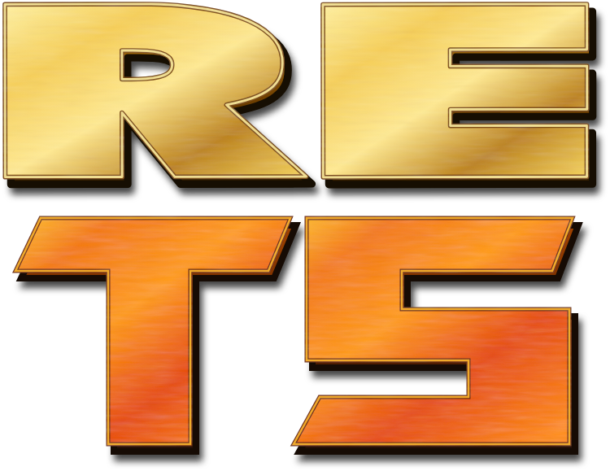

  

**reTS** is an early, in-development clean-room reimplementation of the classic
Westwood isometric real-time-strategy engine behind the **Command & Conquer**
titles **Tiberian Sun**, **Red Alert 2**, and **Yuri's Revenge**. Its goal is a
faithful, standalone, moddable engine, with accuracy as the non-negotiable
constraint.

The eventual engine release will contain **no original game code** and ship **no
game assets**. Players will supply their own legally owned game data.

> **Current availability:** the documentation site and devblog are public. The
> engine source, binaries, playable client, and native authoring tools have not
> been publicly released.

*Status last verified: 2026-07-15.*

## What makes reTS different

- **Accuracy is the bar.** Every implemented engine slice is held to recovered
  behavior and pinned by oracle tests so it cannot silently drift.
- **Standalone is the target.** The finished engine is intended to run without
  original executable code; that end-to-end client does not exist yet.
- **Multi-version by evidence.** Verified differences among the Command & Conquer
  titles Tiberian Sun, Red Alert 2, and Yuri's Revenge are modelled explicitly.
  Pending comparisons remain marked pending rather than assumed identical.
- **Modern layers are additive and planned.** Tooling, configurable limits,
  modern presentation, and native scripting are designed to sit above the
  faithful path. Most of those surfaces are roadmap work, not current features.

## Documentation

Documentation and the devblog live at **https://rets.dassheep.tech**:

- 🎮 **[For players](https://rets.dassheep.tech/docs/users/overview)** — current release availability.
- 🛠️ **[For modders](https://rets.dassheep.tech/docs/modders/overview)** — the planned authoring direction.
- 🧩 **[For contributors](https://rets.dassheep.tech/docs/contributing/overview)** — architecture and source-release status.
- ✍️ **[Devblog](https://rets.dassheep.tech/devblog)** — the reverse-engineering → modernization journey.
- 🏺 **[Engine Reference](https://rets.dassheep.tech/reference)** — verified-only documentation of original engine behavior.
