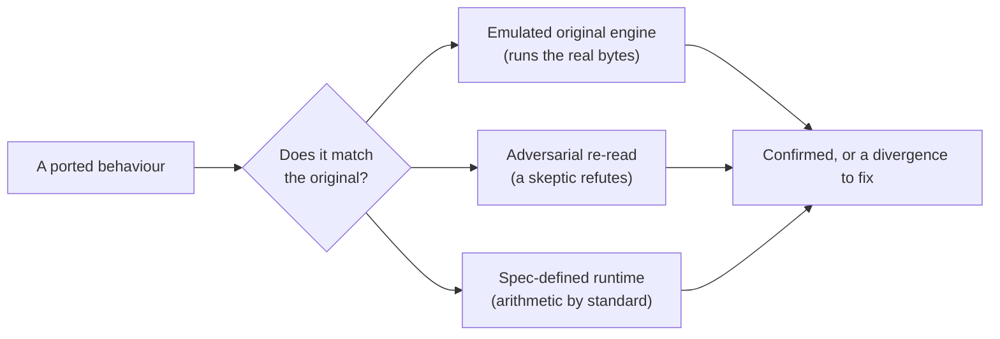

For months, every number in this project has been checked the same way: a person
reads the original engine's instructions, works out by hand what they must
produce, and writes that value into a test. It's rigorous — but it's one
person's arithmetic standing in for the CPU. The weak point was always the
derivation: a subtle misreading can hide in a test for a long time, because the
test and the reading share the same author and the same blind spot. Today the
project got three ways to have that reading checked by something that doesn't
share the author.

{/* truncate */}

*Last verified against the project oracle and live site: 2026-07-17.*

## The machine as second opinion

The first, and the one that changes the methodology, removes the author from the
loop entirely. Take the *actual bytes* of a function we've reversed, map just
that code into a sandboxed processor emulator, set up the calling convention the
way the engine would, run to the return, and read the result register. The
reimplementation and the original are now handed the same inputs, and their
answers are compared directly. When they disagree, the disagreement is the
finding — no human transcription in between.

The first function put through it was deliberately boring: a pure predicate that
decides whether a given lobby slot is one of the multiplayer starting positions.
Our port models it as a simple range check — is the index within this band? The
original engine does something that *looks* different: a run of discrete equality
tests, one per start slot, falling through to "no." For every valid input the two
are identical, and the emulated original confirmed it across a batch of cases
that included both edges of the band and values just outside it. That is exactly
the question this tool exists to answer — *is our simplification sound?* — and now
it can be answered by the machine instead of by a careful reading of it. A second
target that reads fields off an object exercised the harder path, where the
emulator has to be handed a small synthetic object to read from; its inheritance
and pass-through cases agreed too.

This does not replace reversing from the instructions — you still have to
understand a function to port it. What it replaces is the quiet risk that a
plausible-looking reimplementation and a plausible-looking hand-derived
expectation are wrong in the *same* direction. That risk is not hypothetical.
The very same afternoon, it showed up for real, deep in the campaign AI — and
this time it was a human skeptic, not the emulator, that caught it.

## When the blind spot actually bit

The campaign AI work reached the payload of a long thread: a *team* is the unit
the mission scripting commands — a squad handed a script, and each step of that
script is a *mission*: go here, guard this, load into that transport, unload,
attack, scatter, patrol, and sixty more. The full behaviour of every one of
Yuri's Revenge's sixty-five mission kinds is now reversed, ported, and pinned by
tests, then diffed against the older engines in the lineage. That work was run
as paired lanes — one agent reverses a mission, an independent one re-reads the
same instructions specifically to *refute* the first — and those verify lanes
earned their keep with dozens of corrections.

The sharpest correction is a near-perfect illustration of the shared blind spot.
One family of missions is gated on a power-level threshold, and an early reading
declared that whole family dead code, because the threshold constant read as
zero. It isn't zero. The comparison the engine performs consumes eight bytes,
not four — it's a double, not a single-precision float — and the value is one,
not zero. The low four bytes of a double holding 1.0 happen to be all zeroes,
which is exactly what a four-byte reading sees. One operand-size distinction
decided whether an entire branch of behaviour existed; it does, and it's live. A
port and a hand-derived expectation could easily have agreed on the wrong answer
here — which is precisely the failure the emulated-original check is built to
close, and the reason both kinds of second opinion matter. A separate correction
pulled a real lifecycle coupling out of the noise: when a team successfully sends
a member into a structure, it unconditionally arms the flag that governs whether
the team disappears next tick — so a release and a disappearance that look
independent are actually chained. A port written to the obvious reading would
drop that link silently.

Cross-game, the tidy result held: the older engine's version of this dispatcher
has exactly fifty-three mission kinds, and the twelve that the newer engines add
on top are provably *absent* there — not merely unfound, but sitting behind
padding where their table entries would be. The lineage grew this system by
appending, never renumbering, which is the same pattern the scripting layer as a
whole turned out to follow. Two independent readers converging on the same
fifty-three is, itself, another form of the second opinion this whole day was
about.

## A third witness, for the playable half

The last of the day's checks doesn't verify a function — it verifies the
*simulation itself*, and it arrived as an architecture decision about how the
project's playable side will be built. A browser build is now a first-class
parallel target alongside the native client, both of them thin shells over the
same shared simulation core, eventually joined by a single input-agnostic command
layer, so the same match logic runs behind a desktop window, a browser tab, or a
touchscreen without forking. The in-game interface will come from the reversed
engine, faithfully; only the shell around it is new.

Two facts made the browser path cheap rather than speculative, and the second is
the one that ties it back to the theme. The core that would have to compile to it
already carries no external dependencies, so the build is nearly free. And a
browser build's arithmetic is defined by a *specification* rather than by whatever
hardware it runs on — which makes it a genuinely independent witness that the
simulation stays deterministic, a fourth check whose numbers come from a written
standard instead of from a particular chip. It confirms the same thing the
emulator and the skeptic confirm, one level up: that our version of the engine
does what the original does, for a reason nobody on the team simply asserted.

None of the three shares the author's blind spot, which is the whole point. For
months the only check on a hand-derived number was the same hand that derived it.
Now the machine can run the original's own instructions and compare, a second
reader can be pointed at the disassembly with a mandate to prove the first one
wrong, and — as the playable client comes together — a runtime whose arithmetic
answers to a spec can stand in as an outside judge of determinism. Three
independent second opinions, on a project whose entire promise is that its
answers match the original engine's. The loop that catches a shared mistake now
closes at more than one level.
