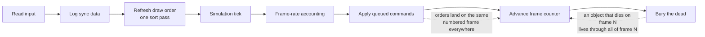

Every real-time strategy game is secretly a metronome. Thirty times a second
the engine reads your inputs, advances the world one tick, and draws what
happened. This week we finished dissecting that heartbeat across all three
games we track — Tiberian Sun, Red Alert 2, and Yuri's Revenge — and then went
one level deeper, into the bodies of the subsystems the tick calls, all the way
down to the layer where the computer players decide what to build. Along the
way the engine handed us a genuinely strange discovery: one virtual call that
takes its arguments two different ways depending on which game you're playing.

{/* truncate */}

*Last verified against the project oracle: 2026-07-19.*

## The envelope

The outer frame loop — the envelope around the simulation — is now mapped
end-to-end in all three engines, and its spine is identical everywhere: read
input, log sync data, refresh the draw order, run the simulation tick, account
for frame rate, apply queued player commands, advance the frame counter, and
finally bury the dead.

Two placements in that sentence carry the whole multiplayer story. Queued
commands apply *after* the tick but *before* the frame counter advances — so
every player's order lands on exactly the same numbered frame on every machine.
And object destruction is deferred: things that "die" during a tick are only
flagged, then swept at the very end of the frame, *after* the counter has
already moved on. An object that dies on frame N is still present, in every
list, for all of frame N — every scan traverses it, guarded only by a liveness
check — and is physically freed at end-of-frame at the earliest. Get either of
those wrong in a reimplementation and two machines playing the same game drift
apart within seconds.

That deferred-death queue was itself a small correction. Our object-model notes
had long dismissed it as a limbo bookkeeping list that was never broadcast; the
cross-references say otherwise. It is the engine's real destruction queue —
several teardown paths enqueue into it, and one of the pump's previously
unexplained closing calls is the drain that empties it after the counter ticks.
The drain asks each queued object a virtual "are you ready" question and, only
on consent, removes every occurrence and runs its destructor. We confirmed the
same drain exists in all three binaries — the later games run a few extra type
checks before freeing, the ancestor uses a different flag byte, but the "objects
die on schedule" guarantee holds across the whole lineage. That ordering was the
last unproven pillar of the deterministic world model we're building the
skirmish on, whose keystone is an argument the retail binary supplies for free:
lockstep works across machines with different memory layouts, so gameplay can
never depend on a pointer's *value* — only on identity and array order. Reproduce
the arrays exactly and you've reproduced the observable world.

One detail in that spine is a lovely period piece. The "refresh the draw order"
step is a *single pass* of a bubble sort over one display layer per frame.
Sorting everything every frame was too expensive for 1990s hardware, so the
engine amortizes — objects barely move between frames, so one cheap pass nudges
the layer back toward sorted, and because the pass runs before the tick, its
progress is shared game state, not just cosmetics. All three engines run the
identical algorithm.

The divergences in the envelope tell a story about the family. The ancestor
carries a large scenario-transition state machine in its tail — campaign-first
machinery the later games streamlined into a flat four-flag check. And the
newest engine alone has a **phantom random draw**: in networked games, behind a
congestion check, it pulls a number from the lockstep generator and throws it
away. It looks pointless until you remember what lockstep is — every peer must
consume its shared random stream in exactly the same order, so when a branch
that *would* have drawn doesn't run locally, the engine draws anyway to keep the
count aligned. That's a faithfulness detail the netcode port will have to honor
to the letter.

## The letter inside

Inside the envelope is the simulation tick itself: an ordered sweep of over
twenty subsystems — triggers, timers, bombs, lighting, teams, radiation, the
full object walk, factories, houses. The *order* was pinned some time ago. What
we finished this week was naming every remaining mystery in it, then reversing
every subsystem body behind those names.

Three mysteries had survived in the margins, and each fell to the same
discipline we lean on for anything a misread could quietly corrupt: independent
readers working from the raw bytes, an adversarial pass whose only job is to
refute the first, and a principal who re-dumps every load-bearing fact before
believing it.

A nameless routine the tick calls every frame with a six-millisecond budget
turned out to be the drain half of the dynamic lighting system — cells whose
light changed queue up, and the tick retints a budgeted batch each frame so a
big lighting event can't blow the frame time. The decisive evidence wasn't in
the drain at all; it was in its siblings. Every routine that *fills* that queue
is a light-source method — a light turns on, marks its cells pending, and the
tick works them off.

An array the tick walks only during real gameplay turned out to be a *second*,
undocumented animation registry. Certain feedback animations are filed there at
birth, and their destructor checks a per-instance flag to know which of the two
registries to unlink from. Neither community header set knows this one exists;
we're recording it as new.

And the smallest mystery had the best answer. Every object-update call in the
tick goes through the same slot in each object's virtual-function table — except
in Tiberian Sun, where the slot sits exactly one position later. We walked the
compiled type-information structures in all three binaries and dumped the base
class's table from raw bytes: the ancestor carries one extra virtual method that
the later games dropped, and its single insertion shifts every subsequent slot
down by one. Reproduce the newest game perfectly, forget this, and your Tiberian
Sun build calls the wrong function on every object, every frame.

## From names to mechanisms

With every callee named, we reversed the stage bodies end-to-end. Several are
small combat and effect systems with real mechanical personality.

**The attached-bomb list** — Ivan's ticking presents, a later-era class the
ancestor engine never had — is one function with three loops and three
*different* iteration disciplines. The first destroys bombs whose victim no
longer exists, and because the bomb's destructor doesn't remove it from the
list, the loop immediately re-runs its own compaction to sweep the dangling
slot. The invariant that falls out — every surviving bomb has a live target — is
exactly what lets the later loops skip null checks entirely. The visibility rule
is pure Westwood charm: your own bombs you always see; enemy bombs need a
bomb-detecting unit within range, measured as a true 3-D floating-point
distance, re-evaluated on a timer that resets to 45 but — counting the sweep
frame itself — actually fires every 46 frames.

**The kamikaze tracker** manages aircraft on a one-way trip, and it taught our
verification pipeline some humility. A first reading claimed its 30-frame timer
counts down in memory; the assembly says the subtraction happens in a register
and is never written back — the timer is a pure "has enough time elapsed"
comparison against a fixed duration. Two behaviors any faithful reimplementation
must keep: every tracked plane has its ammo forced to 1 every 30 frames, so the
crash always delivers its payload; and planes tracked without an explicit target
re-derive their crash point from their *current facing* every cycle — the aim
drifts as the plane banks — while planes with a stored target keep it forever,
even if the target is long gone. The reverse lane also flagged a garbage write
into the timer struct's padding that reads like an uninitialized variable but is
gameplay-inert — a compiler idiom we'd meet again.

**The ion blast** is where the layered reading paid off most, and where the
week's strangest discovery lives. It's a 79-frame effect that sweeps a 7×7 cell
neighborhood each frame looking for infantry and vehicles to zap, walking its
target list *backward* so an effect deleting itself mid-sweep can never make the
loop skip a neighbor. Its proximity check measures distance in *screen* pixels —
both positions go through the world-to-camera projection before the compare — so
the zap radius is literally twice as large in the newest game as in its
ancestors, camera-relative by construction. And then the calling convention. The
first reader called the per-frame hit-test a zero-argument accessor; the
adversarial pass refuted that — two extra values are passed; then the principal's
own dump refuted *the verifier* — in the newest game those two values travel in
CPU registers, while the two older engines push them on the stack. Same call,
same purpose, different convention per binary. We've been burned twice before by
convention misreads that only a live crash exposed. This one we caught on paper,
by stacking three independent readers against each other and believing none of
them until the bytes agreed.

The dynamic lighting drain we'd named earlier turned out to be the most
engineered thing in the tick: a two-phase, wall-clock-budgeted, *resumable*
pipeline. Changed cells go into a backlog; each frame the drain gets a
six-millisecond allowance and walks the backlog behind a cursor that *persists
across frames* — if time runs out mid-walk, next frame resumes exactly where it
stopped — polling the clock only every sixteenth cell to keep the timing
overhead itself cheap. Only once the whole backlog is resolved does an
unbudgeted second phase apply everything to the map at once and refresh the
display — once per batch, not once per cell. There's even a vestigial
self-tuning governor at the end: if lighting resolution takes too long, it
consults a hook that was compiled down to "always say no." A quality knob, wired
up and then unplugged before shipping.

The last of these core bodies is a small masterpiece of misdirection. The
Floating Disc's laser isn't a weapon that tracks — it's a wound-up toy. Firing
computes the bearing to the target, rotates it a half turn, and hands the rest
to a nine-beat state machine: two beam arms sweep around the disc in opposite
directions, one step per activation, and geometry does the scheduling — the arms
land on the same facing exactly at step eight. That converged beat draws the
single real beam, applies the single damage event, plays the report sound, and
marks the object for the end-of-frame grave. Every intermediate beam is a purely
visual object with its own lifetime sweep — and every beam allocation is guarded
so an out-of-memory frame silently drops the *visual* while damage and state
march on. The renderer is allowed to fail; the simulation is not.

Two more stage bodies finally explained the tick's two backward walks and its
oldest piece of trivia. Radiation sites count their lifetime down and, when it
hits zero, delete themselves *right there*, mid-walk — the destructor compacts
the array by shifting every later element down one slot, so walking backward is
the only safe order. We had that shift-down mechanism only as community folklore
until the destructor's disassembly showed the literal copy loop. The same site
fades its glow as it decays, and that fade carries a genuine retail bug: its
skip-if-unchanged check compares the stored red channel against the incoming red
*and* the incoming blue, and never looks at green. Faithfully reproduced, quirk
toggle and all. And the production stage answers the trivia question every fan
knows: the build clock has 54 steps — a constant that now sits, verified, in the
comparison instruction of all three games. Each due tick charges the remaining
balance divided by the remaining steps, rounding down, with the final step
sweeping the exact remainder, so a build never over- or under-pays by a cent. If
funds run dry the step rolls back — but the progress-changed flag stays raised
and the timer has already rewound, so a stall costs a full interval and briefly
lies to the sidebar.

The camera stage closed as a verdict rather than a port. Its class has no
runtime type information anywhere, so the lanes chased the singleton's
construction to recover its method tables in all three games — and found the
per-frame body is pure presentation: smooth-scroll easing, viewport clamping,
dirty-flag bookkeeping, and a screen-shake timer driven by the *wall clock*.
That last fact matters enormously: it is the only nondeterminism in the stage,
and it can never touch game state. The simulation spine now records this stage as
a documented client-side no-op instead of an unexamined hole.

## When faithful means reproducing the dice

Several stages look visually trivial and are, underneath, the most
determinism-hostile code in the frame — because in a lockstep game the *number*
of random draws is as load-bearing as the result. Consume one draw too few and
two machines' random streams diverge, and with them every combat roll for the
rest of the match.

Tiberium regrowth is the clean example. It looks like a timer per resource type:
fire when due, re-arm. The adversarial re-read killed the innocent version. The
number of cells processed per firing is a two-stage computation — first a
deterministic bound from how many cells are queued times the type's growth
percentage, clamped to 5–50, *then* a random draw modulo that bound, plus one —
and every candidate cell drawn after that consumes a *second* random number to
build a float-scored priority heap. None of it matters visually; all of it
matters for sync. Even the re-arm interval runs through floating point — an
integer growth rate times a scenario-dependent fraction, truncated — one more
place where a single rounding mode is load-bearing.

Crate placement is the most sync-hostile stage so far: placing one crate may
burn up to a thousand retry attempts, two random draws each, then one final draw
to arm the respawn timer, uniform over a window computed in doubles. The oracle
test for that window failed on first run — we had hand-derived the top of the
range as unreachable, the way the formula reads on paper. The actual bytes of
the scale constant are not exactly the power of two it plays on TV; it's larger
by one part in a billion, just enough that the maximum draw rounds up to the full
upper bound. That failing test is the workflow doing its job: the binary is the
spec, and it disagreed with our arithmetic until we read the constant's real
bytes.

The lightning storm turned out to be a shared ticker for a whole family of
screen-state machines — the storm itself, the nuke-flash fade, and two more
siblings the earlier games don't wire in here. Its best secret hid in a branch
both readers missed and the principal pass caught: the storm's shutdown code is
only *reachable* when the list of live storm clouds is empty. A storm whose
duration expires stops striking immediately, but keeps its stormy lighting until
the last cloud animation finishes — and when it finally shuts down, control falls
straight through into the countdown for the *next* queued storm, which can
promote on that very tick. Timing like that is invisible in normal play and
decisive in a replay diff.

The random threads run right up into the computer players, too. One block in the
house update — present only in the newest game — rolls twice on a *separate*,
non-synced stream and then, on one branch, rolls once on the shared lockstep
stream and discards the result: the same alignment trick as the envelope's
phantom draw, and a port that skips it desyncs every networked match from that
frame on. And the deciders that pick "build what the teams need" versus "build
something random" scale their coin flip by a stored constant sitting a hair
*above* the exact power of two it approximates — so a single roll value out of
two billion still goes random even at a fully deterministic setting. The same
almost-a-power-of-two footgun, twice in one engine.

## Ghosts in the machine

Reversing the same code across three binaries keeps turning up features that
outlived their own wiring, and cross-version reads that refuse a plausible answer.

The archaeology find of the week is the EMP pulse. All three engines run its
per-frame update in the same tick position — and in both later games the code
that would ever *create* one has exactly zero callers. Proven dead, not folklore:
exhaustive cross-reference on both binaries. In the ancestor the same constructor
has two live call sites gated by warhead flags — Firestorm's EMP was real,
shipped content, and the two later engines carried the entire mechanism forward
disconnected, faithfully executing an empty loop every frame for two decades. Our
port pins the mechanism *and* the dead-in-two, alive-in-one verdict.

The weather has its own ghost. The ancestor's ion storm is not an earlier draft
of the lightning storm — it's a different machine entirely: a per-tick
probability roll instead of fixed strike cadences, target selection that scans
live units first and falls back to random cells, and none of the cloud-then-bolt
choreography. The lineage rewrote the weather wholesale. And a 120-frame full-map
shroud refresh simply does not exist in the oldest engine — it's a later
addition, one more thing the descendants bolted onto the same tick spine.

Two smaller stages — transient light flashes and laser beams — earned the
cross-version check its keep one more time. The first reader claimed the ancestor
shares its descendants' memory layout for the laser record; the adversarial
re-read of the actual bytes showed the ancestor's late fields sit a further eight
bytes earlier, because it's missing two fields the later games added. Both stages
also share a removal idiom where the loop, already holding an item's position,
politely asks the array to search for the item anyway, then frees memory raw —
and the laser timer reproduces the exact "write compiler padding with stack
garbage" quirk we first met in the kamikaze tracker. Same idiom, second sighting,
all three binaries.

## The house takes its turn

The biggest single function in the tick is the per-house update. Each faction —
player, AI, or neutral — gets one call per frame to run its own housekeeping, and
that function turns out to be the engine's town square. Power and radar outages
re-check themselves through timers that deliberately fire one frame *early*,
stopping themselves and raising a flag the real recompute reads next. Grudges
between houses decay on a hundred-frame cadence and never quite reach zero — the
floor is one, so an AI that has been attacked literally never fully forgives.
Win, lose, and game-over are three flags sharing a single countdown, and before
the engine will admit any of them it spins on a wall-clock budget waiting for
queued announcer speech to finish — the EVA voice always gets the last word. The
win and lose paths then set the main loop's exit flags with mappings that are
exact mirror images of each other, and the lose flag itself is never cleared: a
genuine little retail quirk, faithfully reproduced and test-pinned.

The oddest find sits right after the function's return instruction: a complete,
working copy of its superweapon-sidebar sweep that nothing ever calls. A
whole-binary scan found zero references in the two later games. The oldest game
explains the corpse — there, the update *calls* that helper as a real subroutine.
The dead copies in the later binaries are the fossil left behind when the
compiler started inlining it: three shipped executables accidentally documenting
their own build history.

The house update dispatches into the AI's actual decision layer — six functions
deciding what building to place next, whether to train a vehicle, infantryman, or
aircraft, when to panic-sell, and which team to raise — and reversing those
justified the adversarial pass immediately. The base-planning function's most
load-bearing branch had been read exactly backwards on the first pass, success
and failure swapped, which would have shipped an AI that cancels plans when
they're viable and builds when they're not. Another reviewer found that the
"grudge" helper doesn't just adjust one hostility score — it silently re-elects
the AI's tracked enemy after *every* adjustment, and one of its two callers
immediately overwrites the result, making half its work a faithful no-op. The
three per-category production deciders turned out to be one function copy-pasted
per category: an instruction-level diff found exactly five substitutions and not
a byte more. And one detail every first-pass reader missed, caught by re-reading
the raw bytes: when the AI is at its team budget it sets a flag handed straight
into the map-scripted trigger conditions — the AI literally tells the mission
logic "I'm full."

Cross-version reconciliation here delivered a real behavioral difference rather
than shuffled offsets: the middle game evaluates its production dispatch every
single frame, where the newest throttles it to every eighth — same code shape,
eight times the decision cadence. The money check that gates every build, mean-
while, goes through a COM interface embedded inside the house object with a
calling convention the decompiler renders identically to a normal method call —
the exact trap our call-site discipline exists to catch, and the same trap that
made the ion blast's arguments so slippery.

## Where this leaves us

Everything above feeds one goal: a playable skirmish that stays bit-identical
with the original, frame by frame. The frame envelope tells us *when* things
happen; the tick order tells us *what* happens when; the stage bodies — every one
now with a reversed, test-pinned implementation or a pinned client-side
classification — tell us *how*, right down to the decisions the computer players
make. The frame is no longer a list of mysteries in a known order. It's a list of
mechanisms, each pinned by tests whose expected values were hand-derived from the
machine code, so any drift in our implementation fails loudly.

One large helper remains before the AI path is bit-exact end to end: the fallback
that weighs alternate build plans, with its own data-dependent lockstep dice
rolls. And the next move for the frame as a whole is the only witness that can't
be wrong — driving the live original through single frames and diffing its state
against ours at each boundary. We've read the anatomy from the bytes. Now we get
to watch it beat.
