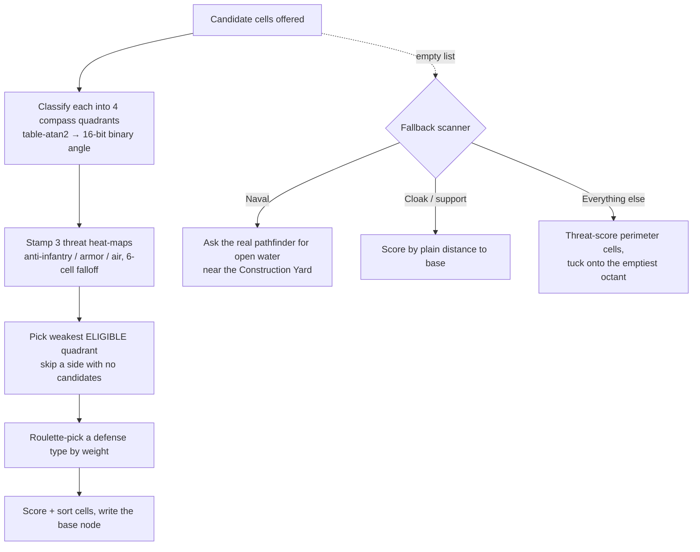

If you've ever watched a skirmish AI in Red Alert 2 quietly ring its base
with prism towers on exactly the side you were massing tanks, you've seen
this week's subject in action. We spent the day dissecting the routines that
decide *where defensive structures go*, *when* the AI is even allowed to want
them, and the ancient trigonometry humming underneath both — the last unmapped
pieces of the AI's base-building brain, and the functions standing between us
and a bit-exact port of that entire decision path.

{/* truncate */}

*Last verified against the project oracle: 2026-07-20.*

## A compass around the base

The placement engine thinks in compass quadrants. Every candidate cell gets
classified into one of four directions around the base center — the engine
computes a bearing with its own table-driven arctangent (much more on that
below), squashes it to a 16-bit "binary angle," and keeps just the top three
bits' worth: north-ish, east-ish, south-ish, west-ish.

Then it asks: which direction am I weakest? Every building the AI owns
reports three numbers — how good it is against infantry, against armor, and
against aircraft — and those get stamped into three threat heat-maps with a
gentle falloff: full value on the building's cell, fading over a six-cell
radius. Sum each quadrant, pick the smallest total, and that's where the
next gun goes. There's a subtle eligibility rule our adversarial review pass
caught: a numerically weaker direction is *skipped* if no candidate cells
were actually offered on that side. The math says "build north," but if
north has nowhere to build, the second-weakest side wins.

Here is the whole decision, including the fallback we'll come to next:

## Counting the dice rolls

Deterministic lockstep multiplayer means every random number matters. Both
players' machines run the same simulation and only exchange inputs, so if
one machine draws three random numbers where the other draws four, the game
desyncs — not crashes, just quietly diverges until the "reconnection error"
box appears. That's why an AI routine with a *variable* number of internal
dice rolls was a blocker: we couldn't port anything downstream of it until
every roll was accounted for.

The full census turned out to be beautifully finite. In Yuri's Revenge the
routine makes zero to four draws per call: up to three to add fuzz to the
AI's "what mix of defenses do I want" targets (skipped entirely when the AI
has no elected enemy — and, in a path our verification pass flagged, still
*burned* even when the fuzz drives the totals negative and the result gets
thrown away), plus at most one for a weighted lottery over eligible defense
types (skipped when there's only one candidate).

Then came the genuine surprise: **Red Alert 2 doesn't make the fuzz draws at
all.** Its version of the same routine hardcodes the target mix to a flat
one-third each and never touches the random stream for it. Same function,
same shape, three fewer dice rolls — the second confirmed case where the two
sibling engines disagree about *when randomness happens*, after the
dispatch-cadence difference we wrote about earlier. For anyone dreaming of
cross-game compatibility layers: this is why you can't just swap rules files
and hope.

Two smaller routines fell alongside the main event, and both matter for the
same census. One is the AI's base-plan maintenance pass, which has a charming
permanent side effect: every time it runs, it grows the AI's notion of its own
base footprint by one cell in every direction, then walks the perimeter
looking for stretches of five or more buildable cells to reserve as future
expansion nodes. Run it enough times and the AI's "base" is most of the map.
The other seeds placeholder nodes for power plants around an existing one — and
our review pass proved it draws no random numbers anywhere in its call tree,
upgrading an earlier "probably clean" into a certainty. The adversarial wave
earned its keep beyond that: it overturned six claims from the first-pass
analysis, including one where a dispatch helper's call into the
base-construction brain — the only path to the random stream in that
neighborhood — turned out to be *conditional*, not unconditional as first read.
A ported version built on the first reading would have drawn dice on ticks
where the original didn't. That's the whole reason every finding gets a hostile
second pass before it becomes code.

## When the candidate list runs dry

So the compass tells the AI which *side* is weakest. But what happens when
that side has no cells to offer — when the candidate list is simply empty?
That job belongs to a second, larger routine, the map-wide placement scanner,
and it turned out to have three personalities.

If the building being placed is **naval**, the scanner doesn't scan at all: it
calls the game's actual pathfinder with the floating movement class, asks it
for open water near the base center sized to a shipyard footprint, and then
rejects anything farther from the house's first Construction Yard than a
rules-configurable adjacency distance — the naval-yard adjacency knob modders
know from the INI. If the base has no center yet, it just returns the base
anchor. Otherwise it scores a per-house list of base-perimeter cells — through
the threat grid, or by plain distance-to-base for cloak generators (support
structures don't chase threat) — sorts, and walks the winners through a
placement dance: look at all eight neighbors of a candidate, sum up the
compass directions of the ones already reserved by this house's base, convert
that *vector sum* into one of eight octants, and try to tuck the building on
the corresponding side, offset by its foundation plus the AI base-spacing
margin (plus one extra cell for buildings that want walls or elbow room — the
rule names literally explain the +1).

The hostile-review pass earned its keep three times over. Our own first
reading said the neighbor scan "keeps the last match" — refuted; it's a
running sum, which means a candidate with owned cells on *opposite* sides
cancels to zero and gets skipped exactly as if it were isolated. A claimed
uninitialized-memory argument turned out to be a deterministic zero hiding
behind two disguised half-word writes. And the strangest find: the whole
attempt phase runs **twice**, and an exhaustive trace proved the second pass
is byte-for-byte dead logic — a fossil the compiler faithfully preserved for
twenty-five years. Our version runs it once and documents why.

Cross-game, the scanner sharpened the picture too. Red Alert 2's copy drops a
safety check Yuri's Revenge keeps — a null guard on the picked type that, if
you ported the newer engine naively, is a reachable crash. Tiberian Sun's
defense-placement brain passed its own exhaustive audit: one gated random draw
is its *entire* relationship with the dice, but its pick weighting quietly adds
a cost bonus that neither sibling has — cheap defenses get a leg up in Tiberian
Sun. Three engines, one function, three personalities, and the test suite now
knows all three.

## The math that time forgot

Underneath all of this — every bearing, every distance, every angle — sits
something delightful: the engine doesn't compute square roots or trigonometry
the way any modern program would. It ships lookup tables and does a few bit
tricks on the floating-point representation to index them. Classic 1990s speed
engineering, shared byte-for-byte across Tiberian Sun, Red Alert 2, and Yuri's
Revenge, and used by hundreds of call sites across the whole engine: bullets,
pathfinding, rendering, everything.

For our port this is a gift and a trap. The square-root table (sixteen
thousand entries) we managed to regenerate *bit-exactly* from a closed-form
formula — every one of 16,384 entries matches — because it only needs
operations the IEEE floating-point standard guarantees to the last bit on
every platform. The arctangent, sine, and cosine tables are the trap: they
were baked decades ago by whatever C runtime the original compiler shipped, and
modern math libraries land up to fourteen units-in-the-last-place away from
them. No formula we can responsibly write reproduces them; the shipped data
*is* the specification. So the port carries those tables embedded verbatim,
with witness values pinned in tests — 4,094 of the arctangent table's 4,097
entries disagree with a modern library, which settles the argument. The sine
and cosine tables (one shared ten-thousand-entry table, one full period plus a
quarter-period tail so cosine's phase shift never wraps) carry a faithful
imperfection we now reproduce *on purpose*: negative angles round *away* from
the nearest entry, so the sine of −90° lands two slots off from where a clean
implementation would put it — returning not −1.0 but −0.9999988. The game has
been slightly wrong, identically, on every machine, for twenty-five years — and
now so are we.

The sharpest catch in this whole family was a single number. The constant that
converts angles into the engine's 16-bit compass has been described — by us and
by community lore alike — with a tidy formula: negative 65536 over 2π. A
reviewer pulled the actual eight bytes out of the executable and did the
arithmetic: the real value is **negative 32767 over π**, off from the folklore
by exactly 1/π. Our code already carried the correct extracted value, but any
future cleanup that "simplified" the literal into the pretty formula would have
quietly bent every angle computation in the game. The lesson is a running theme
here: the extracted bytes are the oracle, and the elegant closed form is a
hypothesis until it matches them.

One more entry for the "one percent is never one percent" file, in the same
spirit: the fuzz magnitude scales a difficulty setting by a floating-point
0.01 — which, as binary fractions go, doesn't exist. The nearest representable
value is 0.00999999977..., so a difficulty of 50 against a base of 3000 fuzzes
by ±1499, not the ±1500 you'd compute on paper. Our first hand-derived test
said 1500; the port said 1499; the port was right. We keep catching our own
arithmetic with this class of bug, which is exactly why every expected value
gets computed twice, two different ways, before it becomes an oracle.

## The "when," not just the where

Knowing *where* and *what* the AI builds only answers half of it. Every AI
team in the game is born from a trigger list, and each trigger runs a predicate
— a cascade of gates and a nine-way condition check — before it's even allowed
a lottery ticket. That predicate is now fully reversed, adversarially reviewed,
and ported with a spec test on every gate. It rolls no dice at all, which is
good news for lockstep. The gates have opinions: while a house hasn't met its
per-difficulty quota of base-defense teams, *only* base-defense triggers may
fire; once the team builder signals there's enough defense, they're excluded
instead. The skirmish difficulty toggles are indexed by an enum that counts
*backwards* (hardest = 0), and a difficulty value out of range passes the gate
entirely.

The sharpest finds were two errors in the community's own reference headers,
trusted for years: a comparator struct whose two field names are swapped
relative to the real binary layout (the threshold and the operator code live in
each other's slots), and a condition enum whose first two labels are crossed
(the first inspects the *enemy's* arsenal, the second your own — the opposite
of what the names say). Port from the headers alone and you'd compare the wrong
number with the wrong operator against the wrong player. The binary remains the
only witness that never misremembers. Two curios rode along: the "superweapon
charged" conditions never actually check *charged* — they check *granted*,
within a tunable slack of readiness — and they inspect the asking player's
superweapons rather than the enemy's, thanks to a one-instruction stack quirk.
Cross-game, Red Alert 2's copy is instruction-identical, while Tiberian Sun's
is the visible ancestor: fewer condition kinds, a smaller class, and no
base-reachability gate at all — that geography check (can my base even *reach*
yours, amphibiously if need be) arrived with Red Alert 2.

## The placement finder that never was

There's a function whose community-known name says *pathfinding* — and it has
nothing to do with routes. It's the **placement finder**: the routine every
scattered infantryman, deploying vehicle, rallying factory, and teleport
landing asks the same question — *"find me a valid cell near here."* It's now
fully reversed, along with all five of the helper predicates it composes, and
it's the primitive the naval branch of the scanner above actually calls.

Its search is a square ring expanding outward from the start cell, each
candidate run through a gauntlet: is the cell inside the playable diamond, can
this unit's whole footprint stand there, is the ground close enough in height,
is it clear to build on if asked. Collect up to twenty-four survivors, then
pick. The pick is the fun part. If the caller named a target to be near, it's a
straight nearest-wins scan through the engine's table square root. If the
caller *didn't* — and here's the quirk — the engine takes the current **frame
number modulo the candidate count**. Not the synchronized dice everything else
uses: the frame counter. Every client computes the same frame, so lockstep
survives, but the choice depends on *when* you ask, and the sentinel for "no
preference" is cell (0,0) itself — the engine literally cannot express "put me
near the map's origin corner." Better still: at ring radius zero, the scan's
top and bottom edge generators both collapse onto the start cell, so the origin
enters the candidate list *twice* and gets double weight in that modulo pick.
Faithful means reproducing that too.

The day's sharpest catch, though, was ours, not Westwood's. Re-deriving the
playable-diamond bounds check from a fresh disassembly showed its first
inequality is a *lower* bound — the pass condition points the other way from
what our five-day-old notes said, and our shipped port had faithfully inherited
the inverted reading. The port's tests never caught it because their expected
values were hand-computed from the same wrong formula — a perfect specimen of
the shared-misread failure mode our adversarial-verify process exists to kill.
Fresh eyes on the raw instructions caught it; doc, port, and tests are all
corrected. The lesson generalizes: a test is only as honest as the
independence of the person who computed its answer.

One tidy loose end fell with it. Three mysterious team-configuration fields the
AI's reachability gate reads turn out not to be map-author data at all — the
engine *derives* them from a team's unit composition (what movement class the
group shares, whether it's naval, whether it's a base-defense team, which skips
the geography check entirely). "Can my base reach yours" answers itself from
what units the team wants to field. And the finder's cross-game story is a neat
nesting: Yuri's Revenge has the fullest version, Red Alert 2 lacks one option,
Tiberian Sun lacks two — three nested generations of the same machine,
identical at the core.

## How bridges actually work

Two threads closed the day where they had to: at the very bottom of the stack,
the per-cell question everything above eventually asks — *"can this unit stand
here?"* The passability predicate is now fully reversed, fresh-eyes and
adversarially verified, and its three long-mysterious argument slots finally
have names. The best of them explains bridges. The engine keeps *two* occupancy
ledgers per cell: one for the ground, one for the bridge deck above it. With
the default arguments every retail caller passes, a bridge cell automatically
switches to the deck ledger — and *waives* the impassability of the terrain
underneath. That one four-instruction waiver is the entire reason infantry can
walk across water on a bridge.

Getting there on the Tiberian Sun side first meant solving a disassembler
mystery that had blocked walking its per-house AI tick for a week: an
"unresolved jump table" that fused three functions into one unreadable blob.
It turned out not to live in the tick body at all — it's a small island of
*data*, one jump table cleverly shared by two different switch statements (the
second indexes seven entries deep into the first one's table through a
byte-compression map), sitting between functions. A linear disassembler eats
those bytes as instructions and never recovers. Resolved from raw bytes, the
layout is clean: a buildability checker, a tiny owned-building lookup helper
nobody had documented, and the real tick body, each padded apart. The switch's
bounds check is an *unsigned* compare, so a sufficiently malformed prerequisite
value would wrap around it and index memory far out of bounds — a dormant hazard
the original compiler left in, cousin to one we'd already documented on the
Yuri's Revenge side.

## Where this leaves us

The AI's build-order brain is now decision-complete for Yuri's Revenge — *what*
to build, *where* to put it, and exactly *when* the dice get rolled — all the
way down through the trigonometric tables and the single passability predicate
the whole engine leans on, and all pinned by tests whose expected values were
hand-computed from the original machine code and, where a port and its study
could have shared a blind spot, cross-checked against the running retail game
itself. The Tiberian Sun counterparts we'd been hunting are located too, its
copies of every one of these functions read side by side with the newer engine
so each `identical` / `divergent` / `TS-exclusive` verdict is on the record.

The through-line of the whole day is a single discipline: the extracted bytes
are the only witness that never misremembers. A constant that community lore
had "simplified," a comparator struct whose header field names were swapped, a
diamond bounds check our own five-day-old notes had inverted — every one of
them agreed with a plausible, tidy story, and every one of them was wrong until
the raw instructions said otherwise. That's why a hostile second reader gets
the last word before anything becomes code.
