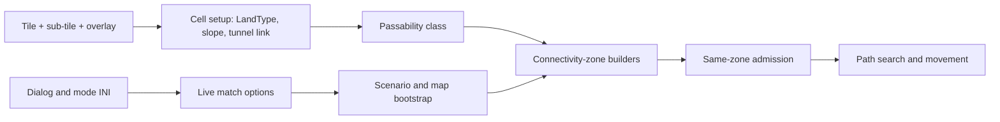

A skirmish match seems to begin when the battlefield appears. The engine has a
different answer. Long before the first tank accepts an order, it has already
turned dialog controls into a match contract, raw map records into terrain,
and terrain into connectivity rules that decide where every ground unit may
go. This week we followed that preparation chain from both ends.

{/* truncate */}

*Last verified against the project oracle: 2026-07-22.*

## The match behind the dialog

The Skirmish screen is not merely presentation. Its commit handler writes the
live match-options structure and the player's saved preferences from the same
set of controls. Those are parallel destinations: the preferences do not get
loaded back and transformed to create the live match. This distinction matters
for a standalone client, because reproducing the visible dialog without the
exact commit contract would produce a match that looks configured correctly
but behaves differently.

One initialization routine gave us the backbone of that contract. It copies
seventeen defaults from the rules into the live options in a straight pass.
The dialog then overwrites the fields it owns. Two choices are more opinionated
than the UI suggests: bridge destruction is committed on, while the
multi-engineer option is committed off. The dialog is not simply preserving
whatever value an INI file supplied.

The game-mode catalog is similarly concrete. The engine probes six named INI
sections in a fixed order and instantiates one of several multiplayer-mode
classes. A previously undocumented cooperative class is present alongside the
better-known modes. The Siege machinery survives too, but its shipped section
is empty in both Red Alert 2 and Yuri's Revenge — working engine support for a
piece of cut content.

There is also a boundary worth stating plainly: the unmodified retail
executables do not read `spawn.ini`. That launch surface belongs to the later
community ecosystem. The faithful engine's own mode lookup is therefore the
right seam for supporting both the retail dialog and modern headless launch
configuration without pretending they came from the same original parser.

Difficulty finishes the configuration story. Assigning a handicap copies one
of three rule rows into a house's runtime multipliers. Computer houses use a
mirrored index — effectively `2 - difficulty` — rather than the player's row
directly. The original also carries a real uninitialized-stack write in this
path, shared by Tiberian Sun and Yuri's Revenge. It is documented as a retail
quirk rather than quietly rationalized away.

## A map cell is a decision, not a file record

Once the match options exist, the map still is not ready for movement. A cell
starts as a tile index, a sub-tile, a height, and perhaps an overlay. The setup
pass turns those ingredients into the `LandType` used by passability and
pathfinding.

The order of that decision is surprisingly consequential:

- An overlay first imprints its own land type. Walls, railroads, and specially
  flagged overlays are authoritative; the underlying tile does not override
  them.
- Ordinary cells validate their sub-tile and derive land and slope from the
  loaded TMP tile record. Invalid sub-tiles are blanked rather than trusted.
- Tiberium is conditional terrain. On a shallow clear slope it becomes
  Tiberium land; on a steep slope the engine removes the overlay.
- Tunnel mouths can request a tube link as part of setup.
- A cliff safety pass examines six neighbors in a fixed, asymmetric pattern.
  With the shipped `CliffBackImpassability=2`, a sufficiently high cliff behind
  a cell forces that cell to Rock, making the back of the cliff impassable.

That last rule was hiding in plain sight. It had once looked like an editor
safety measure; tracing the rules loader showed it is a normal, enabled
gameplay option in every shipped rules set. It changes where units can stand,
so it belongs in the simulation contract.

Here is the preparation pipeline as the engine effectively sees it:

Each arrow is now an explicit implementation seam rather than an assumption
that “the map loader probably handles it.”

## The ring around the playable map

The next question above those connectivity tables is named exactly as you
would expect: are two cells in the same zone? But the retail routine does more
than compare two integers.

It distinguishes the scenario's usable rectangle from the full isometric map
diamond. A source cell in the rim between those boundaries is accepted before
the engine consults either zone table. With a separate leave-map flag, a unit
starting in the usable area may also target that rim. Only the ordinary case
resolves both cells — including their independent bridge-deck rules — and
compares the resulting zone ids.

That permissive rim is deliberate boundary policy. Flattening the function to
`zone(source) == zone(destination)` would make transitions at the edge of the
playable area disagree with the original even if every zone id were otherwise
perfect.

The same control-flow shape appears in Tiberian Sun, Red Alert 2, and Yuri's
Revenge. The work also located Red Alert 2's previously missing cell-zone
resolver, completing the three-game lineage for this part of the map contract.
The port records which of the four exits accepted or rejected the query, and
its tests cover the boundary rim, the leave-map gate, equal and unequal zones,
and bridge handling at each endpoint.

## Three engines, one preparation chain

Reading the three generations together is more useful than stamping everything
“shared” or “different.” The terrain-tag table is byte-identical across all
three. Red Alert 2's cell-setup pass closely matches Yuri's Revenge. Tiberian
Sun has the recognizable ancestor, but keeps a veins-era case and different
height-step behavior. The same-zone policy, on the other hand, is structurally
the same in every binary.

That is the shape reTS needs: shared code where the instructions support it,
versioned behavior where the engines genuinely diverge, and no modernization
layer allowed to blur the distinction. A modern lobby may feed the match
contract. A modern renderer may draw the resulting world. Neither gets to
silently change how a steep tiberium slope is cleared or how a unit crosses the
edge of the usable map.

Before the first tank moves, the engine has already made thousands of small,
ordered decisions. Faithfulness means those decisions are part of the game —
not invisible setup we can replace with something merely plausible.
