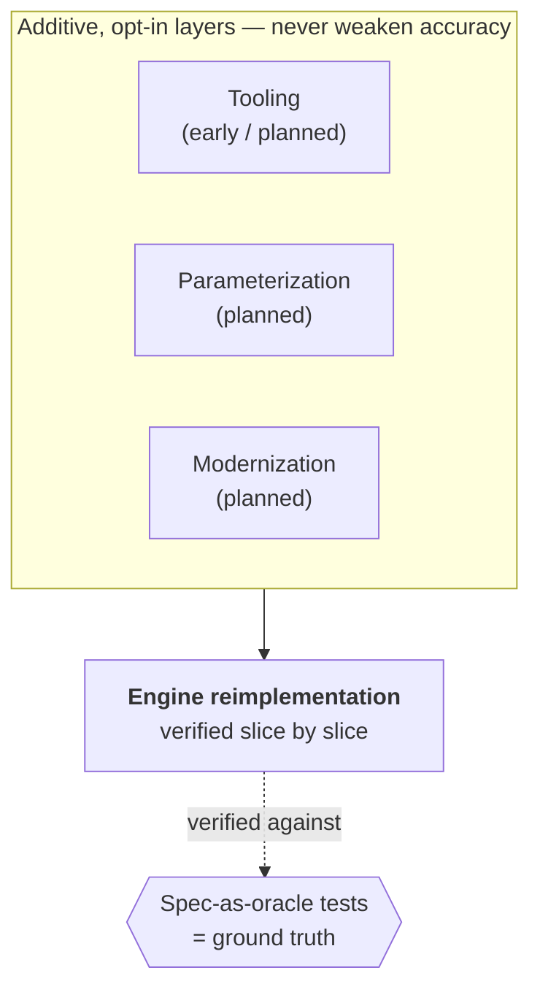

# For contributors

This page gives a public-safe view of the architecture. Build and contribution
instructions will follow the public engine-source release.

*Last verified against the architecture charter and public repository: 2026-07-16.*

:::caution Source not released
The public repository currently contains this website, not the engine source or
binaries. There is no public build, test, or pull-request workflow for the engine
yet, so this page does not invent one.
:::

## Architecture at a glance

reTS is organized as a layered system:

- A **faithful core** — the reversed Command & Conquer engine behavior, pinned by
  tests that treat the original engine's behavior as ground truth.
- **Opt-in layers on top** — tooling, configurable limits, modern presentation,
  and native modding/scripting — each gated so it never weakens the accuracy bar.

Only completed slices of the engine core carry the verified claim. The upper
layers are separate roadmap dimensions and do not count as faithful-engine
completion merely because their designs exist. Verified slices already span a
broad cross-section of engine areas — combat, economy, movement, presentation,
audio, UI, and netcode among them — each pinned independently as it clears the
oracle bar, not delivered as a single monolithic milestone.

## How reTS is built

reTS is developed with an **AI-assisted, verification-first** workflow: every
system is made introspectable, pinned by tests whose expected values come from the
original engine's behavior, and exposed to AI agents through a fixed, four-tool MCP
capability gateway — rather than a growing tool per system — so discovery cost
stays constant as coverage grows. See **[The MCP capability
gateway](./mcp-gateway)** for how that surface is shaped and how a system joins
it. The same discipline extends to this documentation — public docs are checked
against the same ground truth to detect and prevent silent drift.

## When contributor guides publish

Once the clean public source release exists, this section can document the actual
repository layout, toolchain, test commands, contribution boundaries, and review
process. Until then, the **[Devblog](/devblog)** is the public narrative of
milestones and design decisions.
