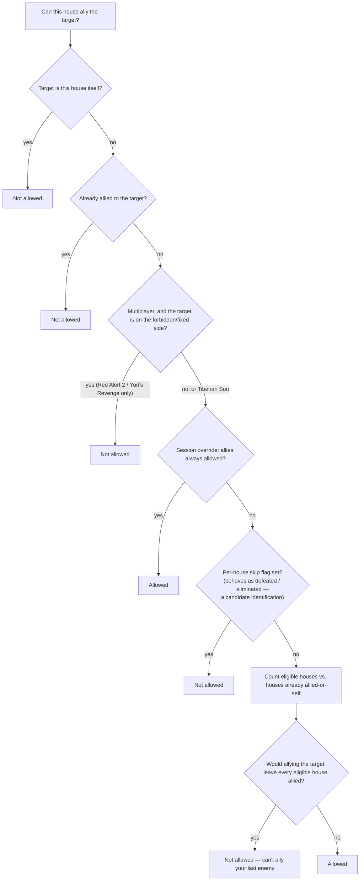

# House alliances — the diplomacy relation

*Last verified: 2026-07-25. Version coverage: the alliance relation, the anger
bookkeeping, and the `CanAlly` "last enemy" rule are **identical in mechanism**
across **Tiberian Sun**, **Red Alert 2**, and **Yuri's Revenge** — only the
struct layout differs between games, not the behavior. A defect in the
alliance-breaking path is **byte-identical in all three**. Two gates diverge:
the forbidden-side eligibility check exists only in **Red Alert 2 and Yuri's
Revenge**, and an additional coalition-sweep guard exists only in **Yuri's
Revenge**.*

This entry covers the core of `HouseClass` diplomacy: how the engine stores
and tests whether one house considers another allied, how an alliance is
formed and broken, the eligibility gate that can refuse a new alliance, the
mechanic that makes computer-controlled houses band together against the
player, and the handful of wires — the multiplayer diplomacy button, a map's
starting-allies key, campaign squads, team games, and scripted triggers —
that all funnel through the same small set of functions. It is not a guide to
diplomacy *strategy*, and it does not cover what an alliance's anger score is
used for beyond this core, the on-screen presentation of a diplomacy change,
or the broader trigger-action and multiplayer-team-game systems that call
into it.

:::note Publication bar
This entry covers the diplomacy relation itself: the alliance bitmask, the
membership test, forming and breaking an alliance, the eligibility gate
(including the last-enemy rule), the AI coalition sweep, and the wires that
trigger a diplomacy change (the network diplomacy toggle, a map's
starting-allies key, campaign squads, multiplayer team games, and trigger
actions). It does **not** cover: the world-effect sweep that runs alongside a
change (units retargeting off a new ally), the in-game presentation of a
diplomacy change (message, voice bark, sidebar redraw), the full internal
semantics of trigger actions or multiplayer team-game setup beyond naming
that they exist, or several internal fields and helper routines whose exact
identity the underlying research has not yet pinned down (listed under "Not
covered" below).
:::

## The relation: a directional bitmask

Each house stores its alliance relation as a single bitmask, one bit per
house, indexed by that house's slot in the game's house list. This caps the
mechanism at 32 houses and, more importantly, makes the relation
**directional**: whether house A considers house B an ally is a bit in A's
mask, completely independent of whether B considers A an ally. A "mutual"
alliance is really two separate one-sided facts that happen to both be true
at once — and that split is the root of an asymmetry that runs through the
whole system.

The membership test itself (`IsAlliedWith`) is a plain bit check with two
special cases: a house is always considered allied with itself, and the "no
house" sentinel index is never allied with anything. Beyond the base
integer-index test, the engine offers convenience overloads that resolve a
house pointer, a live game object (via its owning house), or a generic
in-game object down to the same index-based test.

## Forming an alliance is one-sided: `MakeAlly`

Calling `MakeAlly` on a target house only ever sets **the caller's own bit**
for that target. The target's own mask is never touched. Concretely, forming
an alliance:

1. Is refused outright if the eligibility gate (`CanAlly`, below) says no —
   `MakeAlly` does nothing at all in that case.
2. Sets the caller's bit for the target house.
3. Zeroes any anger the caller had accumulated toward that house.
4. Clears the caller's "current vendetta" pointer if it was aimed at the
   house that just became an ally.
5. Runs an internal per-house recompute step after the mask changes (its
   exact role is not established by the underlying research).
6. Conditionally touches a **second** per-house bitmask, but only when a
   particular session-wide flag is active. Neither this flag's nor this
   second mask's identity has been established — see "Not covered."
7. Sweeps every unit the caller currently owns and, for any of them
   currently targeting something that now belongs to an ally, clears that
   target — you stop shooting your new friend. This is a real, verified
   behavior of the retail engine; it is not modeled by this entry beyond
   naming it, because it depends on the live object graph rather than the
   diplomacy state alone.
8. Under a separate, additional set of conditions — gated by a different
   rules toggle than the one that gates the AI coalition sweep's own entry
   point (see below), plus checks on the target's type and on whether the
   game is actually running — `MakeAlly` can itself trigger a full run of
   the AI coalition sweep.
9. Drives presentation: a localized diplomacy message, an audio bark, and a
   sidebar redraw, all gated on whether the game is actually in a
   multiplayer session and on whether the local player controls the house in
   question. This entry does not model presentation.

## Breaking an alliance is two-sided: `MakeEnemy`

`MakeEnemy` is the mirror image in one crucial respect: unlike forming, it
**is not gated** by the eligibility check at all — a house can always declare
another an enemy. But where forming touches only the caller's own bit,
breaking is **bilateral**: if the relation had been mutual, breaking it tears
down both directions in a single call. Concretely:

1. In multiplayer, if either house's type is flagged as a "no diplomacy"
   type, the whole call is a complete no-op — no anger, no bit changes,
   nothing.
2. Otherwise, the caller's anger toward the target increases by one,
   **unconditionally, before** the code even checks whether the two houses
   are currently allied.
3. Only if the caller is *currently* allied to the target does anything else
   happen:
   - The caller's own bit for the target is cleared correctly.
   - The second, unidentified per-house mask is also touched here (see the
     bug below).
   - The same internal recompute step runs again.
   - **If the target had reciprocated** the alliance (its own bit for the
     caller was also set), the break becomes bilateral: the target's bit for
     the caller is cleared too, the caller's anger toward the target
     increases by one **again** — so a mutual alliance that gets broken
     leaves the breaking house with two points of anger toward the other
     side, not one — and the second mask is touched again on the target's
     side.
4. The same presentation gating as forming (message, bark, sidebar redraw)
   applies, not modeled here.

### The inherited break bug — confirmed byte-identical in all three games

The second, unidentified per-house bitmask mentioned above is supposed to
have its corresponding bit cleared alongside the main alliance bit whenever
an alliance breaks. On the *breaking house's own side*, the clear is coded
incorrectly: instead of computing "clear just this one bit," the logic
collapses to ANDing the entire mask against zero, **wiping the whole second
mask** rather than clearing the single bit for the house that just stopped
being an ally. Every other bit that mask was tracking for that house is lost
in the same operation.

The mirror-image write — the one that runs on the *reciprocal* side, when the
other house had reciprocated the alliance and its own bit needs clearing too
— is coded correctly and clears only the intended bit. So the two halves of
the same break disagree with each other: one wipes an entire mask, the other
clears one bit as intended.

This defect is present, instruction-for-instruction identical, in Tiberian
Sun, Red Alert 2, and Yuri's Revenge. It predates Yuri's Revenge and was
never fixed in any of the three releases. Because the second mask's own
identity is not established (see "Not covered"), its gameplay consequence
isn't pinned down either — but the defect itself, and its presence in all
three shipped games, is confirmed from the disassembly.

## `CanAlly` — the eligibility gate, and "you can't ally your last enemy"

Before an alliance can be formed, the engine runs an ordered sequence of
checks. The first one that fires decides the answer:

The last step is the interesting one. The engine counts every "eligible"
house — one that is neither of a no-diplomacy type nor carrying a
per-house skip flag whose behavior matches a defeated/eliminated state (that
identification is a strong candidate, not a confirmed one — see "Not covered")
— including itself, then counts how many of those are either itself or already
allied.
After accounting for the house about to be added, an alliance is refused
exactly when forming it would leave the requesting house allied to **every**
eligible house in the game. In plain terms: **you cannot ally your last
enemy.** A direct, visible consequence: in a strict 1-on-1 match, a house can
never ally its only opponent, because doing so would always trip this rule.

The forbidden-side check (step three above) only runs in multiplayer, and
only exists at all in Red Alert 2 and Yuri's Revenge — see "Cross-version
verdict" below.

## `AllyAIHouses` — the AI coalition sweep

A separate routine periodically forms the classic "the computer players all
gang up on you" coalition: for every non-human house that does not carry the
same skip flag described above (read here, as there, as a defeated/eliminated
state — a candidate identification), it marks that house as part of the AI
coalition, then allies it to every other participating AI house and makes every
human house its enemy. Notably, this
sweep does **not** check the no-diplomacy house-type flag that the
eligibility gate and the alliance-break path both respect — only whether a
house is defeated and whether it's player-controlled decide participation.

Whether the sweep runs at all is decided by a rules-driven toggle (or an
equivalent session-level condition) together with an additional guard that
must read clear. That additional guard is where the games diverge — see
below.

## The wires that drive a diplomacy change

| Wire | What it does |
| --- | --- |
| Network diplomacy toggle | The event fired by the multiplayer diplomacy button: if the two houses are already allied, break it; otherwise form it. |
| A map's `Allies=` key | Read once per house at load: the house allies itself (a no-op on the relation, but a real call), then allies every house named in the map's `Allies=` bitmask — each pass still going through the same eligibility gate, so a map's starting alliances can still be refused by the last-enemy rule if the numbers work out that way. |
| Campaign squads | The `Squad_1=`/`Squad_2=` name lists in campaign scripting mutually ally every house named within the same squad. |
| Multiplayer team games | Forced team alliances applied when a team-based multiplayer game starts. |
| Trigger actions | Map triggers can invoke the same form/break actions directly, as scripted diplomacy changes. |

## Cross-version verdict

- **The relation, the form/break asymmetry, the anger bookkeeping, and the
  `CanAlly` gate order (including the last-enemy rule)** were reversed and
  confirmed in Tiberian Sun, Red Alert 2, and Yuri's Revenge. The mechanism
  is identical in all three — only the underlying struct layout differs
  between games (Tiberian Sun's house structure is considerably smaller),
  which is expected structural drift, not a behavior change.
- **The break-path second-mask bug** is present, byte-for-byte identically,
  in the compiled code of all three games. It is an inherited defect that
  predates Yuri's Revenge and was never corrected in any of the three
  releases.
- **The forbidden-side / fixed-team eligibility check exists only in Red
  Alert 2 and Yuri's Revenge.** Tiberian Sun's equivalent gate function has
  no matching branch at all — this multiplayer restriction was added after
  Tiberian Sun shipped.
- **The AI coalition sweep's additional scenario guard exists only in Yuri's
  Revenge.** Red Alert 2's equivalent routine omits it, so Red Alert 2 can
  re-run the coalition sweep in situations Yuri's Revenge would suppress. The
  underlying research did not establish a Tiberian Sun analog of this sweep
  at all, so Tiberian Sun's coalition behavior is outside this entry's
  coverage.

## Not covered

- The world-effect sweep that clears a unit's target when that target
  becomes an ally, and the presentation of a diplomacy change (localized
  message, audio bark, sidebar redraw) — real, verified retail behavior, but
  not modeled by this entry beyond naming that they happen.
- The identity of the second per-house bitmask touched alongside the main
  alliance mask, and of the session-wide flag that gates it and also
  short-circuits the eligibility gate to "always allowed." Neither has an
  established name.
- The exact identity of the "defeated/eliminated" flag the eligibility gate
  and the AI coalition sweep both check. It behaves consistently with a
  defeated/eliminated state elsewhere in the engine, but a definitive
  confirmation is still outstanding.
- The identity of the AI-coalition membership flag the coalition sweep sets,
  the internal per-house recompute step that runs after every alliance
  change, and the source of the forbidden-side value the eligibility gate
  compares against.
- A Tiberian Sun analog of the AI coalition sweep — not established by the
  underlying research.
- The full semantics of trigger-driven diplomacy actions and multiplayer
  team-game setup beyond the fact that both exist and route through the same
  form/break functions described above.

## Corrections

If you can falsify a claim on this page against retail *Command & Conquer:
Tiberian Sun*, *Red Alert 2*, or *Yuri's Revenge* behavior, open
an issue on the [reTS repository](https://github.com/DasSheep/reTS/issues).
Reports are treated as verification input and re-checked against the
binaries before the page is updated.
