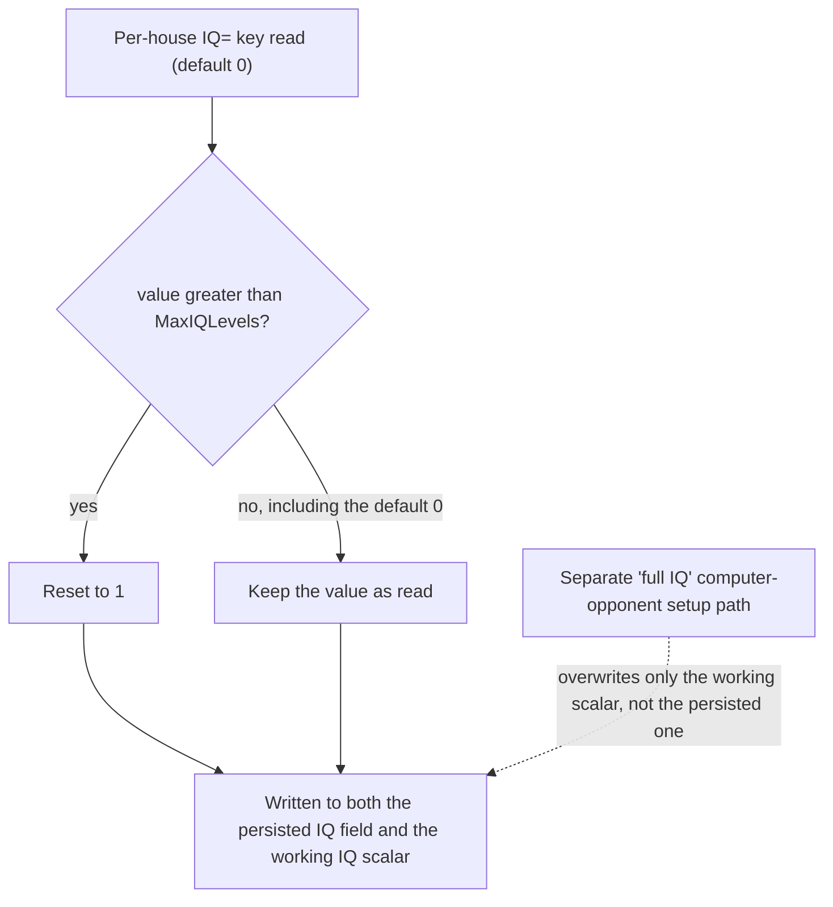

# The [IQ] switchboard

*Last verified: 2026-07-25. Version coverage: identical mechanism verified across Tiberian Sun, Red Alert 2, and Yuri's Revenge — the same eleven-field block, the same parsing convention, the same threshold predicate, and the same dead rung in all three; only the internal per-engine data layout differs.*

This entry documents the `[IQ]` rules-file switchboard: a small, self-contained block of eleven integer settings that assigns a difficulty rung to each of ten autonomous AI behaviors, the per-house scalar that is compared against those rungs, and the single predicate that decides whether a computer-controlled house is allowed to perform a behavior on its own. It is not a description of what any behavior actually *does* once permitted — base-building layout, targeting choices, repair-or-sell decisions, and so on are separate systems with their own contracts.

:::note Publication bar
This entry covers the `[IQ]` rules block (`MaxIQLevels` and its ten behavior thresholds), the section-exists-guard-plus-read-with-default parsing convention that loads it, the per-house IQ scalar and its overflow-reset rule, the uniform threshold predicate, and which shipped behavior each rung actually gates in the retail binary — including the `SuperWeapons` skirmish/multiplayer bypass, the `SellBack` asymmetry, and the `Aircraft` rung, which is parsed but has no live consumer in any of the three games. It does **not** cover the internal decision logic of any gated behavior (how the AI chooses a base layout, a target, or a repair/sell decision once permitted), any setting outside the `[IQ]` section, or how a per-house `IQ=` value is actually assigned at scenario or skirmish start.
:::

## What `[IQ]` is

`[IQ]` is the engine's AI-autonomy difficulty ladder. Each house carries a scalar IQ level. The rules file's `[IQ]` section assigns every autonomous AI behavior a threshold rung between 0 and a configurable cap (`MaxIQLevels`). Whenever a house's IQ level is at or above a behavior's rung, the computer is permitted to run that behavior on its own; below it, the behavior stays off for that house. It is a fan-out design: one small settings block, with many independent consumer checks scattered across the AI, each reading exactly one rung.

All three games ship the **same eleven values** — checked directly in Tiberian Sun's, Firestorm's, and the Red Alert 2 / Yuri's Revenge rules data, which agree key for key. These are mod data, not engine constants: any mod is free to raise or lower them. The descriptions follow each key's own inline comment in the shipped file:

| Rung | Value | Behavior |
|------|------:|----------|
| `MaxIQLevels` | 5 | the maximum number of discrete IQ levels |
| `SuperWeapons` | 4 | super weapons automatically fired by the computer |
| `Production` | 5 | building/unit production automatically controlled |
| `GuardArea` | 2 | newly produced units start in guard-area mode |
| `RepairSell` | 1 | allowed to choose repair or sell of damaged buildings |
| `AutoCrush` | 2 | automatically try to crush antagonists if possible |
| `Scatter` | 2 | will scatter from incoming threats (grenades and such) |
| `ContentScan` | 3 | consider contents of transport when picking a good target |
| `Aircraft` | 3 | automatically replace aircraft |
| `Harvester` | 2 | automatically replace lost harvesters |
| `SellBack` | 2 | allowed to sell buildings |

## How the block is read

The `[IQ]` reader follows a two-part convention, applied uniformly to all eleven fields, in the declaration order shown above:

1. **Section-exists guard.** If the rules data has no `[IQ]` section at all, the reader returns immediately and touches nothing — every threshold keeps whatever value it already held.
2. **Read-with-default, per key.** Each key is read with its *own current field value* passed in as the default. So even when the section is present, an absent individual key doesn't reset to zero — it simply keeps its prior value, exactly as if the whole section were missing.

The reader runs once, when the rules data is loaded.

## The house IQ scalar

Each house carries **two** mirrored IQ fields: one persisted value (what gets saved), and one working scalar that every behavior gate actually reads. Ordinarily the engine keeps them equal.

A per-house `IQ=` key (default 0) is read at house setup. If the read value exceeds `MaxIQLevels`, it is **reset to 1** — not saturated to the cap. An in-range value, including the default 0, passes through unchanged. The result is written to both mirrored fields.

A separate "full IQ" setup path exists for computer-controlled houses: it sets the working scalar directly to `MaxIQLevels`, without touching the persisted field. After this path runs, a computer house's two IQ fields **diverge** — the working scalar sits at the cap while the persisted value keeps whatever the raw `IQ=` reading produced. This matters for one rung specifically (`SellBack`, below). A separate check elsewhere in the engine tests whether a house's working scalar equals `MaxIQLevels`, i.e. whether it is currently at "full IQ."

## The gate predicate

Every behavior gate uses the same comparison: **a house's working IQ scalar at or above a rung's threshold enables that behavior.** Retail writes the comparison both ways depending on the surrounding code — sometimes as the enabling condition directly, sometimes as an inverted skip-branch below the threshold — but it is the same `>=` relationship throughout.

## What each rung actually gates

| Rung | What it gates in the retail binary |
|------|-------------------------------------|
| `SuperWeapons` | Automatic superweapon firing by the computer. **Bypassed entirely in skirmish and multiplayer** — see below. |
| `Production` | The AI's automatic base-building enable. The computer does not begin building on its own until its IQ clears this rung. |
| `GuardArea` | Whether newly produced units default to guard-area mode. Below the rung, units do not get this automatic behavior. |
| `RepairSell` | Whether the computer will consider repairing or selling a damaged building at all (the outer gate on that decision). |
| `AutoCrush` | Automatic crush-on-contact retaliation. Also independently enabled by a separate rules-level flag, whose own key this study does not establish — either that flag or clearing this rung turns the behavior on. |
| `Scatter` | Automatic scattering from incoming threats. Likewise independently enabled by a separate flag alongside this rung. |
| `ContentScan` | Whether a transport's contents are weighed into its perceived target value. Requires the object to be armed, and either a separate per-side flag or this rung being cleared. |
| `Aircraft` | **Dead.** Parsed by the reader, but no code in any of the three games actually reads this threshold. See below. |
| `Harvester` | Automatic replacement of lost harvesters. |
| `SellBack` | Whether the computer is allowed to sell buildings. Reads the *persisted* IQ field, not the working scalar — see below. |
| `MaxIQLevels` | Not a behavior gate itself. Used to clamp an out-of-range per-house `IQ=` value, and separately checked to detect a house sitting exactly at the maximum rung. |

**A scope note on this table.** The full consumer inventory above was traced in **Yuri's Revenge**. Five of the gates — `SuperWeapons`, `RepairSell`, `AutoCrush`, `Scatter`, and `ContentScan` — were then independently located in **Red Alert 2** and confirmed to gate the same behaviors. The remaining rungs' consumers were not separately re-traced in Red Alert 2 or Tiberian Sun; given the identical field order and parsing convention confirmed in all three, they are expected to be analogous, but this entry does not claim them as independently verified per game. The two facts that *were* checked across all three — the parsing convention and the `Aircraft` rung being dead — are stated as such below.

### `Aircraft` is a dead rung, in all three games

The `Aircraft` threshold is parsed and stored like every other rung, and its shipped comment promises "automatically replace aircraft" — but no code path in Tiberian Sun, Red Alert 2, or Yuri's Revenge reads it back. A mod can still edit the key; nothing currently consumes the result. This is established as dead code, not merely unlocated: an export-wide sweep across all three games found no reader.

### `SellBack` reads the persisted value, not the working scalar

Every other rung compares against the house's working IQ scalar. `SellBack` is the one exception: it compares against the *persisted* IQ field instead, and additionally requires a random roll under a separate per-house value before the sale is allowed. Because a computer-controlled house's working scalar gets forced to the maximum by the "full IQ" setup path described above — while its persisted field is untouched by that path — a computer house's `SellBack` gate effectively reflects its original, map-assigned IQ rather than its runtime maximum. This is a genuine asymmetry with the other nine rungs, not a documentation slip.

### `SuperWeapons` is bypassed outside campaign

The `SuperWeapons` gate is written as two conditions joined by "or": a session-level flag that is unset in campaign and set in skirmish and multiplayer, or the ordinary IQ comparison. Because the session flag short-circuits the check, **in skirmish and multiplayer the computer fires superweapons regardless of its IQ level** — the rung simply does not apply there. In campaign, the session flag is unset, and the real `>=` comparison against this rung is what decides whether the computer may auto-fire its superweapons.

## Cross-version reconciliation

**Verdict: identical mechanism in all three games.** Tiberian Sun, Red Alert 2, and Yuri's Revenge each parse the same eleven `[IQ]` fields, in the same order, with the same section-guard-plus-read-with-default convention; each compares against the house's working IQ scalar with the same `>=` predicate; and each leaves the `Aircraft` rung dead. Only the internal data layout differs between the three builds — the settings block sits at a different location in each engine's internal rules structure, and the house IQ scalar likewise sits at a different location in each engine's internal house structure — which is not something a rules-file author or player-facing behavior can observe.

- **Tiberian Sun.** Field order, parsing convention, and gate predicate confirmed identical to the other two. Firestorm's own shipped rules data was checked and carries the same eleven values; its executable was not separately examined for this system, so no Firestorm code-level verdict is claimed here.
- **Red Alert 2.** Field order, parsing convention, and gate predicate confirmed identical; the five behavior gates that were independently checked (`SuperWeapons`, `RepairSell`, `AutoCrush`, `Scatter`, `ContentScan`) gate the same behaviors as in Yuri's Revenge.
- **Yuri's Revenge.** The anchor build for the full consumer inventory in this entry; every rung's consumer (or, for `Aircraft`, absence of one) was independently re-derived from the binary.

## What this entry does not claim

- What any unlocked behavior actually *does* once permitted — base-building layout, target selection, the repair-or-sell decision itself, harvester-replacement logic, and crush pathing are separate contracts, not covered here.
- Any setting outside the `[IQ]` section.
- How a per-house `IQ=` value is actually assigned at scenario, skirmish, or campaign-difficulty setup — this entry documents what happens to that value once read, not where it comes from.
- The specific INI keys for the separate rules-level or per-call flags that independently enable `AutoCrush`, `Scatter`, and `ContentScan` alongside their IQ rungs — this study locates their *role* but does not pin their key names, so they are not named here.
- Any claim that reTS is a playable shipped client. This page describes the **original engine's** behavior as recovered and verified, independent of reTS's own implementation status.

## Corrections

If you can falsify a claim on this page against retail *Command & Conquer: Tiberian Sun*, *Firestorm*, *Red Alert 2*, or *Yuri's Revenge* behavior, open an issue on the [reTS repository](https://github.com/DasSheep/reTS/issues). Reports are treated as verification input and re-checked against the oracle before the page is updated.
