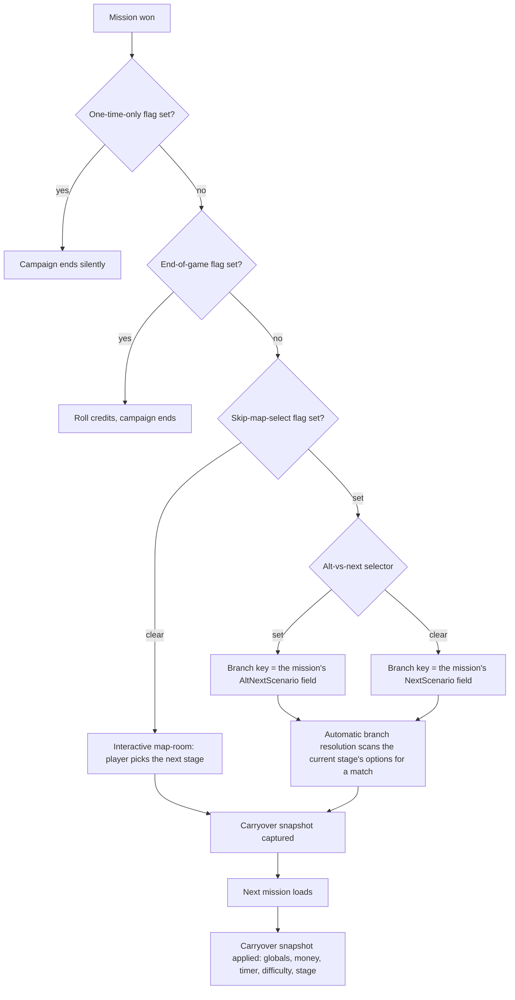

# Campaign progression, mission win, and the variable store

*Last verified: 2026-07-25. Version coverage: **identical mechanism** across Tiberian Sun, Red Alert 2, and Yuri's Revenge for the branch-progression engine, the win→load transition, and the carryover snapshot; the scenario-variable store is likewise identical across all three except one pinned capacity difference — Yuri's Revenge's local-variable array holds 100 entries where Tiberian Sun and Red Alert 2 hold 50. Firestorm's executable was not separately examined for any of this.*

This entry covers what happens at the boundary between two campaign missions: the decision the engine makes the instant a mission is won, the mechanism that turns an authored branch choice into a concrete next map, the fixed bundle of state that survives into that next map, and the two arrays of named boolean flags campaign missions read and write to script around all of it. It does not cover the cinematic map-room's own rendering or audio, the wider trigger/action/event system beyond the handful of cases that touch this store, or the rest of a scenario's save-game contract.

:::note Publication bar
Covers: the win handler's decision tree (silent campaign end, credits end, interactive map-room vs. automatic branch resolution); the four per-frame request flags that separate a win from a loss, a restart/load, or an abort; the branch-graph data model loaded from the per-mission map-select INI and its scan-and-match algorithm; the fixed carryover snapshot (global variables, scaled/capped money, mission timer, difficulty, next-stage key) and its capture/apply timing; the carryover money formula, including its truncation and cap behavior; and the scenario variable store — its record shape, by-index/by-name accessors, INI loading for both arrays, its persistence split, and the high-level shape of its trigger-notify cascade.

Not covered: the map-room's cinematic presentation (video playback, audio, click-map rendering); the wider trigger/action/event system beyond the variable-touching cases cited here; whether shipped retail campaigns actually author branching (multi-option) stages, which is an open content-corpus question the source study leaves unanswered; the exact source of two request-dispatch flags' setters and one carryover accumulator's identity, both unresolved in the source study; and the general scenario save-game contract beyond the variable arrays' confirmed exclusion from it.
:::

## One shared engine, not a Tiberian Sun exclusive

An earlier working hypothesis held that this branch/map-room progression system was a Tiberian Sun feature that later games "streamlined away." That hypothesis does not survive contact with the binaries: the branch-progression engine is the same mechanism, structurally identical, compiled into all three retail executables — Red Alert 2 and Yuri's Revenge even still carry their own build's embedded source-file paths for it. What genuinely differs between the games is *authored campaign content* (how many missions actually define multiple branch options) and the cinematic *presentation* around the choice, not the underlying decision machinery. The rest of this entry describes that one shared mechanism, noting the handful of places — mostly array capacities and file names — where the games do measurably diverge.

## What happens when a mission ends

A campaign mission's outcome doesn't call the win, loss, or restart handling directly. Instead, a per-frame check tests four boolean request flags and dispatches to whichever leaf they indicate:

| Request | Handler behavior |
| --- | --- |
| Win | Captures a fresh carryover snapshot, resolves the next mission, loads it, then restores the snapshot into the freshly loaded scenario. |
| Loss | Presents a restart-or-cancel prompt, then reloads the *current* mission — reapplying whatever carryover snapshot is already resident, with **no fresh capture**. |
| Restart / load | A minimal reload with no dialog — either the current mission restarted, or a saved game loaded — likewise reapplying the resident snapshot with **no fresh capture**. |
| Abort | Returns to the main menu without loading anything. |

Only a win performs a fresh capture. Losing or restarting simply re-applies whatever the *last win* captured — there is nothing new to carry forward from a mission that didn't finish, so this is faithful behavior rather than an oversight.

Two guards wrap the whole decision: it only runs for single-player campaign sessions, and for a networked session with a live session-controller object present, the entire map-room decision is bypassed outright — multiplayer never shows a campaign map-room.

## The win handler's decision tree

On a win, four flags are read in a fixed order, and the order matters: the silent-end flag is checked *before* the credits flag, so if both happened to be set, the campaign would end silently rather than rolling credits — a trap for anyone reading the two checks out of their actual sequence.

Three of those four flags — the one-time-only flag, the end-of-game flag, and the skip-map-select flag — sit inside a single contiguous seven-byte cluster of scenario-level booleans that it shares with unrelated systems: a lighting dirty-flag, the variable store's own dirty flag, the timer-inherit gate used by the carryover apply step, and one further flag that gates whether the end-of-mission score screen is shown. The **alt-vs-next selector is not part of that cluster** — it lives well earlier in the scenario structure, over in the waypoint/timer region, and only its role (choosing between the two branch keys) is confirmed; it has no recovered name.

## Two ways to resolve the next mission

Whichever branch the decision tree takes, both paths converge on exactly the same two observable effects: writing the chosen mission's filename into a shared name buffer, and updating the current stage identifier. Headless simulation can therefore treat "the player clicked stage X in the map-room" and "the branch key resolved to stage X automatically" as two front ends to one identical back-end mutation.

**Interactive map-room.** A full cinematic UI — video, click-map hit-testing, stage descriptions — lets the player pick a destination by hand. This presentation layer is out of scope for this entry; only its two observable effects (the name write, the stage-id update) matter here.

**Automatic branch resolution.** The engine loads the current side's branch graph fresh from the map-select INI, locates the current stage within it, resets the pending next-mission name to blank, and then scans that stage's option list for the one target whose own destination filename matches the branch key chosen by the decision tree above (`NextScenario` or `AltNextScenario`, whichever the alt-vs-next selector flag picked). On a match, the target's filename is written into the name buffer and the stage identifier is updated.

The two ways this can fail are **not** equivalent, and the difference is observable:

- **The current stage resolves, but no option's target matches the branch key.** The name buffer is left **blank**, because the reset runs *before* the scan rather than on failure. A bad or missing branch key does not fall back to the old destination — it clears it. This is a genuine faithful quirk.
- **The current stage id itself fails to resolve.** The resolver fails immediately, on an earlier guard that runs *before* the blank-reset. The name buffer is never touched, so whatever filename it already held stays in place.

So one failure mode clears the pending mission name and the other preserves a stale one, purely because of where each check sits relative to the reset.

## The branch graph: stages, targets, and options

The branch graph for a given side is built by reading a map-select INI file and constructing one stage record per section. The three games name that file differently: Tiberian Sun builds the name from a `MAPSEL%02d.INI` pattern — **one file per side**, numbered with a zero-padded two-digit index — while Red Alert 2 uses a single `MAPSEL.INI` and Yuri's Revenge a single `MAPSELMD.INI`. Each stage carries:

- an identity label used to look the stage up by name (the exact INI key supplying it is not established in the source study);
- a `Scenario=` key — the actual map filename to load if this stage is reached, and the value every option's target is matched against;
- presentation-only data also read here but out of scope for this entry: `MapVQ=`, `VoiceOver=`, `Description=`, `Overlays=`, `ClickMap=`, `Targets=` (map-dot coordinates), and up to seven description strings keyed `Text1` through `Text7` — a one-based range, so a `Text0` key is silently never read;
- up to **256** option slots, keyed by the literal decimal numbers `0` through `255`, each holding the identity label of another stage it branches to.

This graph is rebuilt fresh from the INI every time a branch is resolved — it is not cached across a campaign. One load-time quirk worth knowing: stage construction unconditionally probes for all 256 possible decimal option keys regardless of how many the mission's author actually placed, so a stage's load cost doesn't scale with how many branches it really has.

## What carries over: the fixed snapshot

Between one mission ending and the next one starting, exactly five pieces of state survive the transition, captured into a fixed snapshot buffer and restored after the new mission's own scenario state has been freshly constructed. Campaign continuity is layered on top of a brand-new scenario, not a persisted world:

- all **50** global variable values (see the variable store below);
- the outgoing mission's spendable money, captured *before* any scaling;
- the outgoing mission's remaining mission-timer frames;
- the local player's difficulty/handicap;
- the resolved next-stage identifier.

Applying the snapshot into the freshly loaded mission proceeds in a fixed order: the 50 global values are restored by index; the carryover money formula (below) computes an amount that is credited to the player's spendable balance — and, in the same step, added to a second running accumulator on the player's house whose exact purpose is not established in the source study; the player's difficulty is reassigned; the mission timer is re-armed **only if** a timer-inherit flag is set *and* the captured remaining time was greater than zero, otherwise the timer stays inactive; and the stage identifier is written on every exit path.

One additional documented quirk: an internal timer sub-field is left holding uninitialized memory whenever the carryover cap is at its "uncapped" setting — a genuine retail bug, not a deterministically reproducible value. It doesn't affect the meaningful, observable carried-over time (the remaining-time field itself is always set correctly); only that one internal sub-field is affected.

## The carryover money formula

The amount of money that actually crosses a mission boundary is computed, not copied verbatim:

1. Start from the captured pre-scale money.
2. Multiply by a floating-point ratio (a value of `1.0` keeps 100% of the captured amount).
3. If a cap is set — a plain integer ceiling, with `-1` meaning "no cap" — clamp the scaled amount down to it.
4. **Truncate toward zero** to get the final integer amount (never rounds).

Both the ratio and the cap are per-mission fields populated from that mission's own INI data, and the formula above was read from the floating-point instruction sequence itself. What this research pinned is the pair of fields and the arithmetic they drive; it did not pin the INI key text that writes them, so no key name is asserted here.

## The scenario variable store

Every campaign mission scripts against two arrays of named boolean-style flags living on the scenario itself:

- **Global variables** — campaign-wide, **50** slots in all three engines. Names come from the game's own rules INI `[VariableNames]` section and are label-only: no value is read from there. Their values are **not** preserved in place across a mission boundary — the scenario object is rebuilt on every load and its constructor zero-initializes both variable arrays alike. Globals only *appear* to persist because the carryover apply step described above writes the previous mission's 50 captured values back into that freshly zeroed array immediately afterward. That snapshot is the sole transport; nothing else carries a global forward. (What the INI-loading step specifically does not do is clear the array before reading names into it.)
- **Local variables** — per-mission, **100** slots in Yuri's Revenge, **50** in Tiberian Sun and Red Alert 2. Both the name *and* an initial value come from the current mission's own `[VariableNames]` section, and every slot is reset at the start of each map load.

Each entry has a name of up to 40 characters and a single value byte. Every reader treats that byte as boolean (tests it against zero), but it's stored as a raw byte — the carryover path restores whatever byte was captured, not just 0 or 1.

In the `[VariableNames]` section for either array, the key text is the slot's own decimal index. A global entry is `<index>=<name>`; a local entry is `<index>=<name>,<initial value>`, comma-separated, where the initial value defaults to whatever the slot already held if the comma-separated value is omitted.

**Accessors.** Both arrays expose a set-by-index, a set-by-name (a linear scan through the name table), and a get-by-index. There is no get-by-name accessor in any of the three engines — reads driven by trigger conditions are index-only.

**Change-detect-then-notify.** A write is a no-op unless the new value actually differs from the old one. Only a genuine change marks the store dirty and wakes the notify cascade below; a same-value write still reports the previous value to its caller, but nothing else happens.

**The notify cascade.** When a global or local variable's value genuinely changes, the engine scans the mission's live triggers for any that are specifically listening for that variable being set or cleared, and — for each match — resets that trigger's own elapsed-time and random-delay timers. It does **not** force an immediate re-evaluation or fire the trigger outright; the variable condition itself stays on that trigger's normal polled cadence. This is a narrow "wake the clock," not a push notification.

**Out-of-range reads return stale data, not a clean false.** A variable-set/cleared trigger event that tests an out-of-range index does not see a defined "not set" result — the underlying read cleanly reports failure to itself, but its trigger-event caller doesn't check that failure and reads its output buffer regardless, so an out-of-range test observes whatever byte happened to already be sitting there.

**Unclamped local names.** A local variable's name, read from the mission's own `[VariableNames]` entry, is copied without a length check against the 40-character name field — an unusually long name can spill past it into the following byte. This is reproduced faithfully behind a toggle rather than silently fixed; in practice no vanilla map's variable names come anywhere close to tripping it.

**Persistence.** The two arrays are handled by three entirely separate mechanisms. Neither array is part of the regular scenario save-game data at all — they are plain data reconstructed from INI text every time a scenario loads, not part of the binary save state. Local variables *are* written back into the current mission's own INI file when it's saved (rebuilt from all local slots); global variables are never written back anywhere, since they only ever originate as labels in the rules INI. Global *values* persist across a campaign purely through the carryover snapshot/restore mechanism described above — there is no other transport for them.

**Consumers.** Two paired trigger actions set and clear a global variable; two more do the same for a local variable. Two paired trigger events test whether a global variable was just set or cleared; two more test the same for a local variable. The wider trigger/action/event system these belong to is a separate topic.

## Cross-version verdict

| Aspect | Tiberian Sun | Red Alert 2 | Yuri's Revenge |
| --- | --- | --- | --- |
| Win handler decision tree | Identical mechanism | Identical mechanism | Identical mechanism |
| Branch-graph engine (stage/option scan-and-match) | Identical mechanism | Identical mechanism | Identical mechanism |
| Map-select INI file name | `MAPSEL%02d.INI` (one per side) | `MAPSEL.INI` | `MAPSELMD.INI` |
| Carryover snapshot/apply | Identical mechanism (matching struct layout) | Instruction-for-instruction identical to Yuri's Revenge's version | Identical mechanism |
| Carryover money formula | Identical mechanism | Identical mechanism | Identical mechanism |
| Scenario-variable record and accessors | Identical mechanism | Identical mechanism | Identical mechanism |
| `GlobalVariables` capacity | 50 | 50 | 50 |
| `LocalVariables` capacity | 50 | 50 | **100** |

Every row above was established from the Tiberian Sun, Red Alert 2, and Yuri's Revenge executables. Firestorm's own executable was **not** examined for this system, so this entry records no Firestorm verdict either way.

## What this entry does not claim

- The cinematic map-room's own rendering, video playback, audio, or click-map input handling.
- Whether any shipped retail campaign mission actually authors a multi-option branching stage, or whether every shipped stage effectively has just one option — an open content-corpus question the source study leaves unanswered.
- The exact trigger action-codes responsible for setting the four per-frame win/lose/restart/abort request flags.
- The identity or purpose of the second money-carryover accumulator distinct from the player's spendable balance.
- The INI key names that populate the money-carryover ratio and cap. The fields and the formula they drive are verified; the key text that writes them was not traced to its reader in this pass.
- The wider trigger/action/event system, beyond the variable-touching action and event pairs described here.
- The general scenario save-game contract, beyond the variable arrays' confirmed exclusion from it.

## Corrections

If you can falsify a claim on this page against retail *Command & Conquer: Tiberian Sun*, *Red Alert 2*, or *Yuri's Revenge* behavior, open an issue on the [reTS repository](https://github.com/DasSheep/reTS/issues). Reports are treated as verification input and re-checked against the oracle before the page is updated.
