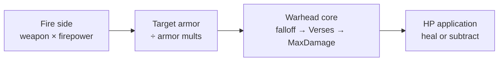

# Damage pipeline

*Last verified: 2026-07-15. Version coverage: **Command & Conquer: Yuri's Revenge** only; Tiberian Sun and Red Alert 2 comparisons are not published here until separately verified.*

How the original engine turns a weapon hit into a health change. This is not a single formula: damage passes through a fixed sequence of stages, and several of those stages convert a floating-point intermediate to an integer by **truncating toward zero**. Swapping two stages that look commutative on paper can change the final integer.

:::note Publication bar
This entry covers only the path that is fully reversed, implemented, and oracle-tested. Early-outs that are verified in the same family (for example Iron Curtain and warp-out immunity on the target side) are named where they sit in order; broader combat systems such as firing loops and weapon selection are separate topics.
:::

## Stage order

Damage moves through three roles, always in this order:



1. **Fire side** — starting from the weapon's base damage, apply the firer's firepower multipliers (unit, house/difficulty, and veteran/elite combat bonuses when those abilities are set). Each multiply is truncated to an integer before the next step.
2. **Target armor** — divide by the target's armor multipliers (difficulty category armor, unit armor multiplier, and veteran/elite armor bonuses when set). Truncate after each relevant divide. After armor, a positive remaining value that would otherwise drop below 1 is raised to **1**.
3. **Warhead core** — distance falloff (when configured), clamp at zero, multiply by the warhead's armor-versus (Verses) entry for the target's armor type, then clamp to the global **MaxDamage** ceiling.
4. **HP application** — subtract from current health (or heal if the finalized value is negative). Lethal hits cap the subtracted amount to the health that remained. Damage-state bands are evaluated on the health before and after the hit.

Friendly-fire immunity, Iron Curtain / force-shield, warp-out, and direct warhead/type immunities (radiation, psychic, poison, and related type flags) sit on the **target side before** the warhead core: when they apply, they zero damage and skip the rest of the hit for that target.

## Warhead core (falloff, Verses, MaxDamage)

Given a non-negative damage integer arriving at the warhead stage, distance in **leptons**, and a warhead:

| Step | Behavior |
|------|----------|
| Hard zero | Damage 0, a global “damage off” condition, or a missing warhead yields 0. |
| Healing shortcut | **Negative** damage does **not** use falloff or Verses. Within **8 leptons** of the impact the full negative value is kept; beyond that it becomes 0. |
| Cell spread radius | `N = trunc(CellSpread × 256)` — one cell is 256 leptons. |
| Linear falloff | Applied only when `PercentAtMax` is not effectively 1.0 **and** `N ≠ 0`. At distance 0 the value stays full (subject to later steps); at distance `N` it reaches `damage × PercentAtMax`; between them it is a linear blend, then truncated. |
| Floor | After falloff, values below 0 become 0. |
| Verses | Multiply by the warhead's Verses entry for the target armor type (stored as a double; for example an INI `25%` is `0.25`), then truncate. |
| MaxDamage | If the result is greater than or equal to rules **MaxDamage**, it becomes MaxDamage. |

Falloff sketch (positive damage, falloff active):

```text
d = trunc(
      damage × PercentAtMax
    + damage × (1 − PercentAtMax) × (N − distance) / N
)
```

## Hit-point application and damage state

After the warhead has produced a finalized integer:

- **Zero or already-dead targets** leave health unchanged (unaffected).
- **Healing** (`d < 0`): health becomes `min(current + |d|, type Strength)`. Healing does not raise combat damage-state events.
- **Damage** (`d > 0`):
  - If the hit would kill, the applied amount is capped to current health.
  - **Yellow band:** half of type Strength is a **hardcoded 50%** threshold (`Strength >> 1`), not a separate configurable yellow rules field. Crossing from at-or-above half to below half marks a yellow transition.
  - **Red band:** threshold is `Strength × ConditionRed` (rules double). Crossing into red overrides yellow for that evaluation.
  - Health is then set to `current − applied`.

Exact numeric examples are pinned by the project's oracle tests; public documentation states the rules, not internal test fixtures.

## What this entry does not claim

- That Tiberian Sun or Red Alert 2 match every Yuri's Revenge step (those diffs are pending).
- That the open fire-side “state multiplier” identities (berzerk-adjacent and related open gates) are fully named; the core firepower × house × unit × veteran path and the target/warhead/HP path above are the published surface.
- The full firing loop, weapon selection, retaliation, or AI threat scoring — separate systems.
- Any reTS-specific API. This page describes the **original engine** behavior recovered for the verified path.

## Corrections

If you can falsify a claim on this page against retail *Command & Conquer: Yuri's Revenge* behavior, open an issue on the [reTS repository](https://github.com/DasSheep/reTS/issues). Reports are treated as verification input and re-checked against the oracle before the page is updated.
