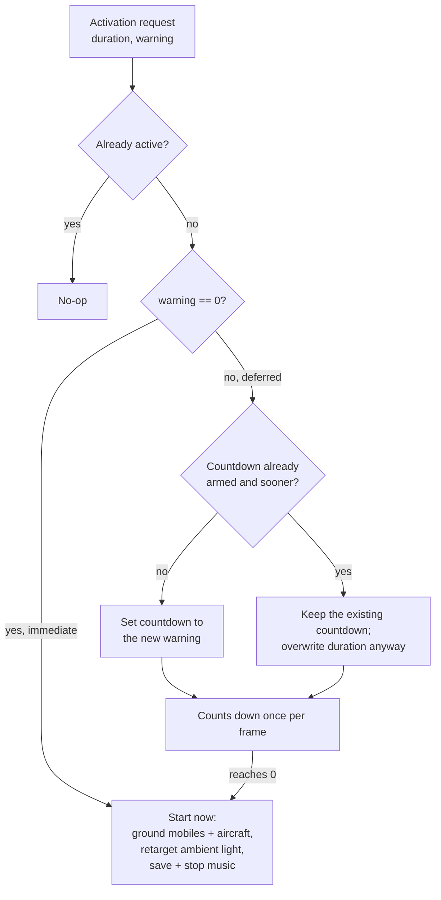
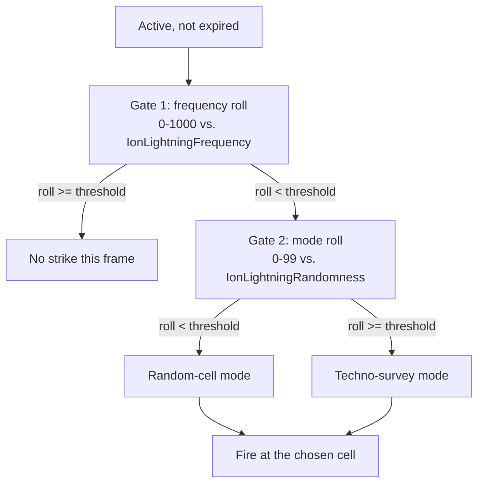

# The Tiberian Sun ion storm

*Last verified: 2026-07-25. Version coverage: **Tiberian Sun** and **Firestorm** share this
system exactly — they run on the same executable, and none of the reversed functions branch
on expansion mode. **Red Alert 2** and **Yuri's Revenge** have no equivalent autonomous
event: the compiled translation unit that implements it was recompiled and repurposed into
their player/AI-fired `LightningStorm` superweapon, a different driver covered in a separate
entry. Only one mechanic — the warning/deferment gate and its announce cadence — is
demonstrably shared across all three games.*

The Tiberian Sun ion storm is a global, self-driving weather event, not a superweapon. Once
armed, it runs on its own from the game's logic tick: it darkens the map, halts locomotion
across the battlefield, grounds aircraft, swaps the music track, and periodically strikes the
ground with damaging lightning, all without anyone clicking anything. This entry covers that
autonomous driver as it exists in Tiberian Sun and Firestorm. It does not cover the Red Alert
2 / Yuri's Revenge `LightningStorm` superweapon, which is a related but distinctly-driven
system documented on its own.

:::note Publication bar
This entry covers the activation state machine (immediate start vs. deferred/warned start),
the warning countdown and its recurring announcement, the expiry test, the per-frame two-stage
random funnel that decides whether a bolt strikes this frame, the weighted survey of
battlefield objects and the random-cell fallback, what changes elsewhere in the game while the
storm is active, the shipped rules defaults, and the lineage relationship to the later games'
`LightningStorm` superweapon. It does not cover the screen-static overlay, the exact visual
shape of the lightning bolt or its impact animation choice, the full struct layout behind the
per-object survey, or whether any shipped Tiberian Sun campaign map actually authors an ion
storm — those remain open per the sections below.
:::

## Activation: immediate start vs. a warned start

The storm has two states — inactive and active — plus a pending sub-state carried by a
countdown value while a warned start is armed. Any activation request carries a duration and
an optional warning length. A warning of zero starts the storm this frame; a nonzero warning
arms the countdown instead:

A request that arrives while a warning is already counting down cannot push an armed storm
further out — the **sooner** of the two warning values always wins. But the **duration** is
overwritten unconditionally on every deferred request, regardless of which warning wins. So
two activation requests aimed at the same pending storm produce the earliest possible start
time, combined with whichever request's duration was authored *last*. This is faithful engine
behavior, not a bug the port works around.

An immediate start (warning zero, including the moment a countdown reaches zero) does five
things at once: it halts every mobile object's locomotor — objects reporting themselves as
"ion sensitive" through their locomotor are powered off, and any object additionally
identified as aircraft is separately grounded — it retargets the map's ambient lighting to the
storm's own tint, it marks the storm active, and it records whatever music track is currently
playing before stopping it, so the original track can resume later.

Ending the storm reverses the locomotor suppression, restores the pre-storm ambient lighting
from a genuinely different source slot than the one activation used (this is not a symmetric
copy of the same value back and forth), clears the active flag, relights the map, and resumes
the saved music track. The two halves of this state machine are **not** mirror images of each
other in their details — start and end walk the battlefield object list in opposite directions,
start alone re-checks each object's re-read-each-iteration position for a shrinking list, only
start special-cases aircraft, and only end guards a specific redraw-flag write against a null
player pointer. None of these asymmetries are externally observable oddities in normal play;
they matter only to anyone re-deriving the exact behavior from scratch.

## The warning countdown

While a warning is pending, the countdown ticks down by one every logic frame. Every 225
frames — 15 seconds, at the engine's 15-frames-per-second logic rate — the countdown fires a
recurring voice announcement and screen message warning that a storm is approaching, repeating
on that same 225-frame boundary until the countdown reaches zero and the storm actually starts.
This 225-frame cadence is, notably, **identical in all three games** — it is the one number
that survived unmodified into the successor system's own deferment mechanic (see
[Lineage](#lineage-the-file-survived-the-class-did-not) below).

## Expiry

Each active-storm frame, before anything else runs, the storm checks whether it has expired: a
signed comparison of the current frame against the frame it started plus its configured
duration. The storm **survives** the exact frame where the elapsed time equals its duration,
and ends on the first frame past that point. A duration value of `-1` is a sentinel meaning the
storm never expires on its own — it can only be ended by an explicit stop request.

## The per-frame strike funnel

Once active and not expired, the storm's per-frame driver decides whether to strike this frame
through a two-stage random draw, always in this order:

**Both** gate-2 and whichever mode follows always draw on any frame that passes gate 1 — the
engine does not skip the mode roll based on gate 1's margin, and it does not skip the target
search based on gate 2's margin. This ordering and draw count is not incidental: the ion
storm's random-number source is shared with the rest of the simulation's determinism, so the
exact number and order of draws taken on a given frame is itself part of the contract, not an
implementation detail (see the [RNG draw ledger](#the-rng-draw-ledger) below).

## Techno-survey mode: a weighted battlefield poll

When gate 2 selects survey mode, the storm walks every object currently tracked by the game
(the global "technos" list) and scores each survivor:

1. An inactive list entry is skipped outright.
2. Any object identified as aircraft is skipped outright — aircraft are already grounded the
   moment the storm started, so they are never lightning candidates.
3. Every surviving object starts at a baseline weight.
4. **If the object's type carries a specific type-level flag** (see the two-flags note below),
   its weight is raised: a building additionally satisfying a separate per-object condition
   gets a much higher weight than the baseline; a unit or infantry object whose locomotor
   reports itself as still powered gets an intermediate weight, six times the baseline.
5. A separate, narrower veto can still remove an object from consideration afterward: a
   ground-type object meeting a specific unrelated precondition is dropped unless its type
   carries that same type-level flag.
6. Each object that survives all of the above rolls once against its assigned weight — this is
   **one random draw per surviving object**, not one draw for the whole survey. An object whose
   roll fails contributes nothing further.

If at least one object survives its roll, one of the survivors is picked uniformly at random
and its position converted to a map cell (leptons to cells, truncating toward zero — a small
but faithful detail for objects sitting at negative coordinates). If none survive, no bolt fires
this frame even though gates 1 and 2 both passed.

**The number of random draws this mode consumes depends on how many objects are alive and
active at the moment the storm ticks.** A reimplementation that batches the survey, filters
candidates before rolling, or otherwise changes which objects consume a draw will desynchronize
from the original even if every individual formula it uses is correct — because the *count* of
draws taken, not just their values, is what has to match.

### The two "ion sensitive" flags — do not conflate them

There are **two separate flags** in this system that both relate to the concept "sensitive to
the ion storm," and they are read by completely different code paths:

- A **weapon-level** flag — this one *is* the shipped `IonSensitive` INI key — is read by the
  engine's can-this-weapon-fire check, and a weapon carrying it simply cannot fire while the
  storm is active. No shipped weapon in retail sets this flag, so in unmodified play it is a
  modding-only surface with no observable effect.
- A **separate, object-type-level** flag is what step 4 above actually reads to decide whether
  a building or moving unit gets a raised survey weight. Its INI key is **not established** by
  the underlying research — it is confirmed to exist and confirmed to be a distinct flag from
  the weapon-level `IonSensitive` key, but no key name has been pinned to it. Anyone looking for
  the setting that controls lightning-target weighting should not go looking for `IonSensitive`
  in an object type's section; that key does something else entirely, and setting it will not
  change survey weighting.

A third, unrelated key, `IonImmune`, exists elsewhere in the engine's data and is not part of
this system at all.

## Random-cell mode: rejection sampling

When gate 2 selects random-cell mode instead, the storm repeatedly draws a Y coordinate against
the map's height and an X coordinate against the map's width — in that order, Y before X — and
retries the pair until it lands on a cell the game currently considers radar-visible. Each
iteration of the retry loop draws two random numbers. There is no separate iteration cap in the
original engine; the loop runs until it succeeds.

## Firing the bolt

Whichever mode chose a cell, the storm plays a strike sound, spawns the impact explosion
animation, and applies damage to that location. The damage call passes no attacking source —
an ion-storm kill is unattributed: it earns no kill credit for any house and provokes no
retaliation AI response, because as far as the combat system is concerned nobody fired it. If
the strike visibly changed the cell (a building or object present, the cell's height, or its
terrain type differing from before the hit), a handful of scorch or debris decorations are
spawned at the site as well. The bolt's own climbing visual, which jitters horizontally as it
rises from the impact point to its full height, draws two more random numbers per visual
segment as it climbs — this presentation detail consumes the same random-number stream as the
gameplay decisions above it, so its draw count is part of the determinism contract even though
nothing about its final appearance affects the simulation.

## What else changes while the storm is active

Beyond the locomotor and lighting changes applied at activation, a number of other systems
check the storm's active flag directly, every frame it matters:

| System | Effect while the storm is active |
| --- | --- |
| Flying-object movement | Flying objects are rerouted to path as if they were ground units, rather than flying — this is the mechanism behind "aircraft grounding" during a storm |
| Jump-jet flight | Jump-jet-capable objects are prevented from taking flight at all, unconditionally |
| Radar availability | The player's radar is forced unavailable, without even checking whether the house has the power or buildings that would normally grant it |
| Weapon firing | A weapon carrying the `IonSensitive` weapon flag (see above) cannot fire |
| Newly-created objects | An object placed into the world while the storm is active is born with its locomotor already powered off if that locomotor is ion-sensitive, rather than powered on as usual — objects created mid-storm inherit its suppression from the moment they exist |
| Ambient lighting | Uses the storm's own light-table entries in place of the normal ones |
| Authored lighting changes | A scenario action that changes the ambient light writes its target normally but defers actually applying it to the live view while a storm is active |
| Music | The pre-storm track is saved at activation and resumed at the end, rather than simply restarting |

## Shipped rules defaults

The relevant `[General]` rules keys as shipped in retail's rules data. Firestorm's own rules data
carries identical values for every key below:

| Key | Shipped value | Role |
| --- | --- | --- |
| `IonStorms` | `no` | A general on/off toggle. The underlying research did not locate this specific key's reader, so no consequence of this shipped value is asserted here — only the value itself. |
| `IonStormDuration` | `120` (seconds, as authored) | Parsed and stored, but **not read by the activation call that actually starts a storm** — see the duration trap below. |
| `IonStormWarning` | `31` (seconds, as authored) | The default warning length; scaled by 15 into frames wherever it is consumed. |
| `IonLightningFrequency` | `10` (percent, as authored) | Gate 1's threshold, stored scaled into the 0–1000 draw space the frame-by-frame roll uses. |
| `IonLightningRandomness` | `90` (percent) | Gate 2's threshold: **90% of strikes that occur pick a random cell**, and only the remaining 10% run the object survey. |
| `IonLightningDamage` | `500` | The damage figure passed into the strike's damage application. |
| `IonStormWarhead` | `IonWH` | The warhead applied to a strike. |
| The ion-storm crate powerup | weight `0` | Shipped with zero selection weight in the crate table. |

Gate 1 draws against a 0–1000 range, and `IonLightningFrequency` is authored as a percentage, so
the authored figure is scaled up by 10 before the comparison — the shipped `10` becomes a stored
`100`, i.e. a strike is attempted on one active frame in ten. Two different confidence grades are
worth separating here: that the stored value is compared against a 0–1000 draw is certain, read
directly from the comparison; the ×10 scaling was traced through the rules layer's shared
percentage helper with high confidence rather than confirmed instruction by instruction.

### The dead `IonStormDuration` key, and two authoring paths that disagree

`IonStormDuration` is read into the rules structure like any other key, but **nothing that
actually starts a storm ever reads it back out.** The duration a storm actually runs for comes
entirely from the triggering action's own authored parameter, not from this rules key. It is a
declared-and-parsed-but-functionally-unused setting in retail.

There are two distinct places in the scenario-scripting surface that can start a storm, and
they do **not** agree on how they interpret that authored duration number:

| Authoring path | How its duration argument is interpreted |
| --- | --- |
| The trigger action that starts an ion storm | The authored number is treated as **seconds** and scaled by 15 into frames |
| The team-mission step that starts an ion storm | The authored number is passed through **unscaled**, and effectively treated as frames |

Both paths scale the warning length by the same factor of 15, so only the *duration* half of
this diverges. The practical consequence: a scenario author who puts the same number into a
trigger action and a team-mission step, expecting the same storm length, gets a storm from the
team-mission path that lasts **1/15th** as long as the trigger-action version. This is
worth knowing because the standard tooling documents it the other way round: FinalSun, the
official Tiberian Sun map editor, describes trigger action 44 ("Ion Storm start") in its own
data file as taking "the specified number of game frames." The binary treats that parameter as
seconds and scales it by 15, so a map author following the editor's description gets a storm
fifteen times longer than intended. The editor's description is what does not match the engine —
not the other way around.

Both authoring paths also guard themselves so that starting an already-active storm, or
stopping one that isn't active, is a harmless no-op — and the underlying activation routine
repeats that same guard internally, so the check effectively runs twice on every path. This is
redundant, not broken, and it is faithfully preserved rather than optimized away.

## Dead code recorded, not modeled as live behavior

Two pieces of this system are established as dead code and are called out here only as such,
never as active behavior:

- A natural-looking setter for the storm's active flag exists in the compiled code but has
  **zero call sites anywhere in the executable** — the state machine writes the flag directly
  instead of ever calling it. It is a declared-but-unused accessor, not a hidden second entry
  point.
- The post-load hook that reasserts the storm's suppression effects on every ion-sensitive
  object after a saved game is restored contains an internal branch, gated on one of its own
  parameters, that spawns the screen-static overlay. That branch's only real-world caller
  always passes the value that skips it — so in retail, that branch never executes. The hook
  itself is very much live: it is what makes a mid-storm save-and-reload correctly resume the
  storm's suppression effects on every affected object, and it draws no random numbers when it
  runs.
- A weight-comparison guard inside the object survey checks for a sentinel value that no code
  path in the survey ever actually produces — it is unreachable defensive code, left in the
  compiled binary but never taken.

## The RNG draw ledger

Because the ion storm's random draws are taken from the same source used elsewhere in the
simulation, and because several of its draw counts vary with live game state rather than being
fixed, the complete draw shape per frame is:

| Situation | Draws taken, in order |
| --- | --- |
| Inactive, nothing pending | none |
| Inactive, counting down | none |
| Active, gate 1 fails | one (the gate-1 roll) |
| Active, techno-survey mode | gate 1, gate 2, then one roll per surviving object, then one pick if any object survived |
| Active, random-cell mode | gate 1, gate 2, then two draws per rejection-sampling attempt until a radar-visible cell is found |
| A bolt actually fires | plus a debris-count roll and further picks if the cell visibly changed, plus two draws per segment of the bolt's climbing visual |

## Lineage: the file survived, the class did not

The most notable finding here is not about the mechanism itself but about what happened to it.
Red Alert 2 and Yuri's Revenge have no equivalent of this autonomous, self-driving weather
class at all — but the underlying source file did not disappear. Both later executables still
carry the compiler-embedded build path of the exact translation unit that implements the ion
storm, sitting in the same string cluster as the interface text for their own `LightningStorm`
superweapon. Red Alert 2's executable contains the path as `D:\Ra2\Ion.cpp`; Yuri's Revenge's
contains it as `D:\ra2mdpost\Ion.cpp` — a differing build root consistent with Yuri's Revenge
having rebuilt the file from a later checkout rather than reusing an untouched object file.

In other words: **the later games did not delete this system, they recompiled and repurposed
the same source file as their per-house superweapon.** `LightningStorm` is Tiberian Sun's ion
storm, rebuilt with a new entry point and a new set of behaviors layered on top, never renamed
at the file level even though its class-level identity changed completely.

The two systems are reached from genuinely different places, and this is provable from their
call graphs rather than merely assumed from the shared file:

- In Tiberian Sun, the routine that actually starts a storm has exactly four callers: the
  storm's own per-frame driver (a self-triggered restart once a countdown elapses), the live
  trigger-action dispatcher, one specific standalone trigger-action handler, and one specific
  team-mission step. Every one of those is either the autonomous tick itself or a scripted
  scenario verb. There is no owning house, no charge cost, no player-facing "fire" button
  anywhere in that call graph.
- In Yuri's Revenge, the equivalent start routine is reached primarily through the generic
  per-house superweapon pipeline shared by every other superweapon in the game — both the
  player's own click-to-fire path and the AI's automatic-fire path funnel through it — plus a
  separate scripted-scenario override path. A couple of additional call sites reach it directly
  outside both of those routes and have no statically-found callers of their own, so "reachable
  only through the superweapon pipeline" slightly overstates it; "primarily the superweapon
  pipeline, plus a scripted override, plus a couple of unexplained direct entries" is the
  accurate statement.

Neither the autonomous class nor the superweapon has a distinct object identity of its own in
the executable — both are implemented as plain functions operating on static state, not as
instances of a polymorphic class hierarchy. Red Alert 2 and Yuri's Revenge attach per-house
superweapon ownership to this shared function externally, through their generic
superweapon-dispatch layer, rather than through any inheritance relationship inside the storm
code itself.

The **one mechanic that demonstrably crossed over intact** is the deferment/warning gate: the
warning-length concept passed as the second argument to Tiberian Sun's storm-start routine is
the same concept Red Alert 2 and Yuri's Revenge expose through their own superweapon-deferment
rules setting, and — as noted above — the 225-frame recurring-announcement cadence is
byte-identical across all three games. Every other part of the design changed: the later games'
driver tracks its own cloud and bolt object lists and runs on a cadence/finalize state machine
instead of a warning-countdown-then-tick design, it has no per-object weighted survey (the
target selection logic is different), and it never grounds aircraft.

:::caution Not to be confused with the Ion Cannon
A separate, unrelated class that handles the Ion Cannon superweapon's blast visuals sits
immediately next to this system in the compiled binary and shares part of its name pattern.
Adjacency in the compiled binary is not membership: the Ion Cannon's blast handler is a
distinct system with its own INI-driven visuals, and the storm described on this page spawns
its own, ordinary impact animation rather than reusing the Ion Cannon's blast object.
:::

## What this entry does not claim

- The exact appearance of the screen-static overlay or the cell relighting loop run at the end
  of a storm — both are presentation-only paths that were not reversed past their outward shape.
- The full field layout behind the per-object survey's building- and foot-unit-specific
  conditions, or the canonical names of the locomotor interface's individual capability checks
  — these are pinned by their behavior and calling position, not by a confirmed public name.
- The INI key name for the object-type-level flag that gates survey weighting — see the
  two-flags note above; no key name is asserted for it.
- Any consequence of the shipped `IonStorms = no` rules value — its reader was not located, so
  only the shipped value is stated.
- Whether any shipped Tiberian Sun campaign map actually authors an ion-storm trigger or
  team-mission step. The maps themselves were not inspected for this entry.
- Whether the three standalone scenario-scripting handlers noted as separate from the live
  trigger dispatcher (one trigger-action handler, two team-mission steps) are genuinely
  unreachable duplicates of logic the live dispatcher already inlines, or are reached through a
  call path this research could not resolve. Both are left open.
- Any claim that reTS is a playable shipped client. This page describes the **original
  engine's** behavior as recovered and verified, independent of reTS's own implementation
  status.

## Corrections

If you can falsify a claim on this page against retail *Command & Conquer: Tiberian Sun*,
*Firestorm*, *Red Alert 2*, or *Yuri's Revenge* behavior, open an issue on the
[reTS repository](https://github.com/DasSheep/reTS/issues). Reports are treated as verification
input and re-checked against the oracle before the page is updated.
