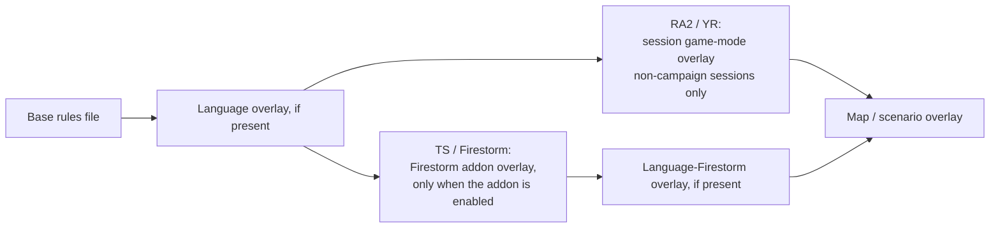

# Warhead rules interpretation

*Last verified: 2026-07-16. Version coverage: **Tiberian Sun** (Firestorm is TS's own
expansion mode, not a separate binary), **Red Alert 2**, and **Yuri's Revenge** — each
game's own Warhead field surface and constructor defaults are independently verified.
The generic INI value-reading behavior described below is directly verified against the
**Yuri's Revenge** binary; it is assumed, not independently binary-confirmed here, to
carry over to Red Alert 2 and Tiberian Sun given the shared engine lineage.*

:::note Publication bar
This entry covers the value readers used while loading a `[Warhead]`-style section
(boolean, double/float, and integer fields, plus the `Verses=` list), the re-read/overlay
behavior that applies to every pass over a Warhead section, and the exact field surface
each game's `WarheadTypeClass` supports. It does not cover rules-file discovery from disk,
the full 30+ other section readers, or non-Warhead type inheritance.
:::

## How a stored INI value becomes a field

Warhead sections are read with the same handful of scalar-value readers the rest of the
rules file uses. Three matter here. **These readers are directly verified against the
Yuri's Revenge binary; Red Alert 2 and Tiberian Sun are assumed — not independently
binary-confirmed in this entry — to share the same reader behavior given the common
engine lineage.**

### Boolean fields — a first-character switch

Only the **first character** of the stored value is inspected, case-insensitively:

| First character (case-folded) | Result |
|---|---|
| `1`, `T`, `Y` | `true` |
| `0`, `F`, `N` | `false` |
| anything else, including an empty value | the caller's default is kept |
| key missing entirely | the caller's default is kept |

"Anything else" is a real trap: a value like `Tomate` reads as `true` (first character
`T`), while `neither` reads as `false` (first character folds to `N` — which the switch
treats as false, not as "unrecognized"). A value like `maybe` (`M`) falls outside the
switch and falls back to the default instead.

The "default" passed into this reader is not a hardcoded constant — it is **the field's
current value** at the moment of the read. That is what makes a missing key non-destructive:
if this INI layer doesn't mention the key, the field is left exactly as the previous layer
(or the constructor) set it.

### Double/float and integer fields

- **Double/float fields** are parsed as a `float` first, then widened to `double`. If a
  percent sign appears **anywhere** in the stored value (not necessarily immediately after
  the number), the parsed value is multiplied by `0.01`. So `25%` and `0.25` both store
  `0.25`, but the percent form goes through an extra float→double widening step the plain
  form does not.
- **Integer fields** read a leading `$` or a trailing `h`/`H` as hex; everything else is
  decimal, parsed the way C's `atoi` parses a prefix (non-numeric text reads as `0`).
- Both readers use the same "current value is the default" rule as the boolean reader: a
  missing key preserves whatever the field already holds.

### `Verses=` is a special case, not a generic double list

`Verses=` is read as one comma-separated string, then split into per-armor-type
percentages/multipliers. Two things make it different from an ordinary double field:

- **Percent tokens use a truncating integer parse, not the float-first double reader.**
  A token containing `%` is parsed with an integer prefix scan *before* the `×0.01` scale,
  so `Verses=...,12.5%,...` stores `0.12` for that slot — the fractional `.5` is lost
  because the percent branch never reaches a floating-point parse. A non-percent token
  (e.g. `0.3333333333333333`) goes through a direct double parse instead, which keeps full
  precision. The two token forms in the same `Verses=` list are not equivalent in precision.
- **A missing `Verses=` key does not reset the table.** The loader passes a literal
  "100% in every slot" string as ReadString's own fallback value, but it only tokenizes and
  stores when the key lookup actually succeeded; when the key is absent, the tokenize step
  is skipped entirely and the field is left at its prior value — the same preserve-on-absence
  rule as every other field, despite `Verses=` going through a different code path to get there.

## Repeated overlay passes: absence always preserves, never resets

A rules file is not read once. The base file, an optional language overlay, and (per game,
see below) a session- or map-level overlay each make their own pass over every section,
including every already-loaded Warhead section. Across all three games:

- **Present key** → the field is overwritten with the newly parsed value.
- **Absent key** → the field is left at whatever the previous pass (or the constructor) set
  it to. This is not a special case for Warhead — it falls directly out of "current value is
  the default" for every reader above.
- **Absent section** → nothing about that Warhead entry is touched at all.
- **Warhead sections are found-or-created, never removed mid-session.** A later pass that
  sees a section it has already loaded re-reads into the *same* entry rather than replacing
  it, so a Warhead accumulates overlay changes across every pass in the same order the
  passes occur.
- There is **no section-level inheritance** anywhere in this loading path — a `[Parent=...]`-
  style mechanism does not exist. This is confirmed for **Yuri's Revenge** (corroborated by
  the Ares/Phobos mod source, which builds on top of the same loading path); Tiberian Sun and
  Red Alert 2 are inferred to behave the same way by structural analogy to the shared
  type-loading base classes, not independently confirmed from their own binaries here. A
  section named e.g. `[Defaults]` is a literal, independent section like any other; it is not
  an engine keyword that other sections inherit from. The only thing that plays the role of a
  "default" is the constructor's own initial value, which absence-preserving reads never
  disturb.

Per game, the layers that stack on the base rules file differ:

Yuri's Revenge has no separate expansion overlay of its own — its expansion content
already ships inside the base rules file, unlike Tiberian Sun where Firestorm is a distinct
optional addon layer gated on whether the addon is enabled. Every layer in this chain,
regardless of game, re-runs the same present-overwrites / absent-preserves behavior over
every Warhead section it encounters.

## Per-game Warhead construction

Each game's `WarheadTypeClass` is a different concrete layout with its own constructor
defaults. All three initialize every `Verses` slot to `1.0` (no damage reduction) and
`ProneDamage` to `1.0` (no prone-infantry damage change) before any INI is read:

| | Tiberian Sun / Firestorm | Red Alert 2 | Yuri's Revenge |
|---|---|---|---|
| `Verses` armor slots | **5**, each defaulting to `1.0` | **11**, each defaulting to `1.0` | **11**, each defaulting to `1.0` |
| `ProneDamage` default | `1.0` | `1.0` | `1.0` |
| `DelayKillFrames` default | not a field in this game (see matrix) | `5` | `5` |
| `DelayKillAtMax` default | not a field in this game | `1.0` | `1.0` |
| `AffectsAllies` default | not a field in this game | not a field in this game | `true` |

Tiberian Sun stores its `Verses` table as 5 doubles in its own `WarheadTypeClass` layout,
separate from RA2/YR's 11-double array. This entry does not assess how TS's 5 armor-type
slots relate to RA2/YR's 11 — whether they correspond to the first 5 of the larger table or
represent a distinct taxonomy is outside what was verified here.

## Supported field matrix

`ABSENT` means the game's `WarheadTypeClass` has **no corresponding field at all** — not a
supported field that merely defaults to a falsy/zero value. Applying a key for an absent
field to that game is a no-op; it is not silently redirected onto some other field.

| Field | TS / Firestorm | RA2 | YR |
|---|---|---|---|
| `Verses` | 5 slots, default `1.0` each | 11 slots, default `1.0` each | 11 slots, default `1.0` each |
| `CellSpread` (splash radius, cells) | **ABSENT** | supported, default `0.0` | supported, default `0.0` |
| `CellInset` (inner splash inset, cells) | **ABSENT** | supported, default `0.0` | supported, default `0.0` |
| `PercentAtMax` (falloff floor fraction) | **ABSENT** — see caution below | supported, default `1.0` | supported, default `1.0` |
| `CausesDelayKill` | **ABSENT** | supported, default `false` | supported, default `false` |
| `DelayKillFrames` | **ABSENT** | supported, default `5` | supported, default `5` |
| `DelayKillAtMax` | **ABSENT** | supported, default `1.0` | supported, default `1.0` |
| `CombatLightSize` | **ABSENT** | supported, default `0.0` | supported, default `0.0` |
| `Conventional` | supported, default `false` | supported, default `false` | supported, default `false` |
| `WallAbsoluteDestroyer` | **ABSENT** | supported, default `false` | supported, default `false` |
| `PenetratesBunker` | **ABSENT** | **ABSENT** | supported, default `false` |
| `Tiberium` | supported, default `false` | supported, default `false` | supported, default `false` |
| `Rocker` | supported, default `false` | supported, default `false` | supported, default `false` |
| `Bright` | supported, default `false` | supported, default `false` | supported, default `false` |
| `InfDeath` (infantry death-animation selector) | supported, default `0` | supported, default `0` | supported, default `0` |
| `Deform` (terrain deformation, double) | supported, default `0.0` | supported, default `0.0` | supported, default `0.0` |
| `DeformThreshold` | supported, default `0` | supported, default `0` | supported, default `0` |
| `EMEffect` | supported, default `false` | supported, default `false` | supported, default `false` |
| `MindControl` | **ABSENT** | supported, default `false` | supported, default `false` |
| `Poison` | **ABSENT** | **ABSENT** | supported, default `false` |
| `IvanBomb` | **ABSENT** | supported, default `false` | supported, default `false` |
| `ElectricAssault` | **ABSENT** | supported, default `false` | supported, default `false` |
| `Parasite` | **ABSENT** | supported, default `false` | supported, default `false` |
| `Temporal` | **ABSENT** | supported, default `false` | supported, default `false` |
| `Airstrike` | **ABSENT** | **ABSENT** | supported, default `false` |
| `Psychedelic` | **ABSENT** | **ABSENT** | supported, default `false` |
| `Paralyzes` | **ABSENT** | supported, default `0` | supported, default `0` |
| `Culling` | **ABSENT** | supported, default `false` | supported, default `false` |
| `ProneDamage` | supported, default `1.0` | supported, default `1.0` | supported, default `1.0` |
| `Radiation` | **ABSENT** | supported, default `false` | supported, default `false` |
| `PsychicDamage` | **ABSENT** | supported, default `false` | supported, default `false` |
| `AffectsAllies` | **ABSENT** | **ABSENT** | supported, default `true` |

### Divergences that look like renames but are not

Two pairs of fields are easy to mis-map across games; treating either pair as "the same
field under a different name" is wrong:

- **`CellSpread` (RA2/YR) is not Tiberian Sun's splash-radius control.** Tiberian Sun has
  its own, separately-named integer splash-radius field that is not part of this modeled
  surface and is not read as `CellSpread=`.
- **`WallAbsoluteDestroyer` (RA2/YR) is not Tiberian Sun's wall-related flag.** Tiberian
  Sun carries its own distinct wall-related field; the two are unrelated bits, not a
  renamed version of one another.
- Red Alert 2 also does not carry Yuri's Revenge's `PenetratesBunker` — it is genuinely
  absent, not merged into another RA2 field.

:::caution What this table deliberately omits
Tiberian Sun has **no `PercentAtMax` field of any kind** — no linear-falloff floor exists
in its Warhead surface at all. This entry states that as an absence and does not publish
any numeric value for it. (An internal placeholder value used purely as a Rust struct's
uniform-initialization convenience is not a Tiberian Sun binary default and does not appear
here.)
:::

## Tiberian Sun's non-normal-session override on one specific section

Tiberian Sun has one additional, narrowly-scoped behavior with no RA2 or YR equivalent.
After a Warhead section has finished its ordinary key reads, the loader checks the
session's current type. If the session's type is **not** the game's pinned baseline session
state (`Session.Type == GAME_NORMAL`) — this entry does not characterize which specific
session kinds (Campaign, Skirmish, or otherwise) fall on which side of that check — *and*
the section being read is exactly the `[ARTYHE]` artillery warhead section (matched by that
section identifier, not any warhead that merely resembles it), the loader unconditionally
overwrites two of that section's just-read fields:

| Field | Forced value |
|---|---|
| `Verses` (all 5 TS armor slots) | `0.4, 0.85, 0.68, 0.35, 0.35`, in slot order |
| `ProneDamage` | `0.3` |

This happens **after** the section's own INI keys are applied, so it wins over whatever a
mod's `Verses=`/`ProneDamage=` for that exact section produced when the session is outside
the baseline state — and it does not run at all while the session is in that baseline
state, nor for any other Warhead section (an otherwise-identically-named section under a
different identifier is untouched), nor in Red Alert 2 or Yuri's Revenge.

This is a **session-type check**, not a Firestorm-addon flag: Firestorm is Tiberian Sun's
own expansion sub-mode (a separate addon-enabled condition), and this override's guard is
independent of whether that addon is active.

## What this entry does not claim

- That the artillery-section override's baseline-session guard (`Session.Type == GAME_NORMAL`)
  maps onto retail's Campaign/Skirmish/other session distinctions in any particular way — only
  the guard's trigger constant is pinned here, not which named session kinds fall on which side
  of it.
- That the generic INI value readers (boolean/double/integer/`Verses=`) were independently
  verified against the Red Alert 2 or Tiberian Sun binaries — they are verified against Yuri's
  Revenge and assumed shared across the lineage.
- That Tiberian Sun's 5-slot `Verses` armor taxonomy corresponds to (or diverges from) the
  first 5 slots of RA2/YR's 11-slot table — that relationship was not analyzed here.
- That Tiberian Sun has a `PercentAtMax`, splash-radius (`CellSpread`-style), or delayed-kill
  surface at all — those are stated as absent, not as unpublished values.
- That the field lists above are the complete `WarheadTypeClass` layout for any of the three
  games — they are the fields this reference currently tracks; additional fields may exist
  that are not yet published here.
- That rules-file *discovery* (which files are opened from disk, in what search order) is
  covered here — this entry starts from an already-open, already-selected rules file.
- That every other section type (weapons, projectiles, techno types, …) follows identical
  re-read semantics — the preserve-on-absence and no-inheritance findings are stated for
  the Warhead-loading path checked here, not asserted as a blanket claim about every reader
  in the file.
- A pinned behavior for a malformed or short `Verses=` list (fewer than the expected number
  of comma-separated tokens) — that case is not asserted here.
- Any reTS-specific API. This page describes the **original engine's** behavior.

## Corrections

If you can falsify a claim on this page against retail *Tiberian Sun*, *Red Alert 2*, or
*Yuri's Revenge* behavior, open an issue on the [reTS repository](https://github.com/DasSheep/reTS/issues).
Reports are treated as verification input and re-checked against the oracle before the page
is updated.
