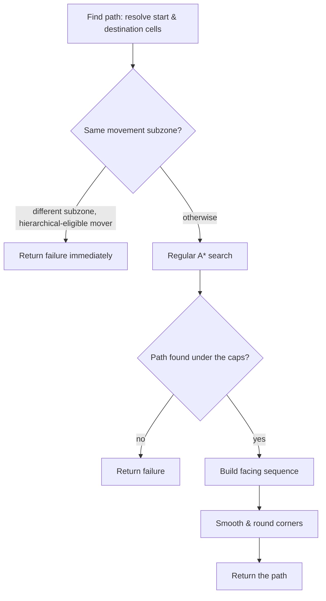

# A* pathfinding

*Last verified: 2026-07-21. Version coverage: **Tiberian Sun**, **Red Alert 2**, and **Command & Conquer: Yuri's Revenge**. The search algorithm, the heuristic, and every cost constant are identical across the three engines. The only differences are internal representation details — one reserved-cell flag stored at a different bit position in Tiberian Sun, and one debug-log guard present only in Yuri's Revenge — neither of which changes the path a unit takes.*

This entry covers the **regular (non-hierarchical) pathfinder** the original engine uses to route a ground unit from one cell to another across the map. A separate *hierarchical* pathfinder exists for long-range planning; it is a distinct system and is not described here.

The map is a fixed grid of cells. Pathfinding works on that grid: given a start cell and a destination cell for a moving object, the engine runs an A* search, then rewrites the resulting node chain into a sequence of eight-way facings for the unit to follow.

## The search at a glance



## The A* search

The open list is a **binary min-heap keyed on each node's f-cost** (`f = g + h`). Nodes are expanded lowest-f first, in the usual A* manner.

- **g-cost** is the accumulated movement cost from the start, summed edge by edge.
- **h-cost (the heuristic) is straight-line Euclidean distance** to the goal — `sqrt(dx² + dy²)` in cells — applied at **weight 1.0, unweighted**. There is no inflation factor baked into the heuristic itself; all tie-breaking and weighting lives in how each edge's cost is built (below).

Equal-cost ties resolve deterministically: when two nodes carry exactly the same key, they stay in insertion order among siblings rather than reordering. This matters for reproducing the exact route a unit picks when several are equally short.

### Visited tracking

The search does **not** mark cells with per-cell "visited" flags. Instead it keeps a **generation stamp** per cell in a side table owned by the pathfinder. Each new search bumps a global counter; a cell's stamp is only meaningful when it equals the current counter. This lets every search after the first invalidate all prior visited-state in constant time — the full table is cleared exactly once, ever, per run of the game.

## Movement cost

Each candidate step's edge cost is:

```text
edge_cost = base_verdict_cost × distance_scale + per_direction_additive
```

`distance_scale` defaults to **1.0**.

### Base cost by movement verdict

Before a step is costed, the engine asks whether the destination cell is passable and, if not, *why*. That verdict selects a base weight (values are identical in all three engines):

| Cell verdict | Base cost |
|---|---|
| Clear / passable | 1.0 |
| Blocked by a cloaked object | 1000.0 |
| Blocked by a moving object | 4.0 |
| Closed gate | 1.0 |
| Friendly destroyable obstacle | 60.0 |
| Destroyable obstacle | 20.0 |
| Temporarily blocked | 8.0 |
| Impassable | 10000.0 |

The "moving object" case is **4.0** in ordinary search. In one special mode — a cheap "can this even be reached?" reachability probe — a moving blocker instead costs **1000.0**, effectively steering around live traffic hard while still admitting it as a last resort.

### Per-direction tie-break additive

A tiny per-direction value is added to every step. It is a **deterministic tie-breaker, not a distance term**:

| Direction | Additive |
|---|---|
| North | 0.001 |
| East | 0.002 |
| South | 0.003 |
| West | 0.004 |
| North-east | 0.005 |
| South-east | 0.006 |
| South-west | 0.007 |
| North-west | 0.008 |

These values are far smaller than any base cost, so they never change which route is cheaper — they only decide the order in which equally-cheap options are considered, keeping the search reproducible.

### There is no separate diagonal multiplier

Notably, the original engine applies **no octile / √2 diagonal-distance multiplier** in this cost path. A diagonal step is not intrinsically costed as `1.414` of a straight step. Whatever straight-versus-diagonal weighting exists is already folded into the base verdict cost plus the small additive above — there is no separate diagonal distance table.

### Bridge and reserved-cell surcharges

Two multiplicative surcharges apply on top of the base cost:

- **Reserved-cell surcharge (×4.0).** Cells that another unit's already-committed path passes through are transiently marked. Stepping onto such a cell multiplies the cost by **4.0** — a soft coordination signal that discourages, without forbidding, crossing a peer's planned route.
- **Bridge-diagonal surcharge.** In the bridge-aware diagonal pass, a diagonal step past bridge corners is scaled by **1.0**, **2.0**, or **10.0** depending on which of the flanking corner cells are bridge cells. This only fires on the alternate (bridge) layer with diagonal movement enabled; on ordinary flat ground it does not apply.

## Termination and caps

The search stops on the first of several conditions:

- **Destination reached** — the node about to be expanded is the goal at the correct height layer.
- **Open list exhausted** — no path exists within the reachable region.
- **Node budget** — a per-call iteration budget; when the caller asks for the default it is **65,527** expansions.
- **Hard expansion cap of 10,000.** The pathfinder carries its own internal safety valve: if a path is only found on or after the **10,000th** node expansion, it is **discarded and the search reports failure** rather than returning the route. This cap is independent of the caller's budget.

The working buffers are fixed-capacity: **65,536** search nodes and **131,072** parent-link records. On any shipped map, the 10,000-expansion cap is reached long before these buffers could fill.

## The cross-subzone early failure

At dispatch time, before any search runs, the engine resolves the start and destination into movement **subzones**. There is one asymmetry worth documenting:

> When the start and destination fall in **different** subzones **and** the moving object is eligible for hierarchical pathfinding, the dispatcher **returns failure immediately** — it runs neither the hierarchical nor the regular search for that request. A mover that is *not* hierarchical-eligible, asking for the exact same start-and-destination geometry, instead gets a full regular search.

This is verified control flow in all three engines. Whether ordinary unit movement ever actually issues a cross-subzone request through this path — that is, whether the early failure is reachable in normal play or is effectively dead defensive code — is not established here.

## Tunnels

Beyond the eight compass directions, the search treats a **ninth "direction"** as a tunnel-network hop: if the current cell is a tunnel entrance, the search can step to the tunnel's paired exit cell. The cost of a tunnel hop is the **Chebyshev distance** (the larger of the two axis distances) to the partner cell, not the ordinary movement-cost formula.

## From node chain to unit facings

Once a path is found, the parent-link chain is walked from goal back to start and rewritten into a **sequence of eight-way facings** — the actual move orders the unit will follow. That raw sequence is then refined by corner-smoothing:

- A **bounded zig-zag smoother** looks for stair-step inflections and replaces them with a straight diagonal run where possible. It considers only the **first 20 raw steps**; longer paths are not further smoothed past that window in a single pass.
- A **corner-rounding pass** rounds only **cardinal-to-cardinal 90° turns**. Gentler 45°/135° turns are left as-is, and turns adjacent to a diagonal step are excluded.

Every proposed straight-line replacement is validated for walkability **and** threat before it is spliced in: if the shortcut would cross a blocked or over-threatened cell, the original stair-step is kept. The threat budget is slightly more permissive for the final segment of a path than for interior segments.

## Cross-version notes

- **Algorithm and constants are identical** across Tiberian Sun, Red Alert 2, and Yuri's Revenge — the same heuristic, the same verdict-cost table, the same per-direction additives, the same facing deltas, the same corner tables and bridge multipliers.
- **Red Alert 2 groups with Yuri's Revenge**, not with Tiberian Sun, on the two internal-representation differences below.
- **Reserved-cell flag bit position** differs: Tiberian Sun stores the transient "reserved by a peer's path" mark at a different flag bit than Red Alert 2 and Yuri's Revenge. The behavior is identical — same algorithm, same field, different bit — so it is invisible to gameplay, but a faithful reimplementation must key the bit to the engine version rather than hardcode one value. The sibling bit that selects the bridge corner-table variant carries the same version split.
- **Debug-log guard:** Yuri's Revenge suppresses one internal "pathfinding without hierarchical" warning when the source and destination are the same cell; Tiberian Sun and Red Alert 2 emit it unconditionally. This is pure log output with no effect on the result.
- Object and cell structure field offsets renumber between the games, as expected across the lineage.

## What this entry does not claim

- **The hierarchical pathfinder.** The long-range subzone planner is a separate system and is not described here; the cross-subzone early-failure above is a dispatch behavior, not a description of that planner.
- **The exact ordering of the corner-smoothing passes.** They are described by role. The precise sequence in which the smoothing passes run is not pinned here.
- **Tunnel-network internals** — how tunnel partners are registered and chosen — is a separate topic.
- **Whether the cross-subzone early failure is reachable in normal unit movement.** Stated as verified control flow; its in-play reachability is explicitly left open.
- **Exact node-expansion order fixtures** or any bit-level replay detail — those are pinned by the project's oracle tests, not published as fixtures.
- **Any reTS-specific API.** This page describes the **original engine's** behavior recovered for the verified path.

## Corrections

If you can falsify a claim on this page against retail *Tiberian Sun*, *Red Alert 2*, or *Yuri's Revenge* behavior, open an issue on the [reTS repository](https://github.com/DasSheep/reTS/issues). Reports are treated as verification input and re-checked against the oracle before the page is updated.
