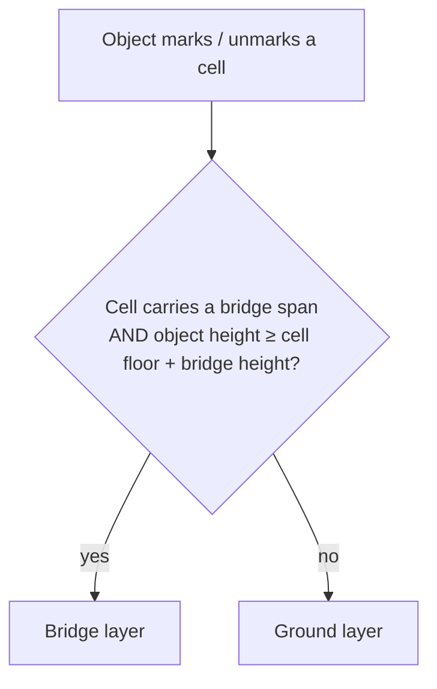
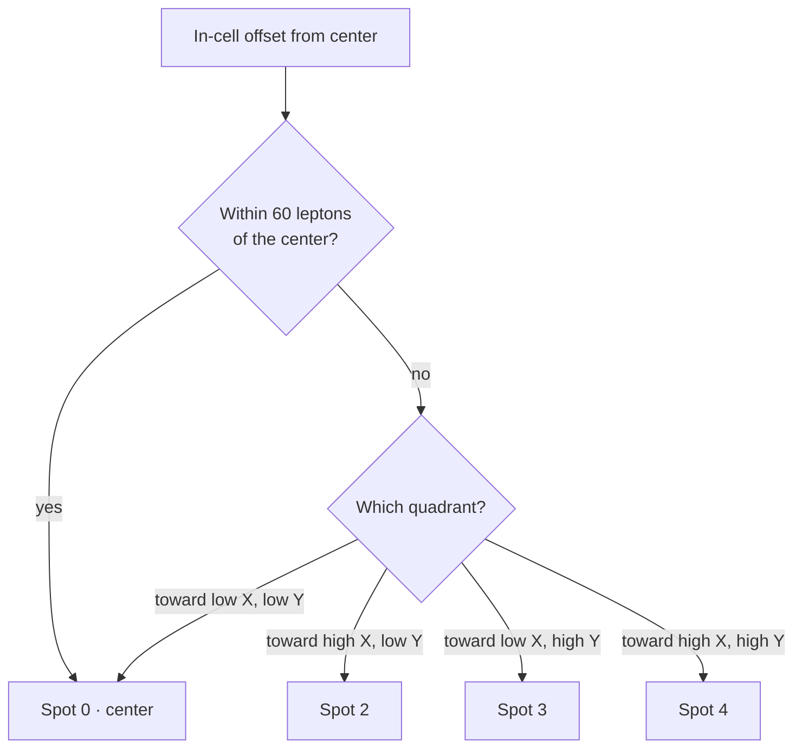

# Cell occupation and sub-cell spots

*Last verified: 2026-07-21. Version coverage: **Tiberian Sun, Red Alert 2, and Yuri's Revenge** all verified. The sub-cell spot indexer is bit-for-bit identical across all three engines, and the vehicle, terrain, and spot occupancy-bit assignments match. The infantry owner stamp, and the inline ground-vs-bridge layer plumbing, are identical in Red Alert 2 and Yuri's Revenge but **absent / different** in Tiberian Sun's shared occupancy layer — those divergences are documented below. The cell-entry ("can this move here") verdict chains are structurally identical across all three, including the tunnel-network gate.*

Every cell on the map keeps a small bookkeeping record of **what is standing on it right now**. Pathfinding, unit placement, and movement all read this record before they let anything move, deploy, or build. This entry describes that record: the two occupancy layers a cell carries, how infantry pack four to a cell, how the engine remembers which house an occupying infantry belongs to, and the graded verdict a mover consults before entering.

:::note Publication bar
This entry covers the parts of the occupancy substrate that are fully reversed, implemented, and oracle-tested across all three engines. The building-footprint marking path and the exact semantics of the generic-object occupancy bit are called out under *What this entry does not claim*.
:::

## Two occupancy layers per cell

A single cell can host things at two different heights at once: on the ground, and on a **bridge** span passing over it. To keep those separate, each cell carries **two parallel occupancy records** — a **ground layer** and an **on-bridge ("alt") layer**. Each layer has:

- an **occupancy bitfield** — a set of flags describing which kinds of thing occupy the layer (see below);
- a **head-of-list pointer** to the objects currently on that layer;
- an **infantry owner stamp** (Red Alert 2 / Yuri's Revenge only) recording which house's infantry hold the layer.

A separate cell flag marks whether the cell actually carries a bridge span at all.

**Which layer an object touches** is decided when it marks or unmarks itself:

The bridge-height addend is a fixed engine constant, not an INI value.

### A marking asymmetry worth knowing

In Red Alert 2 and Yuri's Revenge the layer choice is computed inline from the object's height, and the **mark** side of this test checks *both* conditions — the bridge flag and the height — for infantry and vehicles, while the **unmark** side for infantry and vehicles checks **only the height**, not the bridge flag. The consequence: an object sitting at bridge height over a cell that has **no** bridge span will *mark* the ground layer but later try to *unmark* the bridge layer, leaving a stale ground-layer bit behind. This asymmetry is verified identically in Red Alert 2 and Yuri's Revenge. (The generic base-object mark/unmark pair, by contrast, checks both conditions on both sides.) Tiberian Sun instead takes the ground-vs-bridge choice as a caller-supplied flag rather than computing it inline, so its plumbing here differs.

## Occupancy bits: who sets what

Within a layer's bitfield, different object types claim different flags:

| Occupant | What it sets |
|----------|--------------|
| **Infantry** | one **sub-cell spot** bit — the spot is chosen by position within the cell (see below) |
| **Terrain object** (a tree and similar) | a small footprint mask of up to three bits, on the **ground layer only** |
| **Vehicle** | a single dedicated vehicle bit |
| **Generic object** | a single dedicated generic-object bit (exact cross-engine semantics not published — see below) |

Unmarking clears exactly the same bits the matching mark set, using the same layer choice.

## Sub-cell spots: four infantry to a cell

Infantry do not occupy a whole cell each; up to **four** share one cell at distinct **sub-cell spots**. The engine converts an infantry's fine position inside the cell into a spot index, and that index is the bit it claims.

A cell is **256 leptons** on a side; its center is at offset 128. Given an infantry's in-cell offset from the center on each axis:

Precisely:

- If the straight-line distance from the cell center is **less than 60 leptons**, the spot is **0** (center).
- Otherwise the quadrant is read from the two axes, and the resulting spot is one of **0, 2, 3, or 4**.

Two facts fall out of this and are worth stating exactly, because they are easy to get wrong:

- **There are four reachable spots, not five.** Spot **1** is never produced: the quadrant encoding skips it. The bit that would represent spot 1 is never set by infantry.
- **Spot 0 does double duty.** It is returned both for the near-center case *and* for the low-X/low-Y quadrant. So spot 0 is not simply "the center" — it is "center or that one corner."

The occupancy bit an infantry claims is `1` shifted left by its spot index, so spots 0, 2, 3, and 4 map to four distinct flags.

## The infantry owner stamp (Red Alert 2 / Yuri's Revenge)

Alongside the bits, each layer records the **house** that owns the infantry standing on it — an owner stamp, defaulting to "none." Marking an infantry writes its owner into the stamp. Unmarking clears the stamp back to "none" — but **only when no spot-2, spot-3, or spot-4 bit remains set** on that layer.

That reset condition is narrower than it looks, and produces two faithful quirks:

- **Spot 0 doesn't hold the stamp alive.** The reset test deliberately ignores the spot-0 (and unused spot-1) bit. An infantry standing on spot 0 does not, by itself, keep the owner stamp from being reset.
- **A tree pins the stamp forever.** A terrain object's footprint sets bits in the *same range* the reset test examines. So a cell that contains a tree can never satisfy the reset condition: the stamp, once written by some passing infantry, is never cleared. This is a genuine vanilla bug — later community patches fix it — and reTS reproduces it under its faithfulness toggle, off by opt-in.

Tiberian Sun's shared occupancy layer carries **no** owner stamp of this kind; its single owner field is written elsewhere. The whole stamp-and-reset mechanism above is a Red Alert 2 / Yuri's Revenge feature.

## The cell-entry verdict

Before a mover enters a cell, the engine asks a per-object-type question — informally, *"can this move here, and if not, how bad is the obstruction?"* The answer is **graded**, not a plain yes/no. From best to worst the grades run roughly:

1. clear;
2. blocked only by something cloaked;
3. blocked by something that is itself moving (a transient block);
4. blocked by a closed gate;
5. blocked by a destroyable friendly object;
6. blocked by a destroyable object;
7. blocked temporarily;
8. simply impassable.

Each object type (infantry, vehicle, aircraft, terrain) supplies its own version of this test, but they share a common substrate:

- they **walk the occupant list** for the relevant layer (ground or bridge), grading each occupant they find;
- they consult the shared **movement-cost table** — the same table pathfinding uses — and a **zero cost** for the mover's movement class on that terrain resolves immediately to **impassable**;
- the vehicle test additionally handles crushing, track/wall traversal, and building bibs;
- the grades accumulate as a running worst-case, with the "impassable" cases short-circuiting.

All three engines' cell-entry chains also contain a **tunnel-network participation gate** with identical logic — a recon sweep confirmed it present in Tiberian Sun and Red Alert 2, not just Yuri's Revenge, refuting an earlier assumption that it was Yuri's-Revenge-exclusive.

This test is a *substrate* pathfinding queries; it is not the pathfinder itself. The A\* search and the "find the nearest valid spot" placement helper are separate systems.

## Cross-version notes

| Aspect | Tiberian Sun | Red Alert 2 | Yuri's Revenge |
|--------|--------------|-------------|----------------|
| Sub-cell spot indexer | identical | identical | identical |
| Center threshold (60 leptons), four reachable spots, unreachable spot 1 | identical | identical | identical |
| Vehicle / terrain / spot occupancy bits | identical | identical | identical |
| Infantry owner stamp + reset condition | **absent** (no per-layer stamp) | present | present |
| Ground-vs-bridge layer choice | caller supplies it | computed inline from height | computed inline from height |
| Cell-entry verdict chain (incl. tunnel-network gate) | structurally identical | structurally identical | structurally identical |

The underlying field positions differ between engines (the record was relocated as the class layouts changed), but the arithmetic and the flag meanings above are the same. Tiberian Sun names its four/five spots differently in source, but the reachable set and the center-versus-quadrant decision match.

## What this entry does not claim

- **How buildings mark occupancy.** A distinct occupancy bit is reserved for buildings, but the code path that sets it has not been reversed, so this entry says nothing about building footprint marking.
- **The exact meaning of the generic-object bit across engines.** Tiberian Sun narrows this bit to a specific object class, whereas the later engines use it more generally; the full three-way reconciliation of that one bit is still pending, so its semantics are not published as verified.
- **The pathfinder.** The graded cell-entry test is described here; the A\* search that consumes it, and the nearest-valid-spot placement helper, are separate systems.
- **Any reTS-specific API.** This page describes the **original engine's** behavior recovered for the verified path, not the reimplementation's interfaces.

## Corrections

If you can falsify a claim on this page against retail *Tiberian Sun*, *Red Alert 2*, or *Yuri's Revenge* behavior, open an issue on the [reTS repository](https://github.com/DasSheep/reTS/issues). Reports are treated as verification input and re-checked against the oracle before the page is updated.
