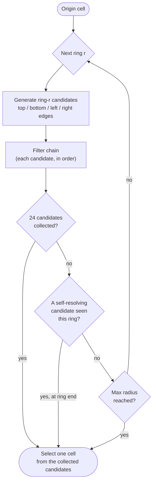
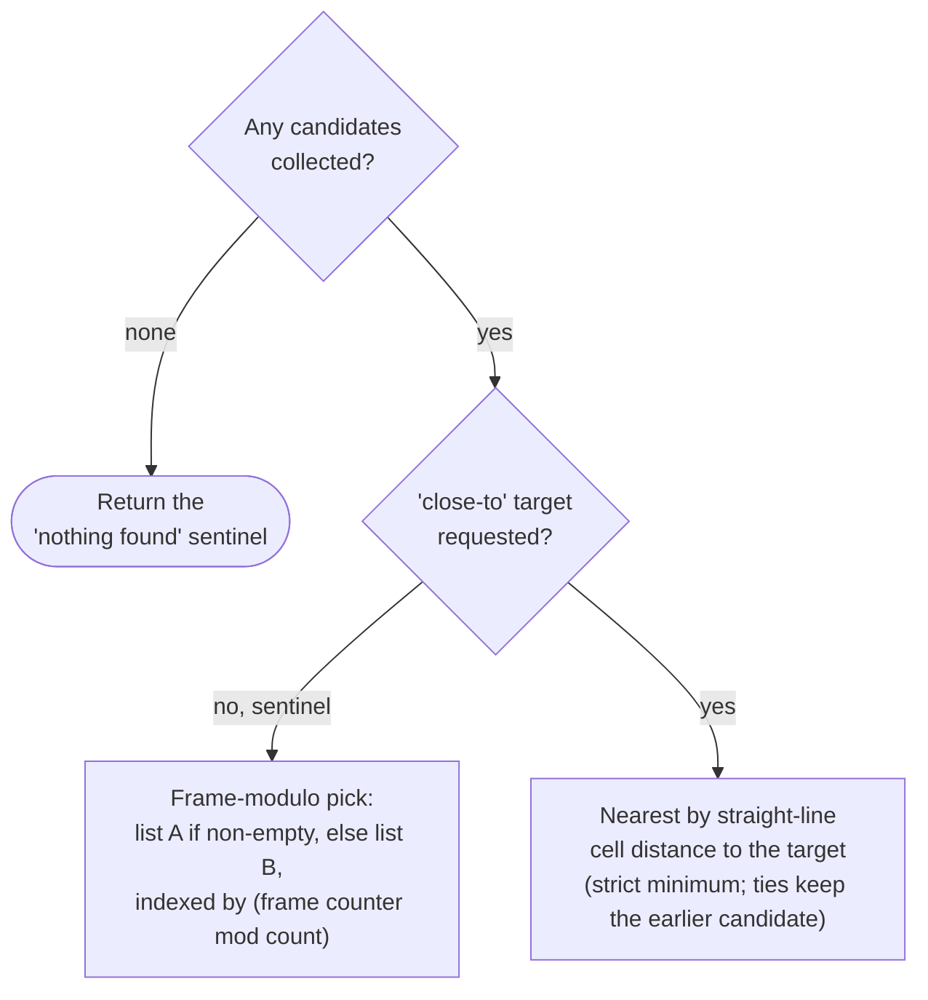

# Nearest-valid-spot placement (NearByLocation)

*Last verified: 2026-07-21. Version coverage: **Tiberian Sun**, **Red Alert 2**, and **Yuri's Revenge** — all three reconciled. The **core logic is identical** across all three engines; the versions differ only in **how many filter options the routine accepts** (Yuri's Revenge is a strict superset of Red Alert 2, which is a strict superset of Tiberian Sun). Divergences are documented per game below.*

When the engine needs to place something on the map — scatter a unit off an occupied cell, find a deploy spot, resolve a rally point, land a chrono-warped unit, drop a parasite's exit cell, or seat an AI base building — it does **not** run route pathfinding. It runs a **nearest-valid-spot search**: a square ring that expands outward from an origin cell and stops at the first candidates that pass a caller-configurable filter chain. Community reimplementations call this routine **`NearByLocation`**.

This is a distinct system from the A* route pathfinder. The nearest-valid-spot search never plans a path; it only answers "give me a nearby cell that satisfies these conditions."

:::note Publication bar
This entry covers the search geometry, the candidate cap, the filter-chain order, and the final selection rule — all fully reversed, implemented, and oracle-tested across the three engines. The internal semantics of some parameters that the routine merely **forwards** into the cell-passability core (movement zone, speed type, and related gates) are documented where the passability system is documented, not here.
:::

## What the search produces

The routine takes a search origin and a set of filter options, and writes back a single chosen cell (or a "nothing found" sentinel). It is engine-internal — there is no single INI tag that turns it on; instead many gameplay actions invoke it with different filter options.

## Ring-scan geometry

The search walks **square perimeters** outward from the origin, ring by ring, radius `r = 0, 1, 2, …`. Within each ring the candidate cells are generated in a fixed order — top edge, bottom edge, then left and right edges — and **each candidate is tested through the full filter chain the instant it is generated**.

Two hard limits bound the scan, both verified exactly:

- **Maximum radius.** The ring radius is derived from the map's dimensions and is **capped at 32**. The scan never expands beyond 32 rings regardless of map size.
- **Candidate cap of 24.** The scan collects at most **24** accepted candidates. This cap is checked **after every single accept-or-reject**, so a ring can be truncated part-way through — the search does not need to finish a ring to stop once 24 candidates exist.

An additional early stop fires when a "self-resolving" candidate is found (see [Selection](#selecting-a-cell)), but — verified — that early stop is checked **only at the true end of each ring**, and only *after* the 24-cap check. So once a self-resolving candidate appears part-way through a ring, the **rest of that ring is still collected** before the scan halts. A ring can therefore contribute more than one candidate even after the stop condition first becomes true.

### The origin cell is generated twice (quirk)

At radius `r = 0` the ring degenerates to a single physical cell — the origin — but the top-edge and bottom-edge generators **both** reduce to that same cell. The origin is therefore pushed through the entire filter chain **twice** and, if accepted, appended to the candidate list twice. This is a genuine, binary-verified duplicate: an accepted origin gets **double weight** in the frame-based tie-break described below. This is faithful original-engine behavior, reproduced deliberately.

### Half-ring restriction (Yuri's Revenge and Red Alert 2 only)

Yuri's Revenge and Red Alert 2 expose an optional flag that restricts each ring to its **right-and-bottom half**. The rule is asymmetric, and verified exactly:

- the **top** edge is dropped entirely,
- the **left** edge is dropped entirely,
- the **bottom** edge drops only its single left-most cell,
- the **right** edge is never trimmed.

At radius 2, for example, this leaves 7 of the ring's 16 cells, all on the right-and-bottom half. The intent is "don't re-scan the half of the ring already covered while expanding in that direction." Under this flag, radius 0 contributes **zero** candidates (the single degenerate cell is exactly the one the bottom edge drops), which cleanly cancels the origin-doubling quirk above.

**Tiberian Sun does not accept this flag at all** (see [Version differences](#version-differences)).

## The filter chain

Every generated candidate runs through the same ordered chain. Any failing stage short-circuits the rest for that candidate:

1. **Within usable area.** The cell must lie inside the map's playable diamond. (The usable-area test is an isometric diamond *band* — a candidate whose diagonal coordinate sum is below the lower bound is rejected, not just those outside the outer edge.)
2. **Footprint passability.** A rectangle of the requested width × height, anchored on the candidate, must be clear to move through — **every** cell of the footprint must pass; a single blocked cell fails the whole candidate. If the requested width or height is zero or negative, the footprint check passes vacuously.
3. **Level-proximity gate (optional).** When requested, the candidate's height level must be within a strict tolerance of a reference level: the absolute level difference must be **strictly less than 2** (a difference of exactly 2 is rejected). The reference level is the origin cell's level, plus **4** when a bridge bonus applies (see below).
4. **Burrow-legality gate (optional).** When placement must be burrowable, the cell is tested for burrow legality.
5. **Bridge rejection (optional).** When bridges are disallowed, any cell carrying a bridge is rejected.
6. **Clear-to-build (optional).** When placement must be buildable, the cell's footprint must be clear to build on.

### Reference level and the bridge bonus

The reference level used by the level-proximity gate is the level of the origin cell. When the caller requests the "alternate/bridge" behavior **and** the origin cell carries a bridge, the reference level is raised by **4** — the fixed height offset that represents standing on a bridge deck rather than the ground beneath it.

### Burrow-legality: out-of-area cells pass (quirk)

The burrow-legality gate has a verified fail-open behavior: a cell that lies **outside** the usable area passes the gate unconditionally rather than failing closed. The gate only actively rejects cells it can evaluate against its interior conditions (tile type, slope, bridge bits, and — when a specific engine mode is active — whether the cell already holds a building or terrain object). This pass-through is faithful original-engine behavior.

### Clear-to-build

The buildable check scans the candidate's footprint rectangle and rejects the whole rectangle if **any** cell trips **any** blocking condition: the cell holds a terrain object, is reserved by base-spacing for a house, carries an overlay, is sloped, holds a building, or trips an internal reservation flag. If the whole rectangle is clear, a final pass additionally requires **all four corners** of the rectangle to lie within the usable area. The entire chain is deterministic — no randomness is consulted anywhere in it.

## Selecting a cell

Once ring scanning ends with at least one accepted candidate, the candidates are split — in acceptance order — into two lists:

- **List A**, candidates that "self-resolve": running the engine's height/bridge-compensated ground-cell resolver on the candidate's center returns the candidate itself (no elevation correction needed).
- **List B**, everything else.

The final pick then depends on whether the caller supplied a real "close-to" target:

- **No target requested.** The "close-to" argument equals a fixed sentinel value of `(0, 0)`. In this case the pick is **frame-based**: take list A if it is non-empty, otherwise list B, and index it by the **global frame counter modulo the list length** (a signed remainder). This is fully deterministic under lockstep — every client shares the same frame counter — but it is genuinely frame-phase dependent, not a nearest-spot choice. The sentinel is verified to be `(0, 0)` at load and was observed to stay `(0, 0)` throughout a live match, so this branch is the one taken whenever no explicit target is given.
- **Real target requested.** The pick is the candidate with the smallest **straight-line distance** (Euclidean, in **cell** units, not sub-cell units) to the target. The running best starts at `100000.0`, and the comparison is **strictly** less-than, so exact ties keep the **earlier** candidate in acceptance order.
- **No candidates at all.** The routine writes back the `(0, 0)` sentinel and runs no selection logic. The same `(0, 0)` value therefore serves three roles: the "no target requested" marker, the frame-modulo pick's list source, and the "nothing found" result.

## Version differences

The verified verdict is **divergent by arity** — a strictly nested option set. The **core logic is identical** in all three engines: the ring geometry, the candidate cap of 24, the cell-indexing scheme, the filter-chain order, and the close-to / frame-modulo tie-break (which uses the same fast square-root routine in every version) all match structurally.

| Capability | Tiberian Sun | Red Alert 2 | Yuri's Revenge |
|---|---|---|---|
| Ring scan, cap 24, filter order, selection tail | identical | identical | identical |
| Half-ring restriction flag | **not accepted** | accepted | accepted |
| Clear-to-build filter option | **not accepted** | **not accepted** | accepted |

So Yuri's Revenge accepts the full option set; Red Alert 2 drops only the clear-to-build option; and Tiberian Sun drops both the clear-to-build option and the half-ring flag. Nothing in the search behavior itself differs — only which optional filters a caller is allowed to request.

Internal per-cell field layouts and bit positions are renumbered between the engines (Red Alert 2 tracks Yuri's Revenge closely; Tiberian Sun renumbers more), but that is a layout detail, not a behavioral difference in this routine.

## What this entry does not claim

- **Not the route pathfinder.** This is placement, not A* routing. The route pathfinder is a separate system.
- The internal meaning of the movement-zone, speed-type, and related parameters that this routine forwards untouched into the cell-passability core — those belong to the passability system's documentation.
- Whether callers center the footprint rectangle on the candidate or anchor it by a corner — the passability core anchors the rectangle by its top-left cell, but any caller-side centering convention was not traced and is not claimed here.
- Exact names for a handful of internal cell/tile fields and engine-mode flags referenced by the burrow and clear-to-build gates; their **behavior** is stated, their source-level names are not.
- Any reTS-specific API. This page describes the **original engine** behavior recovered for the verified path.

## Corrections

If you can falsify a claim on this page against retail *Tiberian Sun*, *Red Alert 2*, or *Yuri's Revenge* behavior, open an issue on the [reTS repository](https://github.com/DasSheep/reTS/issues). Reports are treated as verification input and re-checked against the oracle before the page is updated.
