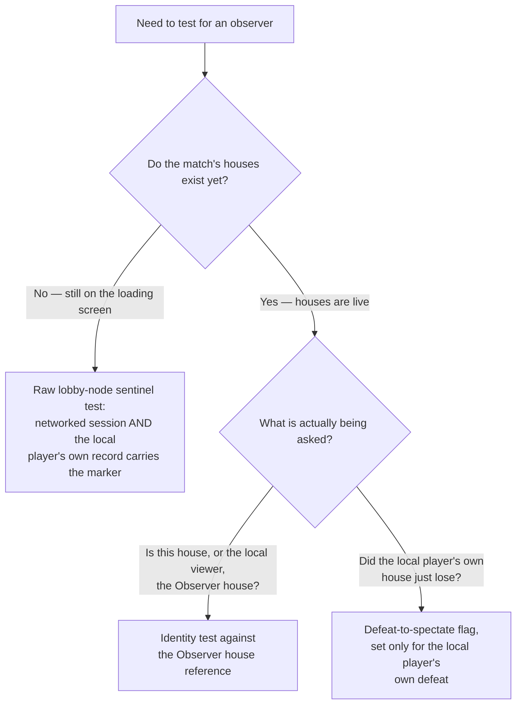

# Observer mode

*Last verified: 2026-07-25. Version coverage: **Yuri's Revenge** is the anchor and is verified
throughout. **Red Alert 2** ships the same mechanism — reconciled at its own native locations for
the identity core (the house-creation rule and the Observer house reference) and for both
end-of-match statistics emitters, reading its own differently-laid-out lobby-node record; the
interface and simulation consumer family and the two secondary observer tests were not separately
re-derived at Red Alert 2's addresses. **Tiberian Sun** was searched exhaustively and confirmed to
contain no observer mechanism at all — a genuine absence, not an unexamined gap.*

Community discussion of observer/spectator play in these games has long treated it as something
that "doesn't exist" or "was cut" from retail, with working spectator support credited entirely to
third-party online-play patches. That framing is only half right. Red Alert 2 and Yuri's Revenge
both genuinely ship a dedicated Observer house identity and a creation-time rule that assigns it,
and Yuri's Revenge — the build examined in full here — carries more than a dozen interface and
simulation routines that behave differently once a house holds it. What
retail does **not** ship is any control in its own lobby screen that lets a player choose to become
that observer — the mechanism runs, but nothing in the shipped UI can trigger it. This entry
describes exactly what is native, what is merely reachable, and what genuinely is dead code, on the
authority of a full reverse-engineering pass over the mechanism and its consumer family.

:::note Publication bar
This entry covers the fully reversed identity core (how the engine assigns its dedicated Observer
house at multiplayer/skirmish house-creation time), the three distinct mechanisms the rest of the
engine uses to test for an observer, the family of interface and simulation consumers that read
those tests, and the two end-of-match statistics emitters and their dead-versus-live output sinks
— all verified for **Yuri's Revenge**. **Red Alert 2** is reconciled for the identity core and the
two statistics emitters (identical mechanism, reading its own lobby-node record layout); its
interface/simulation consumer family and the two secondary observer tests were not separately
re-derived at Red Alert 2's own addresses. **Tiberian Sun** is confirmed absent.

It does **not** cover: which code, if any, actually writes the lobby-node marker that selects an
observer in a real session (not located in retail); whether an observer's identity survives a
save/load cycle; the pixel-level drawing internals of the affected interface elements; Red Alert
2's full lobby-node field layout beyond the two fields this mechanism touches; or any behavior
introduced by third-party online-play tooling rather than retail itself.
:::

## How a house becomes the Observer

Red Alert 2 and Yuri's Revenge each keep one static reference — call it the Observer house — that
starts every multiplayer or skirmish match cleared to nothing. It is set, if at all, during the
same routine that builds every player's `HouseClass` from the lobby's list of player records, and
that routine is the **only** place in either game's code that ever writes it.

That routine processes player records in ascending order of a small per-record field — the player's
chosen game color — rather than in the order the records happen to sit in the lobby's array. Equal
colors process in array order. Two things happen as each record is turned into a house:

- The record sitting at array position zero — the local player's own record, regardless of where
  its color places it in processing order — is recorded as the local viewer's house.
- Any record carrying a specific sentinel value in one particular field makes *its* house the
  Observer. The assignment is unconditional: if more than one record somehow carried the
  sentinel, the last one processed — the one with the highest color — would win, silently
  overwriting any earlier pick.

## The lobby-node sentinel that marks the choice

The field that carries the observer sentinel has no established name in the community's own
recovered type definitions for either game — it is simply an unnamed integer sitting a short
distance past the fields the lobby already knows how to use (player name, country, color, team).
This reference follows the underlying study and calls it **the observer-slot marker**: a
description of its role, not a claim about its real identifier. Two independent binary sites test
this same field on the same record independently of one another — the house-creation routine
above, and a second routine that renders the multiplayer loading screen before any houses exist
yet — which is strong corroborating evidence that this is genuinely what the field means, even
though its name is not recovered.

Critically, **no code path was found in either game that writes this field to the sentinel value**
during a normal session. Retail's own lobby screen has no spectator checkbox or slot type that
would produce it. The mechanism that reads the marker and assigns the Observer house is completely
real and functional; what selects a player *for* that marker, in retail, is an open question (see
"Not covered" below) — most plausibly reachable only through external session data supplied by
something other than retail's own lobby, such as third-party online-play tooling. That distinction
— a real, working consumer with no confirmed retail producer — is the accurate shape of "observer
mode in vanilla," not the flatter "it doesn't exist" or "it was cut" framing.

## The predicate the rest of the engine tests

There is no single, standalone "is this an observer" function in either binary. Three structurally
different tests exist instead, used in different circumstances, and a port or a mod that wants to
reproduce this system faithfully has to keep them apart rather than collapsing them into one:

1. **Identity against the Observer house.** Both a "is this house the Observer" form and a "is the
   local viewer the Observer" form appear throughout the interface and simulation code, comparing
   a house (or the local viewer's house) directly against the static reference. This is the test
   used once houses actually exist — the end-of-match scoreboard's exclusion check and the
   diplomacy panel's special-case row both use the house form; every sidebar and HUD branch uses
   the viewer form.
2. **The raw lobby-node sentinel**, used where houses may not exist yet: is the session a networked
   one, and does the local player's own lobby record carry the observer-slot marker directly? The
   multiplayer loading screen and the spawn-position assignment routine both compute this inline,
   rather than consulting the Observer house reference. Note that the networked-session half of this
   test checks two specific session values (one of which is the game's Internet-play mode) — not
   the broader "any multiplayer or skirmish match" shorthand a casual reading might assume.
3. **A defeat-to-spectate flag**, unrelated to the lobby observer concept entirely. It is set only
   when the *local* player's own house is the one that was just defeated, and it is reset only by
   the main-menu flow. Its sole confirmed consumer hides the game-speed control on the in-match
   options dialog once the local player has been defeated and is now just watching the rest of the
   match play out. Treating this as equivalent to "is a lobby observer" — as some third-party
   patches do, extending its reach to lobby observers too — is a layering of external semantics on
   top of a retail mechanism that means something narrower on its own.

## The consumer families

### Interface

| Consumer | Behavior for the Observer's viewer |
| --- | --- |
| Sidebar (roster mode) | A cluster of six routines — the scroll arrows, the tab up/down scroll, the repair/sell/tab click handler, the per-tick housekeeping pass, and the draw routine — substitute the match's total participant count for the local house's build-queue length in every capacity calculation, and switch to an alternate row color scheme. The draw routine is mutually exclusive: a non-observer viewer draws the build-queue cameo strip and skips the roster block entirely; the observer viewer does the reverse, drawing a per-house roster strip instead of a queue. Sidebar initialization also builds that roster list, but only for networked sessions, and filters the Observer's own house out of the list it builds. |
| HUD credits widget | Instead of a credits readout, the Observer's viewer sees an elapsed-match clock in hours:minutes:seconds, sourced from the match's own elapsed-time counter and capped at 99:59:59. The low-funds warning sound is skipped for this viewer. |
| Diplomacy panel | The Observer's own row uses the same alternate color/stat-format path as the sidebar; the ally-status control for a given opponent row is only set active while that opponent's house is still in the game. |
| Loading screen | Computed via the raw lobby-node sentinel test (mechanism 2 above), since houses don't exist yet at this point in start-up. |

### Simulation

- **Spawn-position assignment.** When the game assigns each house a starting position, it looks up
  a house's matching lobby record by name; if that record carries the observer-slot marker, the
  house is given a fixed placement and the routine returns immediately, skipping the normal
  algorithm that spreads every other player as far apart as possible. (The routine also emits a
  diagnostic message noting the observer's placement — like the end-of-match lines below, this
  passes through a sink that produces no output in the retail build.)
- **Defeat and victory.** The Observer's own house still runs through the same defeat bookkeeping
  as any other house — these two routines are read-only consumers of the Observer identity, not
  gates on it. What changes is presentation: the victory/defeat voice line and on-screen message
  are suppressed specifically for the Observer's house, so a spectating player doesn't get a
  "you lose" fanfare that was never meant for them.
- **Score and statistics exclusion.** Covered below.

## The end-of-match statistics emitters

Two routines format an end-of-match record, one per house, for a multiplayer or skirmish match.

The primary one is the canonical scoreboard emitter. It walks every house in the match and
includes a house in its output only if the house exists, its type isn't flagged as a passive
(non-competing) house, and the house is not the Observer — the Observer is excluded from the
scoreboard by direct identity, the same test described above. Each record's fields cover the house
name, its scheme/difficulty setting, whether it was defeated, its kill count, how much it built,
and its score. For a house that was **not** defeated, the emitted score is inflated by a specific
formula: given the house's accumulated score `x`, retail draws a random value in the range `x/2` to
`x` (inclusive), adds `x/2`, and adds `x` again — so the final emitted score for a surviving house
always lands somewhere between exactly `2x` and `2.5x` of its real accumulated score (integer
division skews the low end slightly for an odd `x`). This inflation is absent from the second
emitter below.

That second emitter is a narrower variant used specifically during a next-map transition between
two houses; it filters only on the passive-house flag (the study did not find it also testing
observer identity directly), and prints the score exactly as accumulated, with no inflation.

Both emitters, in retail, hand their formatted line to a debug-print sink that is compiled down to
an empty function in the release build — called well over a thousand times across the executable,
and doing nothing every time. **The Winner/Loser lines these emitters produce are computed but
never written anywhere in a retail build.** Third-party stat-tracking services that scrape this
data are re-enabling or replacing that sink themselves; it is not something retail does on its own.

The one end-of-match write retail genuinely performs on its own is a small network-quality report,
written once per match to a file on disk, gated on the game's Internet-play session mode
specifically (not the other session modes): the match's frame count and average FPS, followed by
one line per connected player
giving their name, address, round-trip time, resend count, stall count, and packet-loss figures.
This file has nothing to do with the Observer house at all — it is purely a connection-quality
report, and it is the only one of the two output paths that is actually live in shipped retail.

## What this entry does not cover

- **Who writes the observer-slot marker.** No code path was found in either game's own binary that
  sets it during a normal session; retail's own lobby has no exposed control for it. Whether it can
  ever be set through retail alone, versus only through external session data, is open.
- **Save/load behavior.** Neither game's load pipeline was found to re-derive the Observer house
  reference from anything on load. Whether — or how — an observer's identity would survive a
  save/load cycle in a hypothetical session that had one is unresolved.
- **The exact drawing internals** of the sidebar roster strip, the loading-screen text, and the
  suppressed dialog controls — this entry documents *what* changes for these consumers, not the
  pixel-level rendering code behind them.
- **Red Alert 2's full lobby-node record layout.** Its version of this mechanism reads the
  equivalent two fields (the color sort key and the observer-slot marker) at different positions
  than Yuri's Revenge, but the rest of that record's field map beyond those two was not mapped by
  this study.
- **A per-house-type identifier some third-party tooling expects for observer bookkeeping** was not
  located in either game's own type table; whether retail carries an equivalent facility internally
  is unresolved.
- **The setter for the match's total participant count**, which the sidebar substitutes for a
  build-queue length — this study confirmed its consumers, not where its value comes from.
- **A separate per-house "still in the game" flag** that the diplomacy panel, the sidebar, and the
  winner-score inflation all independently read. Its role is corroborated by those three
  independent readers, but its exact setter site is not yet formally pinned anywhere — it remains
  an open candidate identification in the related house-diplomacy work, not a settled fact.
- Any behavior added by third-party online-play patches or launchers, beyond noting where community
  understanding of "observer mode" has conflated their extensions with retail's own mechanism.

## Cross-version verdict

**Yuri's Revenge** is the anchor for this entry: the identity core, all three predicate mechanisms,
the full interface/simulation consumer family, and both statistics emitters are reversed and
verified directly.

**Red Alert 2** ships the identical identity core at its own native locations: the same
house-creation routine, the same ascending-color processing order, the same
local-player-at-position-zero rule, and the same unconditional last-write-wins observer sentinel —
reading its own lobby-node record, which is laid out differently from Yuri's Revenge's but plays
the same two fields the same way. Both games' end-of-match emitters are present, and both
construct a dedicated observer-team object through call-for-call identical constructor logic in
their respective team-creation paths — a class dedicated wholly to observers, present under the
same name in both games' own runtime type information, and compiled from the same source file in
both build trees. This is not a coincidental resemblance; it's the same mechanism carried forward
from one build to the next.

What was **not** separately re-derived at Red Alert 2's own addresses is the interface and
simulation consumer family described above, nor the two secondary observer tests (the raw
lobby-node sentinel and the defeat-to-spectate flag). Given an identical identity core, the same
emitters and a shared source lineage, those consumers are expected to be analogous — but this
entry does not claim them as independently verified for Red Alert 2, and a mod or port targeting
Red Alert 2 specifically should confirm them rather than assume.

**Tiberian Sun** was checked exhaustively — not just
spot-checked — across its own named function corpus and its full set of decompiled exports, and
turned up zero references to anything resembling this mechanism. Its equivalent house-creation
routine has no observer-assignment branch of any kind, and no equivalent static reference exists
anywhere in the binary. Its own end-of-match scoreboard emitter is structurally close to the one
described above (same record shape, the same misspelled "Losser" label sitting alongside "Winner"
in its string table) but has no observer-exclusion gate at all — which corroborates, rather than
merely assumes, that observer support itself was introduced later in the engine's lineage and never
existed in Tiberian Sun to begin with.

## Corrections

If you can falsify a claim on this page against retail *Command & Conquer: Tiberian Sun*,
*Red Alert 2*, or *Yuri's Revenge* behavior, open an issue on the
[reTS repository](https://github.com/DasSheep/reTS/issues). Reports are treated as verification
input and re-checked against the oracle before the page is updated.
