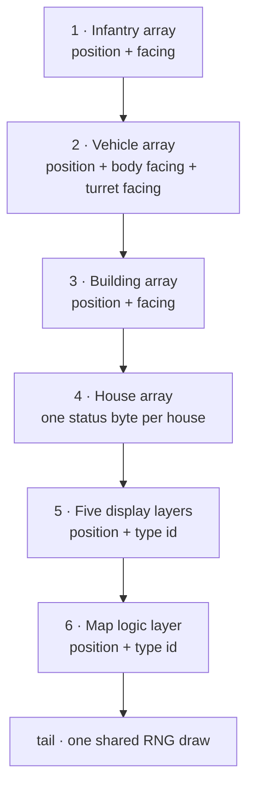

# Multiplayer sync checksum

*Last verified: 2026-07-18. Version coverage: **Command & Conquer: Yuri's Revenge** only; Tiberian Sun and Red Alert 2 comparisons are not published here until separately verified.*

In a lockstep RTS, every player's machine runs the full simulation and only
*commands* travel over the network. That design lives or dies on bit-identical
simulation: if two machines ever compute a different game state, they have
desynced. The engine's tripwire for this is a state checksum — each peer
digests its own game state into one 32-bit value as networked frames are
processed, and peers compare notes. This entry documents exactly what goes into
that digest, in what order, and what the engine deliberately leaves out.

:::note Publication bar
This entry covers the checksum computation itself — the fold, the per-object
schema, and the container walk — which is fully reversed, reimplemented, and
oracle-tested. The surrounding network machinery (command queueing, retry
timing, the desync-recovery dialog) is a separate, unpublished topic.
:::

## When it runs — and when it doesn't

The checksum is computed by the network frame processor and by the
replay-verification path. It does **not** run in single-player games:
campaign and solo skirmish route through a local command path that never
touches the checksum. Two practical consequences:

- A solo game computes no sync digest at all — tools that want one must derive
  it themselves from the same state the engine would have read.
- Computing the checksum **consumes one draw from the shared random-number
  stream** (see [the tail fold](#the-tail-a-random-draw)), so the random
  sequence of a networked game differs from a solo game given identical
  commands. The checksum is not a passive observer of the simulation; it is
  part of it.

## The fold

The digest is built by folding 32-bit contributions into an accumulator, one
operation per contribution:

```text
crc = rotate_left(crc, 1) + contribution        (32-bit, wrapping)
```

Order matters twice over: the rotate makes the fold position-sensitive, so both
the sequence of objects *and* each object's value must match across peers.

## Per-object contribution

For most checksummed objects, the contribution packs a quantized position and a
facing into one value:

```text
contribution = (X / 10) + facing + ((Y / 10) << 16)
```

| Field | Detail |
|-------|--------|
| `X`, `Y` | The object's world-coordinate position in **leptons** (256 leptons = one cell). The division by 10 is **signed** integer division (truncating), coarsening the position to 10-lepton buckets. |
| `Z` | Read alongside X and Y but **never folded** — height does not participate in the digest. |
| `facing` | The object's current 16-bit direction, quantized to 8 bits by rounding to nearest: `((raw >> 7) + 1) >> 1`, keeping the low 8 bits. |

Vehicles contribute **two** facings — body plus turret, summed into the same
single contribution (one fold, not two). The separate barrel facing some units
track is *not* part of the digest.

## Walk order

The engine folds six containers in a fixed sequence (because of the rotating
fold, both this sequence and each container's internal object order are part
of the digest's identity):



Details per stage:

1–3. **Infantry, vehicles, buildings** — the per-object contribution above,
from each type's global array.

4. **Houses** — each house contributes exactly **one byte**: a single boolean
status flag. No credits, no power, no per-house counters.

5–6. **Display layers and the map-logic layer** — every object currently
registered in the five render layers, then in the logic-update layer. Here the
*type id* (the engine's runtime class discriminant) takes the facing's slot in
the contribution instead of a direction. Aircraft and terrain objects are
reached through these layer walks rather than through arrays of their own. A
hashability guard skips presentation-only animation and particle objects that
do not affect the simulation, so cosmetic effects cannot desync the digest.

## The tail: a random draw

After the walks, the engine folds **one fresh draw from the scenario's
synchronized random-number generator** (each peer holds an identically seeded
instance of it) into the accumulator, then stores the finished value into a
rolling 256-slot history used by the desync-detection and recovery machinery.

This is an elegant two-for-one: because every peer's generator must be at the
same point in the same sequence, the tail draw implicitly checksums the entire
history of random-number consumption — any past divergence in *how many* draws
were taken shows up here even if object state happens to agree.

## What is deliberately not checked

Measured against its own ancestor, this engine's digest is notably lean. The
earlier **Red Alert** engine folded each object's **health** and each house's
**credits, power and drain** into its game checksum; this generation dropped
all four. Nothing else fills the gap: the digest carries no health, no economy,
no mission state, no targeting state. Desyncs in those fields go undetected until (and unless) they
bend positions, facings, object lifetimes, or random-draw counts — which, in a
lockstep simulation, they eventually do.

For modders and tool authors the practical reading is: the sync digest is a
*canary*, not an audit. It detects that simulations diverged, cheaply and
probabilistically, one digest at a time; it does not localize what diverged.
The engine's separate desync logging (in community extension projects)
exists precisely because the digest alone cannot say *why*.

## Related

- [Damage pipeline](/reference/combat/damage-pipeline) — why exact integer
  truncation order matters to lockstep bit-exactness.
