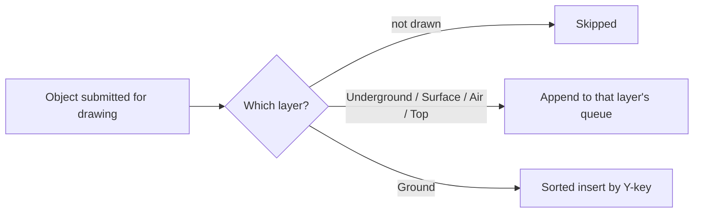

# Draw-layer submission and Y-order

*Last verified: 2026-07-16. Version coverage: **Tiberian Sun / Firestorm**, **Red Alert 2**, and **Yuri's Revenge** — the queue's control flow, capacity handling, and comparator are verified identical across all three binaries. The one confirmed difference is *how* Red Alert 2 reaches an object's sort key internally, not what the queue does with it (see "Version differences" below).*

Before the tactical renderer draws a frame, every visible object is filed into one of five fixed draw layers, and one of those layers — the ground layer — keeps itself sorted by a per-object depth key as objects are added. This entry pins that filing and sorting step: which layer an object lands in, when the queue sorts versus simply appends, how ties and edge-case keys behave, and what happens when a layer's storage is full. It does not cover how each object *computes* its depth key, nor anything about the pixel-drawing pass that consumes the sorted result afterward.

:::note Publication bar
This entry covers only the submission/insertion queue that sits between an object's layer classification and the renderer — the mechanism, not the per-object formulas that feed it. Which numeric depth value a unit, building, aircraft, or effect produces is a separate, still-open topic and is not claimed here.
:::

## The five layers

Every drawable object reports which layer it belongs in. One reported value means "do not draw this object at all"; the other five route to one of five independent queues:

| Value | Layer | Submission policy |
| ---: | --- | --- |
| — | *(not drawn)* | object is skipped entirely |
| 0 | Underground | append (submission order) |
| 1 | Surface | append (submission order) |
| 2 | Ground | sorted insert, ascending by Y-key |
| 3 | Air | append (submission order) |
| 4 | Top | append (submission order) |

Only the Ground layer sorts. Underground, Surface, Air, and Top all simply append each newly submitted object to the end of their own queue, in the order objects were submitted — even though objects placed in those layers can still expose a depth key, that key is never consulted for ordering purposes outside Ground. Conceptually, Surface tends to hold flat terrain decoration, Ground holds units and buildings, Air holds effects, and Top holds aircraft and projectiles, but the routing rule itself only cares about the reported layer value, not the object's type.



## Ground-layer sort order

When an object lands in the Ground layer, the queue scans from the front and inserts the new object just before the first existing entry whose key is *strictly greater* than the incoming object's key:

```text
index = 0
while index < count:
    if existing[index].sort_key() > incoming.sort_key():
        stop scanning here
    index += 1
insert incoming immediately before index; shift the rest back one slot
```

Both the existing entry's key and the incoming object's key are re-read fresh on every comparison — the incoming key is not cached across the scan. The comparison is a plain signed greater-than test with no subtraction involved, so the most extreme signed 32-bit values (the largest negative and largest positive representable keys) still sort into correct order with no wraparound artifact.

Because the scan only stops on a *strictly greater* existing key, an existing entry whose key is merely *equal* to the incoming key does not stop it. The new object is therefore placed after the entire run of already-queued objects that share that key — submission order is preserved among ties. Repeatedly submitting strictly descending keys inserts each new object at the very front every time, and the tail-to-front shift preserves every previously queued object without loss.

## Capacity growth and failure-before-mutation

Every submission — append or sorted insert alike — passes through the same capacity check first, before any key comparison, any data shift, or any count update:

- If the queue currently has room, insertion proceeds immediately.
- If the queue is full but is allowed to grow — it owns its own storage, or it currently reports zero capacity — and its configured growth amount is positive, the queue attempts exactly one resize by that amount. If the resize succeeds, insertion proceeds into the grown buffer.
- Otherwise, the submission is rejected.

A rejected submission leaves the queue's existing contents, order, and count completely untouched — nothing is compared, shifted, or written before the capacity check passes. There is only ever one resize attempt per submission call; the routine never retries and never re-checks capacity after a resize. A fixed-size queue that does not own its own storage buffer can never grow, no matter its configured growth amount. A queue that currently reports zero capacity, however, can still grow on its very first submission even when it isn't flagged as owning a buffer — reporting zero capacity by itself is enough to open the growth path.

## Version differences

The queue's control flow — the five-way layer split, the Ground-only sort policy, the capacity-then-grow-or-reject gate, the strict-greater comparator, the tail-to-front shift, and the exact failure boundary described above — is identical across the Tiberian Sun/Firestorm, Red Alert 2, and Yuri's Revenge binaries. Firestorm runs on the Tiberian Sun executable and inherits that binary's behavior unchanged.

The one confirmed difference is internal to Red Alert 2: its object class layout differs from Tiberian Sun's and Yuri's Revenge's, so the queue's request for an object's sort key is resolved through a different virtual-method slot in Red Alert 2 than it is in Tiberian Sun/Firestorm and Yuri's Revenge. This is a dispatch-mechanism relocation only — the queue still asks the object for "your sort key" at exactly the same point in the algorithm, and the ordering behavior that results is the same. It is not evidence that Red Alert 2's actual depth-key *formula* differs from the other two games; that per-object formula question is separately scoped and not addressed by this entry.

## What this entry does not claim

- The actual numeric depth-key formula any object type (unit, building, aircraft, effect, terrain) computes — those are separate, still-open per-class topics.
- Anything about the pixel-drawing pass, dirty-rectangle tracking, or the rest of the tactical render pipeline that consumes the sorted queues afterward.
- That Red Alert 2's depth-key *values* differ in effect from Tiberian Sun/Firestorm or Yuri's Revenge — only that the internal call path used to obtain that key differs.
- Any reTS-specific API. This page describes the **original engine** behavior recovered for the verified path.

## Corrections

If you can falsify a claim on this page against retail *Command & Conquer: Tiberian Sun*, *Firestorm*, *Red Alert 2*, or *Yuri's Revenge* behavior, open an issue on the [reTS repository](https://github.com/DasSheep/reTS/issues). Reports are treated as verification input and re-checked against the oracle before the page is updated.
