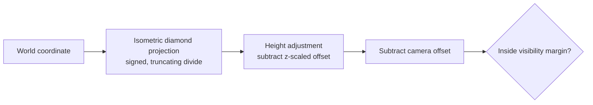

# Tactical world-to-client projection

*Last verified: 2026-07-21. Version coverage: **Tiberian Sun / Firestorm**, **Red Alert 2**, and **Yuri's Revenge**. Red Alert 2 and Yuri's Revenge share identical projection arithmetic and initialized view state, modulo code relocation. Tiberian Sun and Firestorm share one binary and diverge from the Red Alert 2 / Yuri's Revenge family in tile geometry, the height-adjustment threshold, visibility margins, and the inverse-matrix constants (see "Version differences" below). Generic Red Alert 2 / Yuri's Revenge savegame bulk-object restoration of this state is not published here — see "What this entry does not claim."*

This entry covers the coordinate math that sits between the simulation's world coordinates and the tactical view's client-relative pixel points: projecting a world coordinate to a client point, adjusting that point for height, deciding whether the result counts as visible, and mapping a client point back to a world coordinate. It also pins the initialized scale and matrix state that arithmetic depends on, and who owns that state across a save/load cycle. It does not cover draw order, dirty-rectangle tracking, shroud/fog interaction, or scrolling and input handling.

:::note Publication bar
This entry covers only the reversed, ported, and oracle-tested projection arithmetic and its initialized state. Rendering order and depth-key formulas are a separate, already-published topic (see "Draw-layer submission and Y-order" in this section); the pixel-drawing pass itself, shroud/fog, and viewport input are out of scope here.
:::

## World coordinate to client point

A world coordinate projects onto the isometric diamond in four steps, all using the family's tile diamond dimensions:



```text
raw_x = trunc(coord.x * tile_width  / 2) + trunc(coord.y * -tile_width  / 2)
raw_y = trunc(coord.x * tile_height / 2) + trunc(coord.y *  tile_height / 2)

screen_x = trunc(raw_x / 256)
screen_y = trunc(raw_y / 256) - height_adjust(coord.z)

client_x = screen_x - camera_x
client_y = screen_y - camera_y
```

Every division in this chain — the `/2` terms and the final `/256` — truncates **toward zero**, not toward negative infinity. That distinction only shows up for negative world coordinates, but it is exact and load-bearing: for the Red Alert 2 / Yuri's Revenge diamond, a world coordinate of `(-1, 0, 0)` projects to a client point of `(0, 0)` before camera and height adjustment, not `(-1, -1)` — a floor-based divide would have produced a different diamond cell. Pushing the same coordinate one full tile further negative, to `(-257, 0, 0)`, resolves to `(-30, -15)`.

Red Alert 2 and Yuri's Revenge use a 60-by-30 tile diamond. Tiberian Sun and Firestorm use a 48-by-24 diamond, read from runtime globals rather than a fixed literal, but the same four-step formula applies unchanged with those dimensions substituted in.

## Height adjustment

Before the camera offset is applied, the screen-space Y coordinate is reduced by a height term that grows with world Z:

```text
bias   = coord.z >= high_z_threshold ? 1 : 0
adjust = trunc_toward_zero(coord.z * height_scale + bias + 0.5)
```

All three binaries share the same `+0.5` rounding term and force the same truncate-toward-zero rounding behavior on the final conversion. What differs between the two engine families is the scale itself and the threshold at which the extra `+1` bias engages:

| | Red Alert 2 / Yuri's Revenge | Tiberian Sun / Firestorm |
| --- | --- | --- |
| Stock height scale | ≈ 0.14350360082660085 | ≈ 0.11480288066128069 |
| High-Z bias threshold | world Z ≥ **728** | world Z ≥ **936** |
| Scale initialization | computed once at process start | computed lazily on first use, then cached |

The threshold is a hard step, not a smooth blend: a world Z of 727 and 728 differ by more than one unit of height-adjustment output in the Red Alert 2 / Yuri's Revenge family precisely because 728 is the bias cutover point; the equivalent step for Tiberian Sun / Firestorm sits at 936 rather than 728, consistent with that family's different tile and scale constants.

## Visibility margins

Both engine families use the same underlying rule — a point is visible if it falls within six tile-widths/heights of the viewport on every side — but Red Alert 2 and Yuri's Revenge bake the result of that rule into fixed pixel constants, while Tiberian Sun and Firestorm compute it from runtime tile dimensions on every check:

```text
-margin_x <= client_x <= visible_width  + margin_x
-margin_y <= client_y <= visible_height + margin_y
```

| | Red Alert 2 / Yuri's Revenge | Tiberian Sun / Firestorm |
| --- | --- | --- |
| Margin rule | six stock tile-widths/heights, as fixed constants | six *runtime* tile-widths/heights |
| Stock margin (x, y) | 360 px, 180 px | 288 px, 144 px |

Both upper bounds are inclusive. This visibility check only applies to the world-to-client direction; the reverse direction below uses a different, narrower rule.

## Client point back to a world coordinate

Mapping a client-relative point back to a world coordinate uses a different acceptance rule than the forward visibility check above — it is **upper-bound only**:

```text
if client_x >= visible_width: reject
if client_y >= visible_bottom_offset + visible_height: reject

screen = client + camera_offset
world  = inverse_view_matrix * (screen.x, screen.y, 0, 1)
coord.x = trunc_toward_zero(world.x)
coord.y = trunc_toward_zero(world.y)
coord.z = 0
```

There is no lower-bound check on either axis. A negative client x or y is accepted and transformed like any other point; only a client coordinate at or past the visible width, or at or past the visible height (plus an internal vertical offset), is rejected. The resulting world Z is always zero — this query only ever recovers a ground-plane coordinate.

The matrix used for this transform is a small, constructor-written set of literal values distinct from any matrix used for rendering the current camera orientation. Each engine family writes different literals, matching its own tile diamond:

| | Red Alert 2 / Yuri's Revenge | Tiberian Sun / Firestorm |
| --- | --- | --- |
| X-axis row | (4.26669979095459, 8.53339958190918) | (5.333330154418945, 10.66670036315918) |
| Y-axis row | (-4.26669979095459, 8.53339958190918) | (-5.333330154418945, 10.66670036315918) |
| Z-axis row | (0, 0, 1) | (0, 0, 1) |

These are hardcoded retail approximations of each family's inverse isometric basis, not fractions recomputed from the tile dimensions at construction time — Red Alert 2 / Yuri's Revenge's values approximate 256 divided by their 60-and-30 tile diamond, and Tiberian Sun / Firestorm's approximate 256 divided by their 48-and-24 diamond, but neither is computed that way at runtime; both are literal constants written when the tactical view object is constructed.

## Initialization and save/load ownership

The height scale and the inverse matrix are both per-instance state owned by the tactical view object, not values recomputed on every projection call:

- Red Alert 2 and Yuri's Revenge write their stock height scale once, during process startup, and every freshly constructed tactical view object receives the stock inverse-matrix literals above. No routine that recomputes or overwrites the matrix after construction was found; the normal way a new value appears is a full reconstruction, which reinstalls the stock literals.
- Tiberian Sun and Firestorm compute their two derived scale terms lazily, gated behind cache flags, so the first tactical query in a session pays the one-time computation and every later query reuses the cached result. No path that invalidates or re-triggers that cache was found.

Save/load ownership of the inverse-matrix field is confirmed for only one side of the family split:

- Tiberian Sun's save write copies the tactical view object's raw byte image — including the inverse-matrix field — directly into the save file. On load, those bytes are restored, and the constructor variant that runs afterward leaves the restored matrix field untouched. A saved-and-reloaded Tiberian Sun or Firestorm session therefore keeps whatever matrix was present at save time rather than resetting to the stock literals.
- Red Alert 2 and Yuri's Revenge's equivalent bulk savegame-restoration path was not traced far enough to state whether it reinstalls the stock matrix, preserves a saved one, or does something else. **This entry does not extend Tiberian Sun's preserve-on-load behavior to Red Alert 2 or Yuri's Revenge** — that comparison is not published.

## Version differences

Red Alert 2 and Yuri's Revenge are identical in projection arithmetic, initialized height scale, inverse-matrix constants, and visibility bounds, modulo ordinary code relocation between the two binaries. Tiberian Sun and Firestorm diverge from that family in five confirmed respects: a 48-by-24 tile diamond instead of 60-by-30, a lazily cached height scale instead of an eagerly initialized one, a 936 high-Z bias threshold instead of 728, visibility margins computed from runtime tile dimensions instead of fixed pixel constants, and different inverse-matrix literals stored at a different position within the tactical view object's layout.

Firestorm runs on the same binary as Tiberian Sun and was not found to branch on an expansion-pack flag anywhere in the traced initializers, constructor, projection functions, or load path — its behavior is Tiberian Sun's, unchanged.

## What this entry does not claim

- Draw order, dirty-rectangle tracking, shroud/fog interaction, or pixel-level rendering — separate topics (see "Draw-layer submission and Y-order" for the draw-order queue itself).
- Scrolling, edge-pan, or other viewport input handling.
- Red Alert 2 or Yuri's Revenge's generic savegame bulk-object restoration behavior for this state — untraced; do not assume it matches Tiberian Sun's preserve-on-load behavior.
- Any depth-key or draw-order formula — a separate, already-published topic.
- Any reTS-specific API. This page describes the **original engine** behavior recovered for the verified path.

## Corrections

If you can falsify a claim on this page against retail *Command & Conquer: Tiberian Sun*, *Firestorm*, *Red Alert 2*, or *Yuri's Revenge* behavior, open an issue on the [reTS repository](https://github.com/DasSheep/reTS/issues). Reports are treated as verification input and re-checked against the oracle before the page is updated.
