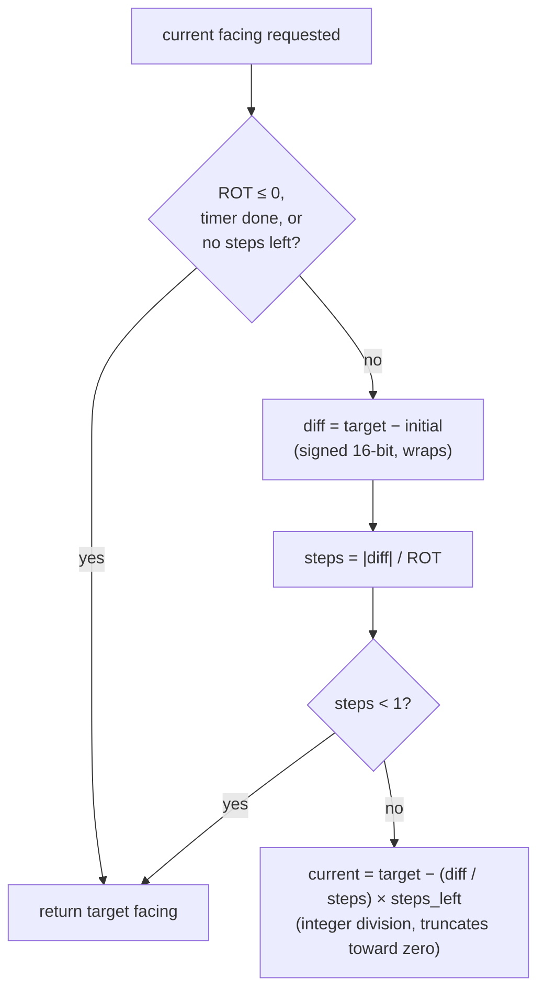
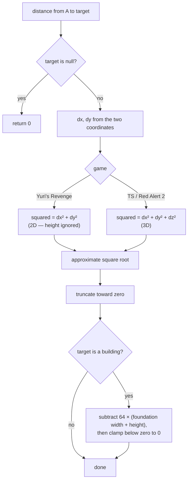

# Coordinate system: cells, leptons, and distance

*Last verified: 2026-07-21. Version coverage: the cell/lepton conversions, facing values, and the building-footprint distance adjustment are **identical across Tiberian Sun, Red Alert 2, and Yuri's Revenge**. The one exception is the object-to-object distance measure: **Yuri's Revenge computes it in 2D** (ignoring height), while **Tiberian Sun and Red Alert 2 compute it in true 3D**. That single divergence is described in full below.*

Every spatial system in the engine — movement, range, weapon reach, targeting, spread — is built on two units and the conversion between them. This entry documents those units, the exact conversion arithmetic (including where it does **not** round the way you might expect), the 16-bit facing value, and the distance function that range checks call.

## Two units: cells and leptons

The engine works in two spatial resolutions:

- A **cell** is one tile of the isometric map grid. A map position at cell resolution is a pair of 16-bit signed values, `(X, Y)` — a 2D grid coordinate with no height component.
- A **lepton** is the sub-cell world unit. A world position is a triple of 32-bit signed values, `(X, Y, Z)` — a full 3D coordinate. `X` and `Y` are horizontal leptons; `Z` is height.

**One cell is 256 leptons on a side.** This constant is not a documentation guess — the same `256` shows up independently in unrelated code (for example, the weapon spread radius in the damage pipeline is measured against this same cells-to-leptons factor).

## Cell ↔ world conversion

Converting a cell to a world coordinate places the point at the **center** of the cell:

```text
world.X = cell.X × 256 + 128
world.Y = cell.Y × 256 + 128
world.Z = (caller-supplied height, default 0)
```

The `+ 128` is exactly half a cell, so a cell coordinate always maps to its midpoint, never its corner.

Converting a world coordinate back to a cell drops the sub-cell remainder:

```text
cell.X = world.X / 256
cell.Y = world.Y / 256
```

### The rounding quirk (truncation toward zero)

That division is C-style **integer division, which truncates toward zero — it does not floor.** For non-negative coordinates the two agree, but for negative coordinates they diverge:

| World X | World X / 256 | Cell X |
|---:|---:|---:|
| `255` | `0` | `0` |
| `256` | `1` | `1` |
| `-1` | `0` | `0` |
| `-256` | `-1` | `-1` |
| `-257` | `-1` | `-1` |

Because of this, a cell→world→cell round trip is **not** always the identity for negative cells. Cell `-12` converts to world `-2944` (that is `-12 × 256 + 128`), and `-2944 / 256` truncates to `-11`, not `-12`. This is verified engine behavior, not a defect to be "corrected" to mathematical floor division — code that relies on floor semantics for negative cells would not match the original engine.

## Facing: a 16-bit compass

Direction is stored as a **16-bit value where a full turn is 65536 units** (2^16). The value wraps through unsigned 16-bit storage, so adding past a full turn naturally rolls over — there is no separate normalization step.

The engine reads that same 16-bit value at several coarser resolutions by taking the top bits:

| View | Bits | Range | Typical use |
|---|---|---|---|
| 8-direction | 3 | 0–7 | 8-facing sprite sets |
| 32-direction | 5 | 0–31 | 32-facing sprite sets |
| 256-direction | 8 | 0–255 | fine facing |

Down-scaling to a coarser view is **rounded** (it adds half a step before dropping the low bits), so a facing that is just past halfway between two sprite directions snaps to the nearer one rather than always truncating down. Up-scaling simply shifts the value into the wider field.

### Turning over time

A unit that is mid-turn does not jump to its target facing; it steps toward it at a fixed **rate of turn (ROT)**. The current facing is resolved like this:



The subtraction `target − initial` wraps in 16 bits, which is what lets a unit turn the **short way** around the compass rather than unwinding all the way through zero. When the configured rate is an ordinary non-negative value, the stored per-tick rate is that value multiplied by 256; rates above 127 are clamped before that scaling.

## Distance between objects

Range checks — "is the target in weapon range?", "is it close enough to attack?" — call a single distance measure between two objects. Its shape is fixed, but one step differs by game.



Several details of this measure are worth stating exactly:

- **A null target returns distance 0.**
- **The square root is approximate.** The engine does not call a precise square root; it uses a fast table-based approximation and then truncates the result toward zero. This is **gameplay-visible**: two objects separated by exactly 255 leptons along one axis report a distance of **254**, because the approximate root of `255 × 255` comes out just under 255 and truncation drops it. A separation of exactly 256 leptons (one full cell) reports exactly **256**. The error is small and bounded, but it is real and it is part of the engine's behavior.
- **Buildings are measured to their footprint, not their origin.** If the target is a building, the engine subtracts `64 × (foundation_width + foundation_height)` from the raw distance and clamps any negative result to 0 — so large structures are effectively "closer" than their reference point, by an amount that scales with their footprint. This building adjustment is identical in all three games and is applied after whichever raw distance the game computed.

### The 2D-vs-3D divergence (the one cross-version difference)

This is the single place where the three games disagree:

- **Yuri's Revenge** computes the raw distance in **2D** — it forms the X and Y deltas, sums their squares, and ignores the Z (height) delta entirely. **Every Yuri's Revenge range check therefore treats the world as flat.** A target directly above or below the firer at the same map position reads as distance 0 before the building adjustment.
- **Tiberian Sun and Red Alert 2** compute the raw distance in **true 3D** — they include the squared Z delta, so height genuinely counts toward range.

This was confirmed by comparing the two code paths directly: the Yuri's Revenge routine sums two squared terms, the Tiberian Sun and Red Alert 2 routines sum three, and the surrounding logic is otherwise line-for-line the same. It is not a quirk to toggle on or off — it is simply the correct behavior of each game, and it has real consequences for cliff and air interactions in the 3D-distance games.

## What this entry does not claim

- **Not** that the approximate square root matches a true IEEE square root bit-for-bit. It is a deliberate fast approximation; only its truncated integer output is documented here.
- **Not** that any facing value beyond the compass storage, the 8/32/256-direction views, and the turn-toward-target stepping is covered — class-specific facing overrides (turret, barrel, and per-unit-type accessors) are a separate object-model topic.
- **Not** a complete catalogue of every cell and map helper. This entry covers the coordinate units, the two conversions, facing, and the object distance measure; other spatial helpers are documented as they are verified.
- **No** claim about any reTS-specific API. This page describes the **original engine's** behavior recovered for the verified path.

## Corrections

If you can falsify a claim on this page against retail *Tiberian Sun*, *Red Alert 2*, or *Yuri's Revenge* behavior, open an issue on the [reTS repository](https://github.com/DasSheep/reTS/issues). Reports are treated as verification input and re-checked against the oracle before the page is updated.
