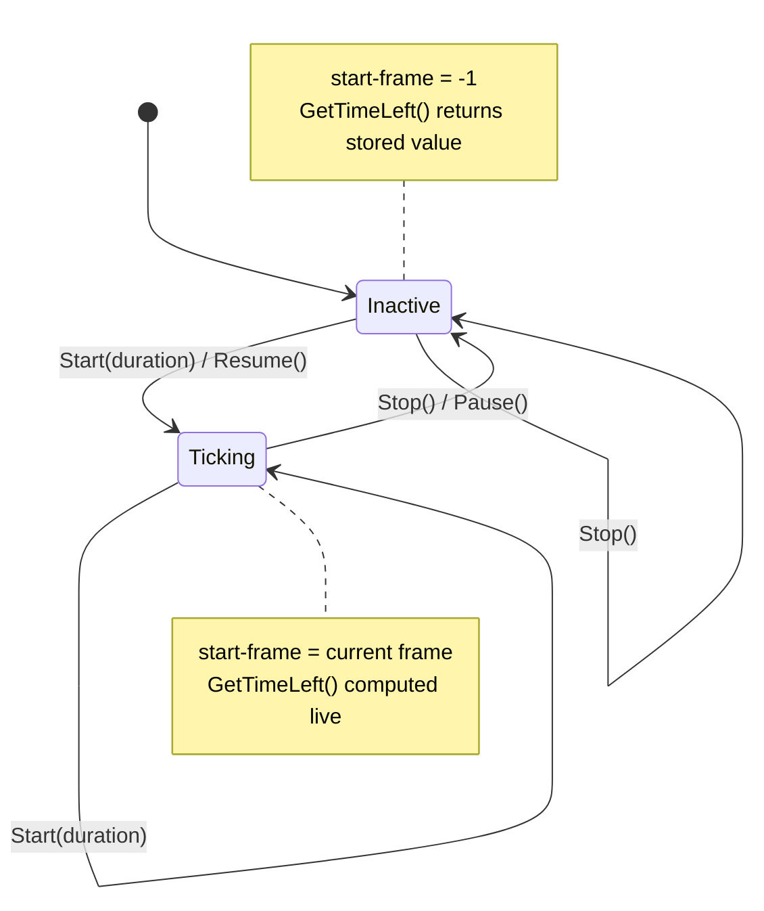

# Fixed-point math and frame timers

*Last verified: 2026-07-21. Version coverage: **Tiberian Sun**, **Red Alert 2**, and **Yuri's Revenge** all verified. The arithmetic and the timer state model are **identical** across the three games; the only reconciled difference is what the engine's own source names the freeze/resume operations (Tiberian Sun calls them stop/start; Red Alert 2 and Yuri's Revenge call them pause/resume). The observable behavior is the same.*

Three low-level primitives sit underneath most of the simulation: the float-to-integer conversion the engine uses whenever a floating-point intermediate has to become a whole number, the fixed-point rescaler that translates a unit's heading between bit widths, and the countdown timers that gameplay measures in **frames** rather than wall-clock seconds. None of these are configurable through INI; they are engine mechanics, documented here because higher-level systems (damage, distance, facing, mission timers) inherit their exact rounding and edge behavior.

## Float-to-integer conversion

Whenever the engine reduces a floating-point value to an integer — after a damage falloff multiply, after a distance square-root, and in many other places — it routes through a single shared helper rather than a plain C cast. The helper:

1. Reads the current floating-point rounding mode.
2. Compares it against the mode this conversion requires, which is **round toward zero** (truncation).
3. Loads the required mode only if the current one differs, performs the conversion, then restores the previous mode.

The net effect callers see is **truncation toward zero**: positive results drop their fraction, and negative results round toward zero as well (so `-2.9` becomes `-2`, not `-3`). This matters because several pipelines truncate an intermediate mid-formula; substituting a floor or round-half-up would diverge from retail.

**Cross-version:** the same conversion helper — the same short instruction sequence, the same required rounding mode, and the same 64-bit result register pair — is present in Tiberian Sun, Red Alert 2, and Yuri's Revenge. Verdict: **identical**; no per-game branch is needed.

## Fixed-point rescaling (facing bit widths)

The engine stores a unit's compass heading as a **16-bit** fixed-point value (65 536 subdivisions of a full turn) and rescales it on demand to narrower views: **3-bit** (8 facings), **5-bit** (32 facings), and **8-bit** (256 facings). A single rescale routine handles conversion in either direction between any two bit widths.

Let `bits_from` and `bits_to` be the source and destination widths, `value` the source number, and `offset` an optional bias. With
`mask_in = (1 << bits_from) − 1` and `mask_out = (1 << bits_to) − 1`, the routine is:

| Case | Result |
|------|--------|
| **Downscale** (`bits_from > bits_to`) | `((((value & mask_in) >> (bits_from − bits_to − 1)) + 1) >> 1) + offset) & mask_out` |
| **Upscale** (`bits_from < bits_to`) | `(((value − offset) & mask_in) << (bits_to − bits_from)) & mask_out` |
| **Equal** (`bits_from == bits_to`) | `value & mask_out` |

The two directions are not symmetric. The downscale path keeps one extra low bit, adds 1, and shifts once more — this is a **round-to-nearest on the discarded low bits**, so a heading exactly on a boundary rounds up to the next facing rather than truncating down. The upscale path subtracts the offset first, then left-shifts to fill the wider field. Both directions mask the result to the destination width, which makes the operation wrap cleanly (a full turn maps back to zero).

## Frame timers

Gameplay countdowns — reload delays, mission timers, ability cooldowns — are counted in **logic frames**, using a global frame counter that increments once per simulation step. A timer does not store a wall-clock deadline; it stores the frame it was armed on plus a duration, and computes remaining time by subtracting from the current frame on demand.

### Layout and states

A timer is a small fixed-size object with three 32-bit slots: a **start-frame** field, an unused middle word, and a **remaining/duration** field. It has two states:

- **Inactive** — the start-frame field holds the sentinel `−1`. `GetTimeLeft()` returns the stored remaining value verbatim; the clock is not running.
- **Ticking** — the start-frame field holds the frame the timer was armed on. `GetTimeLeft()` is computed live.

### Operations

- **Start(duration)** — records the current frame and stores the duration; the timer becomes ticking regardless of its prior state.
- **Stop** — resets to the inactive sentinel with zero remaining. This is a destructive clear.
- **Pause / freeze** — affects a ticking timer **only**: it computes the remaining time, stores that into the remaining field, and sets the start-frame sentinel to inactive. Pausing an already-inactive timer is a no-op.
- **Resume** — affects an inactive timer **only**: it stamps the current frame into the start-frame field while preserving the stored remaining value, so the countdown continues from where it froze. Resuming an already-ticking timer is a no-op.

A repeatable variant adds a stored `Duration` and re-arms itself with that duration each time it is restarted.

### Remaining-time computation

For a ticking timer, remaining time is `stored_remaining − (current_frame − start_frame)`, clamped so it never reports below zero. The frame subtraction is a **wrapping 32-bit** operation, which matches the retail behavior when the signed frame counter crosses its maximum value during a very long session — the arithmetic stays consistent rather than trapping or saturating.

The derived status predicates follow directly:

- **In progress** — ticking with remaining time greater than zero.
- **Completed** — ticking with no remaining time.
- **Expired** — inactive, *or* ticking with no remaining time.

### Mission-timer durations

Trigger actions that arm, pause, resume, or read the on-screen mission timer take their duration parameter **in seconds** and convert it to frames by multiplying by **15** — the same factor in all three games. A mission action that pauses or resumes the countdown drives the same freeze/resume timer operations described above.

## Cross-version notes

- **Float-to-integer** and **fixed-point rescaling**: identical arithmetic in Tiberian Sun, Red Alert 2, and Yuri's Revenge.
- **Timers**: the object layout (a 12-byte object with the meaningful fields first and last), the arithmetic, the sentinel-`−1` inactive state, and the seconds-to-frames factor of 15 match across all three. The reconciled divergence is purely nominal: Tiberian Sun's source names the freeze and resume operations *stop* and *start*, while Red Alert 2 and Yuri's Revenge name the same operations *pause* and *resume*. Yuri's Revenge additionally names a separate destructive *stop* that clears the timer to the inactive sentinel with zero remaining; the reconciliation did not identify a distinctly-named Tiberian Sun counterpart for that clear.

## What this entry does not claim

- That every timer *consumer* (each ability, reload, or build-queue clock) is documented here — this entry covers the shared primitive, not each system that arms one.
- A specific logic-frame rate for the whole simulation. The seconds-to-frames factor of **15** is stated only for the **mission-timer trigger action** conversion, which is where it was verified.
- The Win32 `MulDiv` API as an engine fixed-point primitive. It appears in the binaries only to size a dialog font and carries no gameplay behavior; it is not part of this system.
- Any reTS-specific API. This page describes the **original engine** behavior recovered for the verified path.

## Corrections

If you can falsify a claim on this page against retail *Tiberian Sun*, *Red Alert 2*, or *Yuri's Revenge* behavior, open an issue on the [reTS repository](https://github.com/DasSheep/reTS/issues). Reports are treated as verification input and re-checked against the oracle before the page is updated.
