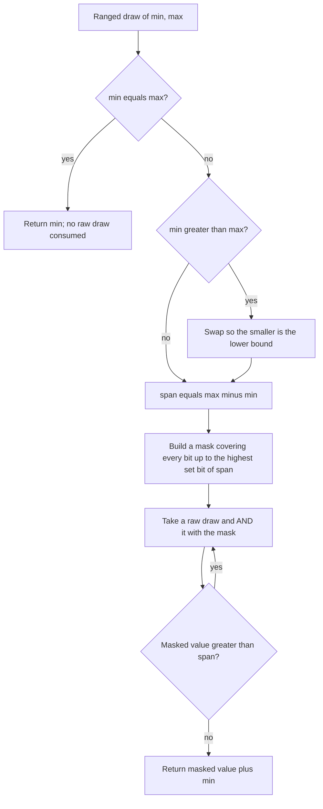

# The randomizer: deterministic sequences

*Last verified: 2026-07-21. Version coverage: verified for **Tiberian Sun**, **Red Alert 2**, and **Yuri's Revenge**. The generator's active draw sequence and its ownership/lifecycle are **identical** across all three. What diverges is documented below: the in-memory object layout differs between Tiberian Sun and the Red Alert 2 / Yuri's Revenge pair, and on save-load the scenario-embedded stream is reconstructed at seed zero after its saved bytes are read.*

Every deterministic decision the engine makes — scatter, miss chance, crate contents, tie-breaks — comes from one small primitive: a seedable pseudo-random generator whose output is a pure function of its seed and the number of draws taken since. Give it the same seed and pull the same number of values, on any machine, and you get the same numbers. That reproducibility is the foundation the lockstep multiplayer model and replays are built on.

There is no INI tag for this. The randomizer is an internal engine primitive, not a moddable field; it surfaces only through the systems that draw from it.

## Two streams per game

Each running game owns **two independent** randomizers, both constructed from the same seed at initialization and diverging the instant their consumers draw at different rates:

- A **scenario-embedded** stream. This is the gameplay stream — the one that must stay bit-identical across peers, so it is the one that matters for lockstep and replay determinism.
- A **separate global** stream for non-critical randomness. It has many consumers and is not restricted to random-map generation; it is simply outside the synchronized path.

Both are seeded together at match start. Because they are drawn from independently, their sequences part ways immediately and are not interchangeable.

If a randomizer is constructed without an explicit seed, the engine's default seed is the current system tick count — derived from a running millisecond tick counter and therefore different every run. Determinism only holds when a fixed seed is supplied, which is exactly what the match-start path does.

## Internal shape

A randomizer is a fixed table of **250** 32-bit words plus **two** cursor indices into that table. On construction the seed is expanded into all 250 table words by a fixed mixing routine (driven by two constant four-word blocks that are identical across all three binaries), and the two cursors are initialized:

- the first cursor starts at **0**;
- the second cursor starts at **103**.

The Red Alert 2 / Yuri's Revenge builds additionally carry a leading **"disabled" flag**; when it is set, a raw draw short-circuits and returns 0 (see cross-version notes). Tiberian Sun has no such flag.

## Drawing a raw value

A single raw draw is a lagged-XOR step over the table:

1. If the disabled flag is set (Red Alert 2 / Yuri's Revenge only), return 0.
2. XOR the word at the second cursor into the word at the first cursor, in place.
3. Return that updated word.
4. Advance **both** cursors by one, wrapping each back to 0 when it reaches **250**.

Because the second cursor leads the first by 103, each step folds the word 103 positions ahead into the current one — a lagged-Fibonacci-style generator with lags of 103 and 250 over a 250-word state.

## Ranged draws

The engine's ranged draw returns an integer in an **inclusive** `[min, max]` interval, built on top of the raw draw with rejection sampling:

The behavior worth stating exactly:

- **Equal endpoints** return that endpoint and consume **no** raw draw.
- **Reversed endpoints** are silently swapped, so the interval is order-independent.
- The interval is **inclusive** of both ends.
- Masking is to the **bit width of the span** (the mask spans every bit up to the span's highest set bit), and masked values **greater than the span are rejected** and redrawn — classic rejection sampling that keeps the distribution flat without a modulo bias. The reject comparison is signed.

A documented convenience built on the ranged draw produces a floating-point value strictly between 0 and 1 (both ends excluded) as a ranged draw over `1 … 2147483647` divided by `2147483648.0`. For a seed of 1, that first ranged value is **1,631,533,363**, making the first double **0.759741926100105**.

## Cross-version notes

The **draw algorithm, the ranged-draw masking/rejection, the reversed-bound swap, the non-consuming equal-endpoint path, and the 250-entry wraparound are instruction-equivalent** across Tiberian Sun, Red Alert 2, and Yuri's Revenge, and all three carry the same seed-mixing constants. The generator you get is the same generator.

The divergences are structural, not behavioral:

| | Tiberian Sun | Red Alert 2 / Yuri's Revenge |
|---|---|---|
| Object layout | two cursors first, then the 250-word table | leading disabled flag, then the two cursors, then the table |
| Object size | 250 + 2 words | 250 words + flag + two cursors (one word larger) |
| Disabled short-circuit | none | a set disabled flag makes a raw draw return 0 |

For a running match none of this changes the numbers: the normal active state is valid for every game and yields the same sequence, so no per-version branch is needed for gameplay draws. The layout difference matters only to code that reads or writes the object's raw bytes — notably save/load.

## Save and load

On save, the scenario writes the embedded randomizer out as part of a raw object block. On load, the engine reads that block back **and then immediately re-runs the scenario's no-initialization constructor**, which reconstructs the embedded randomizer at **seed zero** — overwriting the bytes that were just read. In other words, through this path a loaded save does **not** resume the pre-save random sequence; the gameplay stream restarts from the seed-zero state. The separate global stream is not touched by the scenario save/load routines.

This is a faithful-behavior finding, not a bug to be fixed: a reproduction of the original engine must reset the stream the same way on load.

## What this entry does not claim

- It does not publish the internal seed-expansion constants or the bit-level mixing arithmetic, nor any specific draw-sequence fixtures beyond the two illustrative results named above.
- It does not enumerate every consumer of the separate global stream, nor assert that the global stream is used only for random-map generation — it is not.
- The save/load reset above is established from the scenario save/load call paths directly. It is **not** a proof over every conceivable indirect persistence path; no dedicated standalone randomizer serialization routine was found, but that is bounded call-graph evidence rather than a global guarantee.
- It makes no claim about any reimplementation's API. This page describes the **original engine's** behavior.

## Corrections

If you can falsify a claim on this page against retail *Tiberian Sun*, *Red Alert 2*, or *Yuri's Revenge* behavior, open an issue on the [reTS repository](https://github.com/DasSheep/reTS/issues). Reports are treated as verification input and re-checked against the oracle before the page is updated.
