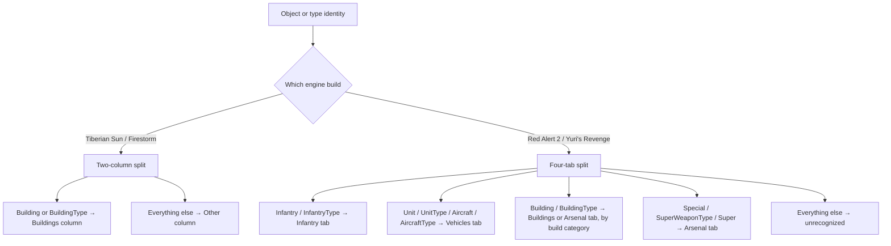

# Sidebar tab and column routing

*Last verified: 2026-07-16. Version coverage: **Red Alert 2** and **Yuri's Revenge** share a four-tab sidebar layout with byte-identical routing logic; **Tiberian Sun** and **Firestorm** share an older two-column layout (same executable, same contract).*

How the original engine decides which sidebar partition a buildable object's cameo belongs in. This is a small, self-contained routing contract that sits in front of the sidebar's insertion logic: given an object's identity (and, for buildings, its build category), it returns a partition index. It does not cover drawing, clicking, production queues, or the ordering of cameos once they're inside a partition.

:::note Publication bar
This entry covers the fully reversed identity-to-partition routing contract on both the Red Alert 2/Yuri's Revenge four-tab mapper pair and the Tiberian Sun/Firestorm two-column mapper, plus the immediate insertion-consumer boundary (capacity and duplicate checks) that acts on a routed result. The larger cameo ordering policy inside a partition, sidebar rendering, gadget/click handling, and production-queue progress are separate systems and are not covered here.
:::

## Two eras, two layouts

Tiberian Sun and Firestorm predate the four-tab sidebar entirely: they route into two physical strips, buildings on one side and everything else on the other. Red Alert 2 and Yuri's Revenge share a four-tab layout, and their routing logic is byte-for-byte identical between the two games (RA2's mapper differs only in the location it jumps to for the build-category lookup, a relocation artifact rather than a behavioral change).

## Red Alert 2 / Yuri's Revenge: the four tabs

The later sidebar has four tabs:

| Tab | Role |
| --- | --- |
| Buildings | non-combat buildings |
| Arsenal | combat-category buildings, plus special and superweapon identities |
| Infantry | infantry |
| Vehicles | units and aircraft |

The primary object mapper — the one used when a cameo is actually added to the sidebar — recognizes both the "live object" and "type" identity for each category, and routes every other identity as unrecognized:

| Identity (live / type) | Routes to |
| --- | --- |
| Infantry / InfantryType | Infantry |
| Unit / UnitType | Vehicles |
| Aircraft / AircraftType | Vehicles |
| Building / BuildingType, build category = Combat | Arsenal |
| Building / BuildingType, build category ≠ Combat | Buildings |
| Special, SuperWeaponType, Super | Arsenal |
| any other identity | unrecognized |

**The Arsenal tab is not a "defenses" bucket.** It is shared by two unrelated inputs: buildings whose resolved build category equals the engine's `Combat` category, *and* the `Special`, `SuperWeaponType`, and `Super` identities, which never go through the build-category check at all. Community shorthand that reads tab 1 as "just defense structures" undercounts it — special abilities and superweapons land there too, unconditionally. (The `Special` identity is present in the engine's type-identity enumeration even though no shipped YR object actually reports it at runtime — verified for YR specifically; RA2's and TS's `WhatAmI` implementations were not independently checked. Action and cameo callers can still route it directly.)

### The Combat build-category split

For a `Building` or `BuildingType` identity, the mapper does not decide Buildings-versus-Arsenal by RTTI alone. It first resolves the object's or type's build category — a small integer field on the building type — and compares it against the engine's `Combat` category value. A negative resolved index is treated as build category `0` (not Combat), so it lands safely on the Buildings tab rather than becoming unrecognized. A non-negative but out-of-range invalid index is not bounds-checked by this contract, and its outcome is an unverified precondition of surrounding game state (see "What this entry does not claim" below) — only an index that resolves to an exact match with the `Combat` category is guaranteed to route to Arsenal.

## The narrower type/factory overload

A second, deliberately narrower routing entry point exists for factory-queue bookkeeping. It only recognizes four **type** identities — not their "live object" counterparts — and it receives the build category already resolved by its caller rather than resolving it itself:

| Type identity | Routes to |
| --- | --- |
| InfantryType | Infantry |
| UnitType | Vehicles |
| AircraftType | Vehicles |
| BuildingType, build category = Combat | Arsenal |
| BuildingType, build category ≠ Combat | Buildings |
| any other identity | unrecognized |

This overload also takes a naval/ground flag as an argument — and never reads it. Its one caller in the per-house factory-queue update logic uses that flag earlier, to decide whether to inspect the ground or naval production queue for that house, and then passes the same flag into the routing call regardless. Naval status changes *which factory queue* the engine looks at; it has no effect on *which sidebar tab* a queued item's cameo is routed to.

## Tiberian Sun / Firestorm: two columns, no unrecognized case

Tiberian Sun's sidebar has two physical strips rather than four tabs, and its routing mapper is deliberately exhaustive — there is no "unrecognized" outcome:

| Raw identity | Routes to |
| --- | --- |
| Building or BuildingType | Buildings column |
| every other value, including negative and out-of-range integers | Other column |

Any identity that isn't specifically Building or BuildingType — including invalid or nonsensical values — falls through to the Other column by default. This is a meaningfully different failure mode from the later four-tab engine, which has an explicit unrecognized result for unmapped identities. Firestorm runs on the same executable as Tiberian Sun and shares this exact contract; there is no Firestorm-specific divergence to record here.

Two of Tiberian Sun's direct UI action paths insert the `Special` identity directly into the Other (right) strip — the same destination the two-column mapper would produce for that identity — and when doing so, the sidebar suppresses its usual "new construction options available" notification for that entry, but still inserts the cameo normally.

## How the insertion consumers use the routed result

**Red Alert 2 / Yuri's Revenge.** The cameo-insertion routine that actually adds a buildable item to the sidebar does not call the routing mapper as a separate step — it has the same routing logic inlined, then immediately uses the resulting tab index to locate that tab's cameo array and slot count. Critically, there is **no check between routing and that array access for the unrecognized (`-1`) case**. If an unrecognized identity ever reaches this insertion routine, the engine computes an address before the real tab array begins rather than failing gracefully. This is not a guarded error path — it is a precondition the caller must uphold: only identities the routing table actually recognizes may reach cameo insertion. reTS's routing port reports an explicit "unrecognized" result and flags it as unsafe for this insertion step, rather than asserting that the original insertion routine handles it safely, because it does not.

For a recognized tab, insertion applies two checks before doing anything else:

- **Capacity.** It rejects the insert once that tab already holds more than 75 entries. Exactly 75 existing entries still allows a 76th to be inserted; the guard is a strict "greater than," not "at or above."
- **Duplicate.** It rejects the insert if an entry for the same identity and item index is already present in that tab.

Only after both checks pass does it hand off to the shared insertion helper, mark the tab and sidebar for redraw, and report success. This document pins the checks and their boundary; the full entry-slot layout and the policy that decides *where within a tab* a new cameo is sorted are a separate, not-yet-published topic.

**Tiberian Sun / Firestorm.** The equivalent insertion routine likewise inlines the two-column split rather than calling the mapper separately, hands off to the strip-level insertion helper, activates the sidebar and marks it for redraw on success, and reports failure if the game is in debug-map mode or the strip-level helper itself rejects the entry.

## What this entry does not claim

- The policy that orders cameos *within* a tab or column once inserted (the engine's broader cameo-sort contract) — reserved for a separate entry.
- Sidebar rendering, gadget/click handling, tooltips, or production-queue progress display.
- That the original engine's Red Alert 2/Yuri's Revenge insertion routine validates an unrecognized route before using it — it does not, and this entry states that as a precondition hazard rather than a handled case.
- Bounds-checking behavior for an out-of-range but non-negative object/type index passed into the build-category lookup — that remains an unverified precondition of the surrounding game state, not a routing-contract guarantee.
- Any claim that reTS is a playable shipped client. This page describes the **original engine's** behavior as recovered and verified, independent of reTS's own implementation status.

## Corrections

If you can falsify a claim on this page against retail *Command & Conquer: Tiberian Sun*, *Firestorm*, *Red Alert 2*, or *Yuri's Revenge* behavior, open an issue on the [reTS repository](https://github.com/DasSheep/reTS/issues). Reports are treated as verification input and re-checked against the oracle before the page is updated.
