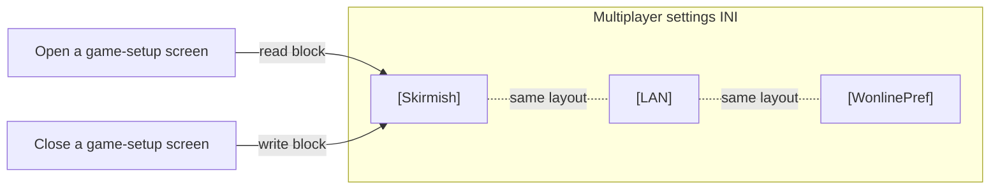

# Skirmish and LAN game options

*Last verified: 2026-07-21. Version coverage: **Red Alert 2** and **Yuri's Revenge** share one identical game-options preference block — same keys, same defaults logic, same three sections — differing only in which rules fields the fallback defaults are read from. **Tiberian Sun** and **Firestorm** diverge: they persist multiplayer setup through an older, differently-shaped settings reader that has none of this block's per-slot or option keys, so nothing here transfers to them.*

How the original engine remembers the last game-setup you chose. When you close a skirmish, LAN, or Westwood Online game-setup screen, the engine writes the chosen options — game mode, map, speed, starting credits, unit count, and the on/off toggles — into the game's settings INI, and reads them back the next time you open the same screen. This entry describes that read/write contract: the exact keys, the fallback behavior when a key is missing, and how it differs across the engine lineage.

:::note Publication bar
This entry covers the fully reversed, oracle-tested preference block used by Red Alert 2 and Yuri's Revenge, and records the confirmed Tiberian Sun / Firestorm divergence. The broader multiplayer-lobby state (player handles, colors, sides, and serial/modem connection details) lives in a different INI section and is a separate contract, not covered here.
:::

## Three screens, one block

The engine keeps a separate copy of the same options block for each of the three game-setup contexts. All three are written into the game's multiplayer settings INI (for Yuri's Revenge, that file is `RA2MD.ini`), each under its own section header:

| Section | Game-setup context |
| --- | --- |
| `[Skirmish]` | single-player skirmish vs. the AI |
| `[LAN]` | local-network multiplayer |
| `[WonlinePref]` | Westwood Online multiplayer |

The same serializer runs three times, once per section, with the same key layout each time. Player identity for a networked game — handle, color, chosen side, phone book — is **not** part of this block; it lives in the separate `[MultiPlayer]` section and is out of scope for this entry.

## The option keys

Each section holds a fixed set of scalar keys. When a key is absent, the engine falls back to the corresponding value from the loaded rules — with one exception noted below. Reading and writing use the identical key set and order; the write side is a mirror of the read side.

| Key | Type | Fallback when the key is missing |
| --- | --- | --- |
| `GameMode` | integer | the rules-provided default game mode |
| `ScenIndex` | integer | **0** (fixed, not a rules value) |
| `GameSpeed` | integer | the rules-provided game speed |
| `Credits` | integer | the rules-provided starting credits |
| `UnitCount` | integer | the rules-provided unit count |
| `ShortGame` | boolean | the rules-provided short-game flag |
| `SuperWeaponsAllowed` | boolean | the rules-provided superweapons flag |
| `BuildOffAlly` | boolean | the rules-provided build-off-ally flag |
| `MCVRepacks` | boolean | the rules-provided MCV-redeploy flag |
| `CratesAppear` | boolean | the rules-provided crates flag |

Two facts are exact and verified:

- **`ScenIndex` always defaults to 0**, independent of the rules. Every other scalar default is pulled from the loaded rules data, so its numeric value depends on the active `rulesmd.ini`; only `ScenIndex`'s default is hardcoded in the engine.
- **Booleans are written as the literal words `yes` and `no`**, and integers as plain decimal digits. Reads go through the engine's standard boolean and integer parsers.

This entry does not publish the specific numeric rules defaults for game mode, speed, credits, unit count, or the toggles, because those are not constants of this contract — they are whatever the loaded rules say.

## The seven player slots

Below the scalar options, the block stores seven per-slot entries under the keys `Slot01` through `Slot07`. Each slot's value is a comma-separated list of **three integers**, written in the form `first,second,third`. These three integers carry per-slot player-setup state; this entry does **not** claim what each of the three positions means (see "What this entry does not claim").

The read behavior for a slot is precise and worth stating exactly, because it governs how partial or hand-edited entries behave:

- The engine starts each slot from a **default triple**. The first slot's leading value and the other slots' leading value are supplied by the caller; the second and third positions default to a fixed sentinel value of **-2**.
- It then reads the slot's INI string and splits it on commas, taking up to three tokens. Each token present is parsed as an integer and overwrites that position; **tokens that are absent leave that position at its default.** A missing or empty slot key leaves all three defaults untouched.

So a slot line with only one number sets the first position and leaves the second and third at their defaults; a line with two numbers sets the first two and leaves the third; and so on. The write side emits all three positions as `first,second,third`.

Only `Slot01` through `Slot07` are serialized — seven slots. (A slot at index 0 exists in the in-memory structure but is never read from or written to this block.)

## Cross-version behavior

**Red Alert 2 and Yuri's Revenge — identical.** The read helper, the write helper, the key set, the three sections, the `-2` slot-field sentinel, and the `Slot01`…`Slot07` naming are the same in both games. The only difference is which fields inside the loaded rules data the scalar fallbacks are read from — a consequence of the two games' rules structures being laid out at different offsets. The observable INI contract — keys, formats, defaults logic — is the same.

**Tiberian Sun and Firestorm — diverge.** These builds predate this preference block. They persist multiplayer setup through a different, older settings reader/writer that handles a `[MultiPlayer]`- and serial/modem-oriented set of keys. It has no per-slot `Slot01`…`Slot07` triples, and none of the `SuperWeaponsAllowed`, `MCVRepacks`, `CratesAppear`, or `ScenIndex` keys this block defines. Firestorm shares the Tiberian Sun executable and this same older reader; there is no Firestorm-specific variant. The correct statement is not "Tiberian Sun uses a subset" — it is a **different contract**, and the keys documented here should not be expected in a Tiberian Sun or Firestorm settings file.

## What this entry does not claim

- **The meaning of the three integers in each slot triple.** They are stored and round-tripped as an opaque three-integer tuple; naming them (for example as AI difficulty, color, or start position) would be a guess this contract does not verify.
- **The specific numeric rules defaults** for game mode, speed, credits, unit count, or the toggles — those come from the loaded rules and vary with `rulesmd.ini`; only `ScenIndex`'s default of 0 is a fixed constant of this contract.
- **The full multiplayer lobby state** — player handles, colors, sides, and serial/modem connection settings in the separate `[MultiPlayer]` section — which is a different serializer.
- **The Tiberian Sun / Firestorm multiplayer settings body itself.** This entry confirms only that it is a *different* contract without this block's keys; its own key layout is a separate topic.
- **Any reTS-specific API.** This page describes the **original engine's** persisted-options behavior as recovered and verified.

## Corrections

If you can falsify a claim on this page against retail *Command & Conquer: Tiberian Sun*, *Firestorm*, *Red Alert 2*, or *Yuri's Revenge* behavior, open an issue on the [reTS repository](https://github.com/DasSheep/reTS/issues). Reports are treated as verification input and re-checked against the oracle before the page is updated.
