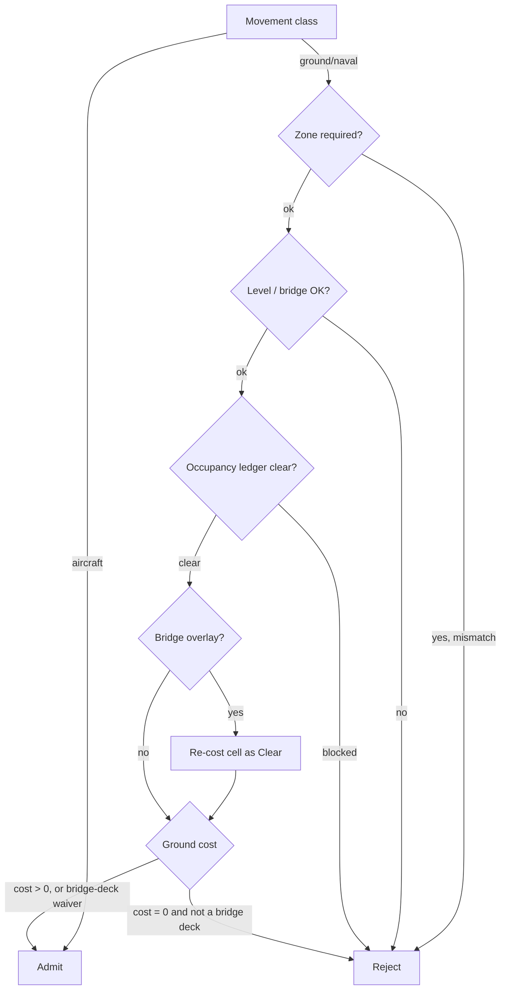

# Map and cell grid

*Last verified: 2026-07-23. Version coverage: this entry reconciles **Tiberian Sun**, **Red Alert 2**, and **Yuri's Revenge**. The cell array and indexing, the shared "invalid cell" fallback, the diamond map-bounds test, the LandType enumeration, and the 16-entry terrain-tag mapping are **identical across all three**. The per-cell height model and the `[Land]` movement-cost table **diverge** between games; those divergences are described factually per game below. One height-model detail (Red Alert 2's level-height representation) is **not yet verified** and is called out rather than guessed.*

The cell grid is the spatial floor of the engine: a flat array of cells that every unit, building, and terrain feature is placed on. This entry describes how a coordinate becomes a cell, how a cell reports its floor height, how the engine tests whether a cell is on the map, how each cell derives its **LandType**, and how the `[Land]` rules table turns a cell's LandType plus a unit's movement class into a movement cost and a pass/fail.

## The cell array

The map is a **flat array of cells sized 512 by 512 - 262,144 entries - regardless of the actual map dimensions**. A cell is addressed by packing its map coordinates:

```text
index = (Y × 512) + X
```

This layout and formula are **identical in all three games**.

Two consequences follow directly from the reversed code and hold across all three:

- **Coordinate-to-cell conversion truncates toward zero, not floor.** A world coordinate is divided by 256 (one cell spans 256 leptons on each axis) using C-style integer division that rounds toward zero. For negative coordinates this differs from floor division, so a coordinate just past the west or north map edge maps one cell differently than a naive floor would suggest.
- **An out-of-bounds lookup never returns null.** Instead the engine returns a single shared **"invalid cell"** - one static, reused, mutable dummy cell - and records the offending coordinate in a diagnostic global. Every out-of-bounds read in a frame therefore sees the *same* dummy object, and each such read overwrites its recorded coordinates. This shared-sentinel pattern is present verbatim in all three games.

## Floor height

Each cell has an integer **Level** (its height step) and a **slope shape** (flat, or one of a fixed set of ramp shapes). The floor height reported for a cell, in leptons, is built from those two:

```text
base = round(Level × 104 + 0.5)     // 104 leptons per level step
```

`104` is the engine's **level-height constant** (the vertical rise of one level step, derived from the isometric cell geometry). A flat cell returns `base` directly. A sloped cell adds a further contribution selected by its ramp shape and clamped to that ramp's maximum rise, and the sum is rounded the same way.

### Cross-version divergence in the height model

This is where the games differ, and the difference is real, not cosmetic:

- In **Tiberian Sun**, a sloped cell's height **interpolates across the cell**: the sub-cell X/Y position within a cell feeds non-zero coefficients for the middle range of ramp shapes, so a point near the high edge of a ramp reports a greater height than a point near the low edge - a smooth gradient of up to roughly one level's worth of rise across a single cell.
- In **Yuri's Revenge**, those sub-cell coefficients are **all zero**. Floor height there is a pure function of `Level` and the ramp shape; the sub-cell position is inert, so every point within a given sloped cell reports the same height. This is a Yuri's-Revenge-side flattening of the Tiberian Sun behavior. (Both the flat and the interpolating variants are the genuine binary behavior of their respective engines - neither is a bug.)
- In **Red Alert 2**, the level-height representation was **not located** and is **not published here**. The literal constant that Yuri's Revenge uses does not appear in Red Alert 2's code or data in the same form, so whether Red Alert 2 interpolates like Tiberian Sun or flattens like Yuri's Revenge is an open question. This entry makes no claim about it.

## Map bounds

The playable map in this engine's cell space is an **isometric diamond**, not a rectangle, and the bounds test reflects that. Given a map rectangle with a width and height in cell units, a cell `(X, Y)` is legal exactly when:

```text
Width < (X + Y) ≤ Width + 2 × Height     AND     |X − Y| < Width
```

This diamond formula is **identical across all three games** (only the internal storage position of the width/height fields shifts between engine versions). The ancestor engines that used a non-diagonal grid tested a plain rectangle here; in the isometric cell space of this family the diamond is the real shape of the map.

A second, tighter test - the **usable area** - carves out a diamond band inside the visible rectangle and, when asked to account for height, raises the band's lower edge for high or sloped cells (tall terrain needs a larger `X + Y` to count as usable). The four-inequality band form is shared; the exact margins are engine-specific.

## LandType

Every cell carries a **LandType** that classifies its terrain. The enumeration is **identical in all three games**:

| Value | LandType | Value | LandType |
|------:|----------|------:|----------|
| 0 | Clear | 6 | Beach |
| 1 | Road | 7 | Rough |
| 2 | Water | 8 | Ice |
| 3 | Rock | 9 | Railroad |
| 4 | Wall | 10 | Tunnel |
| 5 | Tiberium | 11 | Weeds |

A cell's LandType is recomputed from its tile and any overlay, in a fixed order:

1. **Overlay is considered first.** If the cell has an overlay, its LandType is taken from the overlay type. If that overlay land is `Wall` or `Railroad` (or the overlay carries a specific "authoritative" flag), the overlay wins outright and tile classification is skipped.
2. **A blank tile** resolves to `Clear` (unless a non-authoritative overlay is keeping its own land).
3. **A real tile** is classified from a terrain-tag byte stored in the selected sub-tile's TMP image record, mapped through a fixed **16-entry table baked into the engine**. That table is byte-for-byte identical in all three games:

   | Tag | 0 | 1-4 | 5 | 6 | 7-8 | 9 | 10 | 11-12 | 13 | 14 | 15 |
   |-----|---|-----|---|---|-----|---|----|-------|----|----|----|
   | LandType | Clear | Ice | Tunnel | Railroad | Rock | Water | Beach | Road | Clear | Rough | Rock |

4. **Tiberium special case:** when a real tile is occupied by resource growth, the slope is shallow (below the mid ramp range), and the overlay land is `Clear`, the cell's LandType becomes `Tiberium`. On steeper slopes the resource overlay is instead stripped and the cell takes its tile-derived land.

### Cross-version notes on LandType

The recompute spine and the 16-entry table are shared, with two engine-specific branches: **Tiberian Sun** has an extra terrain-object fallback that can force the Tiberium branch. **Yuri's Revenge** strips a resource overlay on a sloped tile in its authoritative-overlay branch; in the later Tiberium branch, a steep slope also evicts the overlay. These are additive branches on an otherwise common spine.

## Tile-class predicates and the missing-guard quirk

The engine answers questions like "is this a water tile?", "is this a ramp?", "is this a bridge tile?" by testing the cell's tile index against theater-loaded index ranges. A theater that does not define a given tileset leaves that range's marker at "absent" (represented as -1).

**Verified quirk:** most of the single-range predicates **do not guard against the "absent" marker**. When a theater lacks the tileset, the test degenerates into a range that starts at -1, so it spuriously matches low tile indices - for example, a water test in a theater with no water tileset would match the first several tiles of any other kind. The bridge and cliff predicates *do* guard correctly. In **Tiberian Sun** none of the predicates guard (the behavior is uniform); **Yuri's Revenge** added the bridge and cliff guards, producing the asymmetry. A "green tile" predicate exists in the later engines but has **no equivalent in Tiberian Sun**.

## The `[Land]` movement-cost table

Movement cost is a lookup: **LandType × movement class → a fraction in the range 0 to 1**, where the fraction scales a unit's speed and **`0` means impassable**. The table is built at load time from twelve rules sections named after the LandTypes - `[Clear]`, `[Road]`, `[Water]`, `[Rock]`, `[Wall]`, `[Tiberium]`, `[Beach]`, `[Rough]`, `[Ice]`, `[Railroad]`, `[Tunnel]`, `[Weeds]` - each supplying one key per movement class:

| Key | Movement class |
|-----|----------------|
| `Foot` | infantry on foot |
| `Track` | tracked vehicles |
| `Wheel` | wheeled vehicles |
| `Hover` | hover units |
| `Winged` | aircraft |
| `Float` | naval / floating |
| `Amphibious` | amphibious |
| `FloatBeach` *(Red Alert 2 / Yuri's Revenge)* / `Creep` *(Tiberian Sun)* | shoreline float / creep |
| `Buildable` | whether the land accepts buildings |

Two exact rules govern every value, in all three games:

- **Each value is clamped on the top only:** `min(value, 1.0)`. A value at or above 1.0 becomes exactly 1.0. A **negative value is passed through unclamped** - the engine does not raise it to zero. A missing key defaults to `1.0`.
- A looked-up cost of **exactly `0.0` means the cell is impassable** for that movement class.

**Aircraft bypass the table entirely.** The `Winged` movement class short-circuits the whole passability check - aircraft ignore terrain cost.

### Cross-version divergence in the `[Land]` table

- **Red Alert 2 and Yuri's Revenge** read **seven** movement keys from INI. `Winged` is **hardcoded to 1.0** (not read from INI), and the eighth slot is `FloatBeach`. `FloatBeach` is present in vanilla Red Alert 2.
- **Tiberian Sun** reads **eight** movement keys from INI: `Winged` **is configurable** there, and the eighth slot is `Creep` rather than `FloatBeach`.

The table's stride, section order, the top-only clamp, and the `Buildable` flag are otherwise shared.

## Passability: how a move is admitted

Putting it together, the per-cell "can this unit enter?" check runs a fixed gate order. Any gate can reject the move; passing all of them admits it.



1. **Aircraft short-circuit** - the `Winged` class is admitted before any other gate.
2. **Zone gate** - if a specific movement zone is required, the cell's resolved zone must match.
3. **Level / bridge gate** - if a specific height level is required, the cell's level must match, with a dedicated allowance for bridge decks (a bridge cell sits a fixed number of levels above the terrain it spans).
4. **Occupancy** - the cell (or, for a bridge, the separate bridge-deck occupancy ledger) must not already be blocked by the relevant kind of object.
5. **Bridge-overlay re-cost** - a cell carrying a bridge overlay is re-costed as `Clear` for the permitted movement zones.
6. **Ground cost** - the `[Land]` lookup above. A cost of `0.0` rejects **unless** the cell is a bridge deck.

The load-bearing consequence: a **bridge cell reads the bridge-deck occupancy ledger and waives the zero ground cost of the water (or other impassable terrain) underneath it**. That waiver is the entire mechanism by which bridges over water are walkable.

## What this entry does not claim

- **Red Alert 2's floor-height representation.** The level-height constant that Yuri's Revenge uses was not located in Red Alert 2, so whether Red Alert 2 interpolates sub-cell height like Tiberian Sun or flattens it like Yuri's Revenge is unresolved and unpublished.
- **The exact per-ramp height coefficients** beyond the shape of the model (flat vs. interpolating). The categories and the `104`-per-level base are stated; individual ramp-by-ramp coefficient values are not enumerated here.
- **Movement-zone construction** (how a cell's zone is computed) and the pathfinding that consumes these costs - separate systems.
- **Any reTS-specific API.** This page describes the original engine's behavior, recovered for the verified path.

## Corrections

If you can falsify a claim on this page against the retail games, open an issue on the [reTS repository](https://github.com/DasSheep/reTS/issues). Reports are treated as verification input and re-checked against the oracle before the page is updated.
